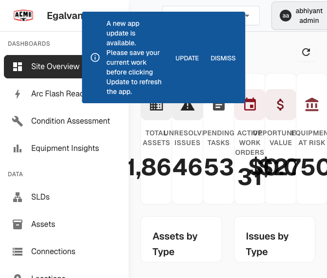
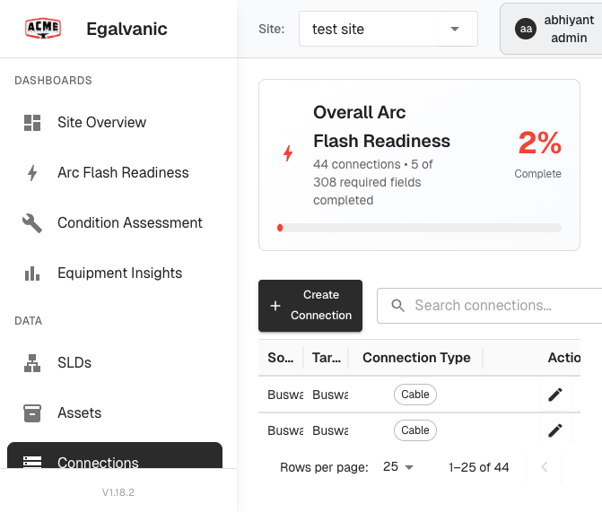
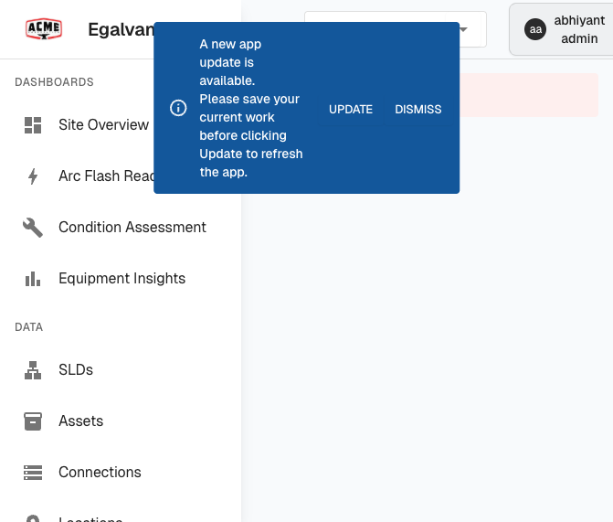
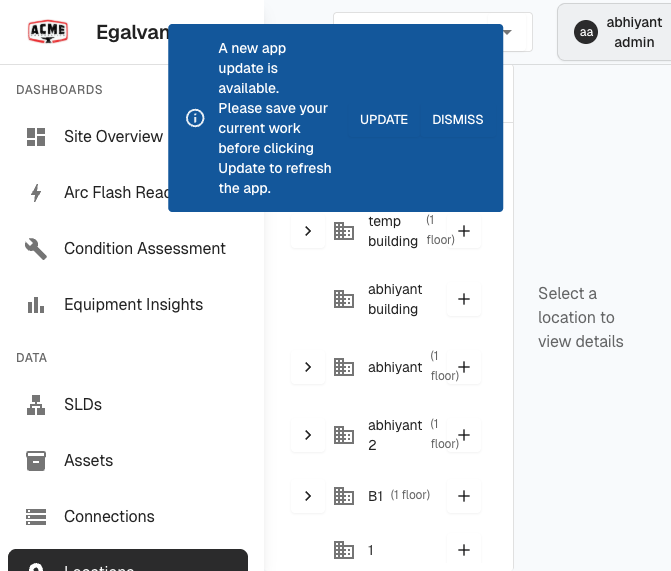
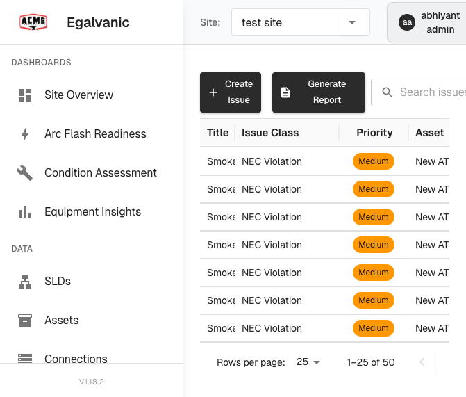
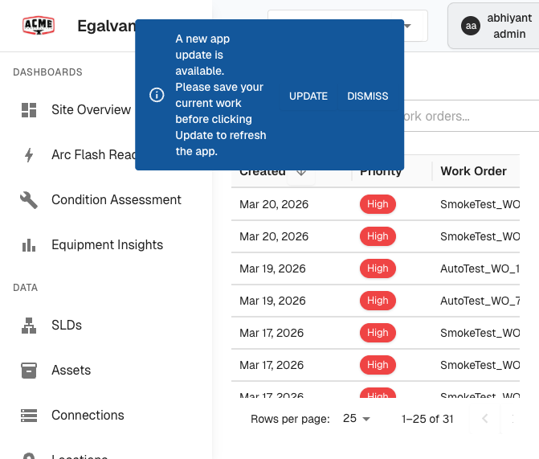

# eGalvanic Website Bug Report

**URL**: https://acme.qa.egalvanic.ai
**Date**: 2026-03-20
**Tested By**: Automated exploration (Playwright)
**Total Bugs Found**: 18 (3 Critical, 7 High, 8 Medium)

### Screenshots
All screenshots are in the `bug-screenshots/` folder:

| File | Shows |
|------|-------|
| `BUG-004-update-banner-dashboard.png` | Dashboard with persistent update banner + stat text overlap |
| `BUG-006-connections-identical-rows.png` | Connections grid with all identical "Busway 2" rows + 2% Arc Flash |
| `BUG-008-tasks-error-loading.png` | Tasks page "Error loading tasks" + update banner |
| `BUG-010-011-locations-test-data.png` | Locations page flooded with SmokeTest_Building entries |
| `BUG-011-015-workorders-test-data-no-status.png` | Work Orders with test data pollution + missing Status column |
| `BUG-011-issues-test-data-pollution.png` | Issues page with 50 "Smoke Test Issue" entries |
| `console-errors.log` | DevRev SDK errors captured from browser console |

---

## CRITICAL (3)

### BUG-001: DevRev PLuG SDK Fails on Every Page Load
- **Severity**: CRITICAL
- **Pages Affected**: All pages
- **Steps to Reproduce**:
  1. Open any page on acme.qa.egalvanic.ai
  2. Open browser DevTools > Console
- **Expected**: DevRev support widget loads successfully
- **Actual**: `plug-platform.devrev.ai/static/plug.js` fails with `net::ERR_FAILED`. Console shows `[DevRev] Failed to load SDK` and `[PLuG] SDK not loaded yet` on every page.
- **Impact**: Customer support/feedback widget is completely broken for all users.
- **Screenshot**: See `bug-screenshots/console-errors.log` for captured console errors

---

### BUG-002: N+1 API Query Pattern — 80+ Individual Requests Per Page Load
- **Severity**: CRITICAL
- **Pages Affected**: Tasks, Work Orders, Connections, Assets, Locations — any page loading SLD data
- **Steps to Reproduce**:
  1. Navigate to `/tasks`
  2. Open DevTools > Network tab
  3. Count requests to `node-subtypes` and `shortcut/by-node-class`
- **Expected**: A single batch API call to fetch all node subtypes and shortcuts
- **Actual**: The app fires individual `GET /api/lookup/node-subtypes/{id}` AND `GET /api/shortcut/by-node-class/{id}` for every node class. On the Tasks page alone, **80+ individual API calls** are made.
- **Impact**: Massive performance degradation. Pages take 5+ seconds to fully load. Gets worse as data grows. Puts unnecessary load on the backend.

---

### BUG-003: Sentry DSN and Project Credentials Exposed in Client JS Bundle
- **Severity**: CRITICAL
- **Pages Affected**: All pages
- **Steps to Reproduce**:
  1. Open DevTools > Network tab
  2. Filter by "sentry"
  3. Observe the Sentry envelope POST requests
- **Expected**: Sentry credentials should not be easily extractable
- **Actual**: `sentry_key=b6be32259a437065e80bc19260796221`, project ID `4510464365101056`, and org ID `o4509671240105984` are visible in plaintext in network requests.
- **Impact**: Attackers could flood Sentry with fake error reports, exhaust event quota, or mask real production errors.

---

## HIGH (7)

### BUG-004: "App Update Available" Banner Persists Across All Pages
- **Severity**: HIGH
- **Pages Affected**: All pages after login
- **Steps to Reproduce**:
  1. Log in to the application
  2. Navigate to any page
  3. Dismiss the banner
  4. Navigate to another page
- **Expected**: Banner should not reappear after dismissal, or app should auto-update
- **Actual**: Alert banner saying "A new app update is available. Please save your current work before clicking Update to refresh the app." appears on every page and reappears after navigation even if previously dismissed.
- **Impact**: Persistent annoyance for all users. If the update is real, users are stuck in a loop; if not, it's a false alarm.
- **Screenshot**: 

---

### BUG-005: SPA State Not Persisted in URL — Site/SLD Context Lost on Reload
- **Severity**: HIGH
- **Pages Affected**: Assets, Tasks, Connections, Locations, and any page requiring site context
- **Steps to Reproduce**:
  1. Navigate to `/tasks` directly (e.g., paste URL in browser)
  2. Observe console logs
- **Expected**: The page should load with previously selected site context, or the URL should include the site/SLD ID
- **Actual**: Console logs `[Tasks] No sldId provided, showing error message` and `[SLD] No sldId provided; skipping fetch`. Site selector briefly shows "No sites available" before eventually loading. Full page reload loses selected site/SLD.
- **Impact**: Users cannot bookmark or share deep links. Refreshing the page forces re-selection of site context.

---

### BUG-006: Connections Grid Shows All Identical Rows
- **Severity**: HIGH
- **Pages Affected**: `/connections`
- **Steps to Reproduce**:
  1. Navigate to Connections page
  2. Observe the grid rows
- **Expected**: Each row should display unique connection data
- **Actual**: All visible rows show identical data: Source Node = "Busway 2", Target Node = "Busway 2", Connection Type = "Cable". All 6+ visible rows are duplicates.
- **Impact**: Either a data bug (self-referencing connections with duplicate entries) or a rendering bug where the same data is repeated. Users cannot distinguish between connections.
- **Screenshot**: 

---

### BUG-007: Duplicate API Calls on Every Page Load
- **Severity**: HIGH
- **Pages Affected**: All pages
- **Steps to Reproduce**:
  1. Open DevTools > Network tab
  2. Navigate to any page
  3. Filter by `/api/users` or `/api/slds`
- **Expected**: Each API endpoint called once per page load
- **Actual**: Multiple APIs are called twice: `Fetching user roles` (2x), `Fetching SLDs` (2x), `Fetching nodes` (2x), `Fetching node classes` (2x). Likely caused by React re-render or state management issue.
- **Impact**: Doubles the API load on every navigation, wasting bandwidth and server resources.

---

### BUG-008: All 53 Pending Tasks Are Overdue
- **Severity**: HIGH
- **Pages Affected**: `/tasks`
- **Steps to Reproduce**:
  1. Navigate to Tasks page
  2. Observe the summary stats at the top
- **Expected**: A reasonable distribution of pending, overdue, and due-soon tasks
- **Actual**: Pending = 53, Overdue = 53, Due Soon (Next 30 Days) = 0, Completed = 3. Every single pending task is overdue with zero due soon.
- **Impact**: Either a systemic workflow failure (tasks not being addressed) or incorrect due date assignment. Overdue count matching pending count exactly suggests a data or logic issue.
- **Screenshot**: 

---

### BUG-009: Date Format Inconsistency Across Pages
- **Severity**: HIGH
- **Pages Affected**: Tasks page vs. Work Orders page
- **Steps to Reproduce**:
  1. Navigate to `/tasks` — observe date format in Created column (e.g., `14/11/2025`)
  2. Navigate to `/sessions` (Work Orders) — observe date format (e.g., `Mar 20, 2026`)
- **Expected**: Consistent date format across the entire application
- **Actual**: Tasks uses `DD/MM/YYYY` format while Work Orders uses `MMM DD, YYYY`. No consistency.
- **Impact**: Confusing for users. In international contexts, `14/11/2025` vs `11/14/2025` can cause date misinterpretation.

---

### BUG-010: Building Name Concatenation Bug on Locations Page
- **Severity**: HIGH
- **Pages Affected**: `/locations`
- **Steps to Reproduce**:
  1. Navigate to Locations page
  2. Scroll through building cards
  3. Find the building with a garbled name
- **Expected**: Building name shows the updated name only
- **Actual**: One building card displays: `SmokeTest_Building_177312475862SmokeTest_Building_1773124758627_Updated7` — the original name and the updated name are concatenated together instead of the update replacing the original.
- **Impact**: Data corruption or rendering bug. Building names are garbled and unreadable.
- **Screenshot**: 

---

## MEDIUM (8)

### BUG-011: Test Data Pollution Across All Data Pages
- **Severity**: MEDIUM
- **Pages Affected**: Work Orders, Issues, Locations, Tasks
- **Steps to Reproduce**:
  1. Navigate to any data page
  2. Observe the entries
- **Expected**: Clean, meaningful data entries
- **Actual**:
  - Work Orders: 31 entries, most named `SmokeTest_WO_*` or `AutoTest_WO_*`
  - Issues: 50+ entries named `Smoke Test Issue`
  - Locations: 40+ entries named `SmokeTest_Building_*`
  - Tasks: entries named `T1`, `tesyv`, `20`, `offline task`
- **Impact**: QA environment is heavily polluted with orphaned test data. Impossible to evaluate the app with realistic data. Test cleanup is not working.
- **Screenshots**:
  - 
  - 
  - 

---

### BUG-012: Dashboard Shows "Company information not available" Alert
- **Severity**: MEDIUM
- **Pages Affected**: `/dashboard`
- **Steps to Reproduce**:
  1. Log in and land on the dashboard
- **Expected**: Dashboard loads without errors
- **Actual**: An alert fires saying company information is not available.
- **Impact**: Users see an error on their first screen after login. Poor first impression.
- **Screenshot**: 

---

### BUG-013: Site Selector Shows "No sites available" Flicker on Load
- **Severity**: MEDIUM
- **Pages Affected**: All pages with site selector
- **Steps to Reproduce**:
  1. Navigate to any page
  2. Watch the site selector dropdown during load
- **Expected**: Selector loads with the correct site or shows a loading spinner
- **Actual**: Dropdown briefly shows "No sites available" before populating (33 sites exist). Console confirms: `[Layout] Sites state updated {count: 0}` fires before the SLD API responds.
- **Impact**: Jarring flash of error state on every navigation. Users may momentarily think no data exists.

---

### BUG-014: Sentry Error Reporting Partially Failing
- **Severity**: MEDIUM
- **Pages Affected**: All pages
- **Steps to Reproduce**:
  1. Open DevTools > Network tab
  2. Filter by "sentry"
- **Expected**: All Sentry error reports sent successfully
- **Actual**: 2 out of 3 Sentry envelope POST requests fail with `net::ERR_ABORTED`.
- **Impact**: Error telemetry is unreliable. You may be missing real error reports from production. Monitoring blind spots.

---

### BUG-015: Work Orders Grid Missing Status Column
- **Severity**: MEDIUM
- **Pages Affected**: `/sessions` (Work Orders)
- **Steps to Reproduce**:
  1. Navigate to Work Orders page
  2. Observe the grid columns
- **Expected**: Grid should include a Status column (Open, In Progress, Completed, etc.)
- **Actual**: Grid only shows 4 columns: Created, Priority, Work Order, SA / Plan. No Status column visible.
- **Impact**: Users must click into each work order to see its status. No way to filter or sort by status from the list view.
- **Screenshot**: 

---

### BUG-016: Arc Flash Readiness at 2% — 5 of 308 Required Fields Completed
- **Severity**: MEDIUM
- **Pages Affected**: `/connections`
- **Steps to Reproduce**:
  1. Navigate to Connections page
  2. Observe the Arc Flash Readiness banner at the top
- **Expected**: Reasonable completion percentage
- **Actual**: Shows "44 connections - 5 of 308 required fields completed" — only 2% complete.
- **Impact**: Either the feature is not being adopted, or the required fields are too burdensome (308 fields / 44 connections = ~7 required fields per connection that nobody is filling out).
- **Screenshot**: 

---

### BUG-017: Most Tasks Missing Type Classification
- **Severity**: MEDIUM
- **Pages Affected**: `/tasks`
- **Steps to Reproduce**:
  1. Navigate to Tasks page
  2. Observe the Type column in the grid
- **Expected**: Each task should have a type assigned
- **Actual**: Most task rows show "—" in the Type column. Only 1 out of 7 visible tasks has a type (`PM`).
- **Impact**: Task categorization and filtering is ineffective.

---

### BUG-018: Beamer Analytics Leaks User Role and Company in URL
- **Severity**: MEDIUM
- **Pages Affected**: All pages (Beamer loads on every page)
- **Steps to Reproduce**:
  1. Open DevTools > Network tab
  2. Filter by "beamer"
  3. Inspect the GET request URL parameters
- **Expected**: Sensitive user metadata sent in POST body or headers, not URL
- **Actual**: Beamer request URL contains `c_user_role=Admin`, `c_user_company=EG-ACME`, `firstname=abhiyant`, `lastname=admin`, and `c_user_hash` in plaintext query string.
- **Impact**: Low-risk information leak. User roles and company identifiers in URLs can be cached by proxies, CDNs, and appear in server logs.

---

## Summary Table

| ID | Severity | Page | Bug Title |
|----|----------|------|-----------|
| BUG-001 | CRITICAL | All | DevRev PLuG SDK Fails on Every Page Load |
| BUG-002 | CRITICAL | All | N+1 API Query Pattern — 80+ Requests Per Page |
| BUG-003 | CRITICAL | All | Sentry DSN Exposed in Client JS Bundle |
| BUG-004 | HIGH | All | "App Update Available" Banner Persists |
| BUG-005 | HIGH | All | SPA State Not Persisted in URL |
| BUG-006 | HIGH | Connections | Grid Shows All Identical Rows |
| BUG-007 | HIGH | All | Duplicate API Calls on Every Page Load |
| BUG-008 | HIGH | Tasks | All 53 Pending Tasks Are Overdue |
| BUG-009 | HIGH | Tasks/WO | Date Format Inconsistency |
| BUG-010 | HIGH | Locations | Building Name Concatenation Bug |
| BUG-011 | MEDIUM | All Data | Test Data Pollution |
| BUG-012 | MEDIUM | Dashboard | "Company information not available" |
| BUG-013 | MEDIUM | All | Site Selector "No sites available" Flicker |
| BUG-014 | MEDIUM | All | Sentry Error Reporting Partially Failing |
| BUG-015 | MEDIUM | Work Orders | Missing Status Column |
| BUG-016 | MEDIUM | Connections | Arc Flash Readiness at 2% |
| BUG-017 | MEDIUM | Tasks | Missing Type on Most Tasks |
| BUG-018 | MEDIUM | All | Beamer Leaks User Role in URL |

---

## Recommended Fix Priority

1. **BUG-002** — N+1 API pattern (biggest perf win, batch the node-subtypes/shortcuts calls)
2. **BUG-001** — DevRev SDK failure (fix or remove the broken integration)
3. **BUG-005** — URL state persistence (fundamental SPA usability)
4. **BUG-007** — Duplicate API calls (React re-render / state management fix)
5. **BUG-004** — Update banner persistence (dismissal state not saved)
6. **BUG-006** — Connections grid identical rows (data or rendering issue)
7. **BUG-010** — Building name concatenation (data corruption)
