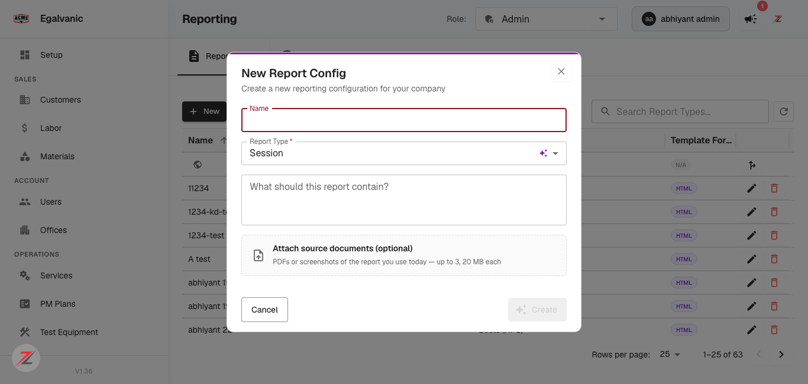

# Report Builder ticket — four errors in the QA checklist itself

**Env:** QA V1.36 · https://acme.qa.egalvanic.ai · **Found:** 2026-08-10 · **Evidence added:** 2026-08-12
**Ticket:** Report Builder & AI Config Editor (24 PRs) · **Severity:** n/a — ticket quality, not product

These are not product defects. They are places where the ticket's checklist, extrapolated from PR
descriptions rather than the running app, would send a tester to the wrong place. Two of them would
cause a tester to file bugs against **correct** behaviour; one hides a **real** gap.

---

## 1. Item 2 (multiple attachments) points at the wrong surface

The checklist asks to verify multiple attachments. Where a tester would naturally look — the
**Create Custom Template** modal — the code appends a single file (`fd.append("attachment", file)`),
so only one can ever be chosen. A tester follows the checklist, finds one slot, and files
"multi-attach is broken".

Multi-attach genuinely exists, but in the **configs-list dialog** and the edit composer:

*"New Report Config" → **"Attach source documents (optional) — PDFs or screenshots of the report you
use today — up to 3, 20 MB each"**. The underlying input is `multiple: true`,
`accept=".pdf,.png,.jpg,.jpeg"` — verified in the DOM, not inferred.*

**Fix the checklist**, not the product: name the surface that supports it.

## 2. Item 4's "streamed" is wrong for the frontend

The checklist says AI edits are *streamed*. PR #1081 is explicit: **"no chat, async job… progress
polling."** Streaming is an AI-pipeline internal, not something the UI does. A tester watching for
streaming will find polling and wrongly file a bug.

## 3. Item 8 has a real scope gap — the one worth acting on

#1085 role-gated the **configs list**, **EG Forms** and the **editor**. It did **not** gate the edit
pencils in the **Plan / Quote preview panes**. Any role sees clickable pencils that dead-end on an
"Admin role required" card. The checklist only asks about the surfaces the PR touched, so following
it would never surface this.

## 4. `context_entity_type` is sent as a field name

The value is the literal string **`"plan_id"`** — a *field name* used where a *type* belongs (the
equivalent of `type="user_id"` instead of `type="user"`). It may work today by coincidence of how
the consumer parses it. Worth a contract check rather than a bug.

---

## Also worth correcting in the ticket

Config creation posts to **`/api/reporting/ai/config`** (multipart), not `/reporting/configs` as the
ticket states.

## Why this matters beyond this ticket

Four wrong items out of one checklist is a high rate, and the failure mode is asymmetric: a tester
who trusts the checklist files noise, and a tester who doesn't trust it stops using it. The cheapest
correction is to write QA items against the running build — the same discipline that made the TEGG,
EG Forms and shutdown-schedule tickets testable to the field-name level.
