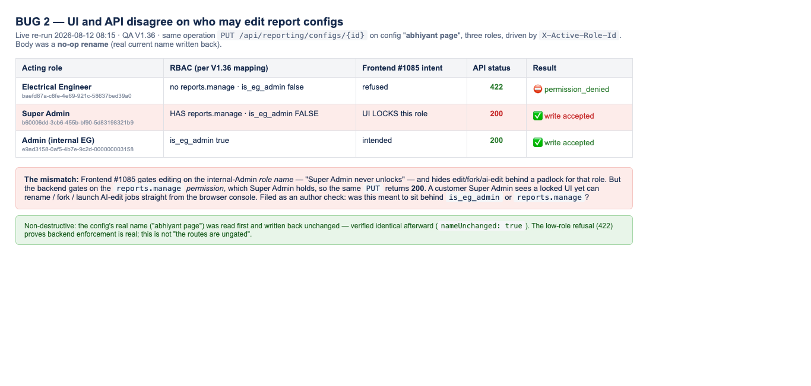

# Report Builder — UI and API disagree on who may edit report configs

**Found:** 2026-08-10 · **Env:** QA V1.36 · **Ticket:** Report Builder & AI Config Editor
**Related PRs:** frontend #1085 (internal-Admin gating), backend #914 (SECURITY: dead
`is_eg_admin` predicate + gate reporting/forms edit routes)
**Severity:** Medium · **Priority:** Medium — needs an author decision, not necessarily a fix

## Summary

The frontend gates report-config editing on the **internal-Admin role name**; the backend gates
the same operations on the **`reports.manage` permission**. The two disagree for exactly one
role — **Super Admin** — which the UI explicitly locks but the API accepts.

Frontend #1085 states the intent plainly: *"assigned-role detection (internal 'Admin' / legacy
'EG Admin' by exact name — **Super Admin never unlocks**)"*, and hides edit/delete/fork/create
behind that check with a lock tooltip.

## Evidence — same operation, three roles (`PUT /api/reporting/configs/{id}`)

| Acting role (`X-Active-Role-Id`) | perms | `reports.manage` | `is_eg_admin` | Result |
|---|---|---|---|---|
| Electrical Engineer | 80 | no | false | **422 `permission_denied`** — correctly refused, name unchanged |
| **Super Admin** | 101 | **yes** | **false** | **200 — rename persisted** ← UI locks this role |
| Admin (internal) | — | yes | — | 200 — intended |

Also accepted as Super Admin: `POST /reporting/configs/{id}/fork` (200, fork created) and
`POST /reporting/configs/{id}/ai-edit` (200, job accepted).

### Screenshot — re-run live 2026-08-12, non-destructively

*Same `PUT /api/reporting/configs/{id}` on config **"abhiyant page"**, driven three times via
`X-Active-Role-Id`. Electrical Engineer → **422 permission_denied** (backend enforcement is real).
Super Admin → **200 write accepted**, despite #1085 locking that exact role in the UI.
Admin (internal EG) → 200, intended.*

**This re-run was a no-op:** the config's current name was read first and written straight back, and
confirmed byte-identical afterward (`nameUnchanged: true`). The finding is about *who the API lets
through*, so nothing had to be altered to demonstrate it.

> Method note: my first attempt at this evidence page read the name from `data.name` and got
> `undefined` — the payload nests it at `config.name`. That would have sent an empty body and still
> returned 200, which looks like the same finding but proves less. Re-run with the real name.

## Why this is worth an author check rather than an automatic bug

The backend enforcement is **real and working** — it refuses a low-privilege role outright. This
is not "the routes are ungated". The question is narrower: was fork / update / ai-edit meant to
sit behind `is_eg_admin`, or behind `reports.manage`?

- If `is_eg_admin` was intended, a customer Super Admin can bypass a deliberate product lock by
  calling the API directly — client-side-only enforcement for that role.
- If `reports.manage` was intended, then #1085's UI lock is simply stricter than the API, and
  the ticket's security wording overstates the backend's role gating.

I could not read `eg-pz-backend` (no repo access), so I cannot confirm #914's intended scope.

## Impact if the first reading is correct

Bounded: within-tenant only (the actor is already a company admin, `company_id` matches — no
cross-tenant exposure), and it requires deliberately issuing API calls rather than using the UI.
The exposure is the boundary between *customer admin* and *internal EG admin*: a customer
Super Admin could fork, rename and launch AI edit jobs on report configs the product intends
only eG staff to edit.

## Steps to reproduce

1. Log in as a user whose assigned role is **Super Admin** (`is_eg_admin: false`, holds `reports.manage`).
2. Open the report config picker — edit/fork affordances are correctly **hidden/locked**.
3. From the browser console:
   `fetch('/api/reporting/configs/<id>', {method:'PUT', credentials:'include', headers:{'Content-Type':'application/json'}, body:JSON.stringify({name:'changed'})})`
4. **Actual:** 200, the rename persists.
   **Expected (if the UI lock reflects the security model):** 403/422 refusal.

## Notes

- Test data cleaned up: the fork created during testing was deleted (`DELETE` → `{"success": true}`, confirmed gone).
- Related QA item verified in passing: **fork leaves the original untouched** — name, global flag
  and config body byte-identical before/after.
