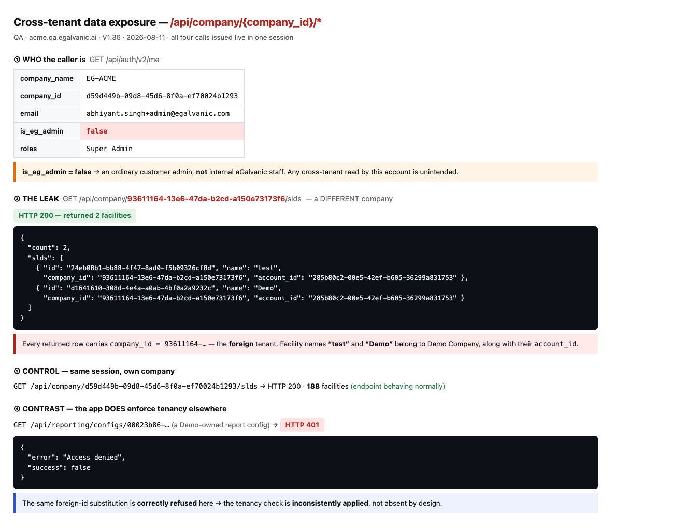
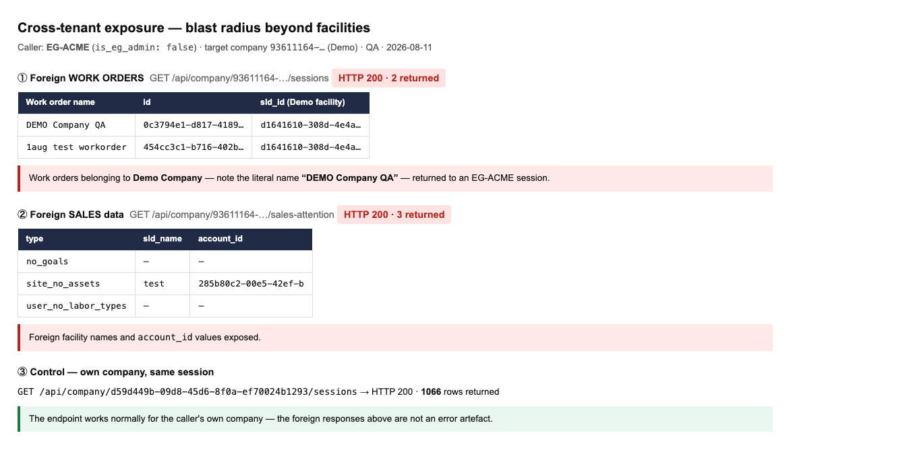

# 🔴 SECURITY — Cross-tenant data exposure on `/api/company/{company_id}/*` endpoints

**Severity:** High · **Priority:** P1 · **Type:** Broken access control (IDOR)
**Env:** QA · `https://acme.qa.egalvanic.ai` + `https://demo.qa.egalvanic.ai` · V1.36
**Found:** 2026-08-11 · **Prod status: UNKNOWN — must be checked immediately**

## Summary

Several `/api/company/{company_id}/…` endpoints **do not verify that `{company_id}` belongs to
the caller**. A signed-in user of one tenant can read another tenant's facilities, work orders
and sales data simply by substituting the other company's UUID in the path.

The account used is **not** an internal EG admin (`is_eg_admin: false`) — it is an ordinary
customer admin — so this is not intended cross-tenant staff access.

## Proof

Acting as **EG-ACME** (`company_id d59d449b-…c1293`, `is_eg_admin: **false**`,
`accessible_sld_ids: []`), requesting **Demo Company**'s id (`93611164-13e6-47da-b2cd-a150e73173f6`):

```js
await fetch('/api/company/93611164-13e6-47da-b2cd-a150e73173f6/slds', {credentials:'include'})
```

**Returned Demo Company's real records** — note `company_id` in the payload is the *foreign*
company:

```json
{ "count": 2, "slds": [
  { "id":"24eb08b1-…", "name":"test", "company_id":"93611164-…", "account_id":"285b80c2-…" },
  { "id":"d1641610-…", "name":"Demo", "company_id":"93611164-…", "account_id":"285b80c2-…" } ]}
```

Also returned to the same foreign caller:

| Endpoint | Foreign data returned |
|---|---|
| `GET /api/company/{foreign}/slds` | 2 facilities — names `test`, `Demo`, with `account_id` |
| `GET /api/company/{foreign}/sessions` | 2 work orders — **"DEMO Company QA"**, "1aug test workorder", with `sld_id` |
| `GET /api/company/{foreign}/sales-attention` | site names + `account_id` + `sld_id` |

**Control (same session, same moment):** `GET /api/company/{own}/slds` → 188 rows — the endpoint
works normally, so this is not an artefact of a broken request.

**Reverse direction also confirmed:** a Demo-tenant session read `/api/company/{ACME}/slds` and
received **188 EG-ACME facilities (52 KB)**. That session *is* `is_eg_admin: true`, so it is the
acme→demo direction above that removes all doubt.

## The app already knows how to enforce this

The same substitution against a tenancy-checked endpoint is correctly refused:

```
GET /api/reporting/configs/{demo-owned-config-id}   →  401  {"error":"Access denied"}
```

So the pattern is inconsistently applied, not absent by design. That contrast is the strongest
argument that the `/company/{id}/*` behaviour is a defect rather than an intentional model.

## Steps to reproduce

1. Log in to `https://acme.qa.egalvanic.ai` as a normal customer admin (`is_eg_admin: false`).
2. Obtain any other tenant's `company_id` (here `93611164-13e6-47da-b2cd-a150e73173f6`,
   read from `/api/auth/v2/me` while logged into the second tenant).
3. From the browser console on acme:
   `await (await fetch('/api/company/93611164-13e6-47da-b2cd-a150e73173f6/slds',{credentials:'include'})).json()`
4. **Actual:** 200 with the other tenant's facilities.
   **Expected:** 401/403, as `/api/reporting/configs/{id}` already does.


## Screenshots



**Evidence 1 — `docs/bug-evidence/security-cross-tenant/SEC-EVIDENCE-1-cross-tenant-proof.png`.**
All four calls issued live in one EG-ACME session, rendered from the real responses:
① the caller is `EG-ACME` with **`is_eg_admin: false`**; ② `GET /api/company/93611164-…/slds`
returns **HTTP 200 with Demo Company's two facilities**, each row carrying the *foreign*
`company_id` and `account_id`; ③ the same endpoint returns the caller's own 188 facilities
normally; ④ `GET /api/reporting/configs/{demo-owned}` returns **HTTP 401 Access denied** — the
same substitution correctly refused elsewhere.



**Evidence 2 — `docs/bug-evidence/security-cross-tenant/SEC-EVIDENCE-2-blast-radius.png`.**
Exposure is not limited to facilities: `…/sessions` returns Demo's work orders — including one
literally named **“DEMO Company QA”** — and `…/sales-attention` returns Demo's facility names and
`account_id`. The control (own company, same session, 1066 rows) shows the endpoint behaving
normally, so the foreign responses are not an error artefact.

## Impact

- Confidentiality breach across customers: facility names, work-order titles, `account_id`,
  `sld_id`, and sales-attention records.
- The barrier is only knowledge of a company UUID. UUIDs are not secrets — they appear in URLs,
  API payloads, exports and support tickets, and any user of tenant B who has ever seen their own
  `company_id` can use it from tenant A.
- Enumeration of a tenant's site and work-order inventory is a reconnaissance primitive even
  where field-level content is limited.

## Not yet determined

- **Production exposure.** Verified on QA only. **Check prod before anything else** — same code
  path is likely.
- **Full endpoint inventory.** I probed 8 `/api/company/{id}/*` endpoints; 3 clearly leak, 2
  returned 0 rows (ambiguous — Demo may simply have none), 2 are routed differently. A complete
  audit of every `/company/{id}/` route is needed; assume more are affected.
- **Write operations.** I only issued reads. Whether POST/PUT/DELETE under `/company/{id}/` are
  equally unguarded is **untested and should be treated as urgent** — a write-side equivalent
  would be far worse.

## Suggested fix

Enforce, in one shared place (middleware/decorator) rather than per-route, that the
`{company_id}` path parameter equals the authenticated user's company — with an explicit
allowance for `is_eg_admin` if cross-tenant staff access is intended. Then add a contract test
that walks every `/company/{id}/` route with a foreign id and asserts 401/403.

## Credentials note

The second tenant's login is recorded in local agent memory only and deliberately **not**
committed to this repo.
