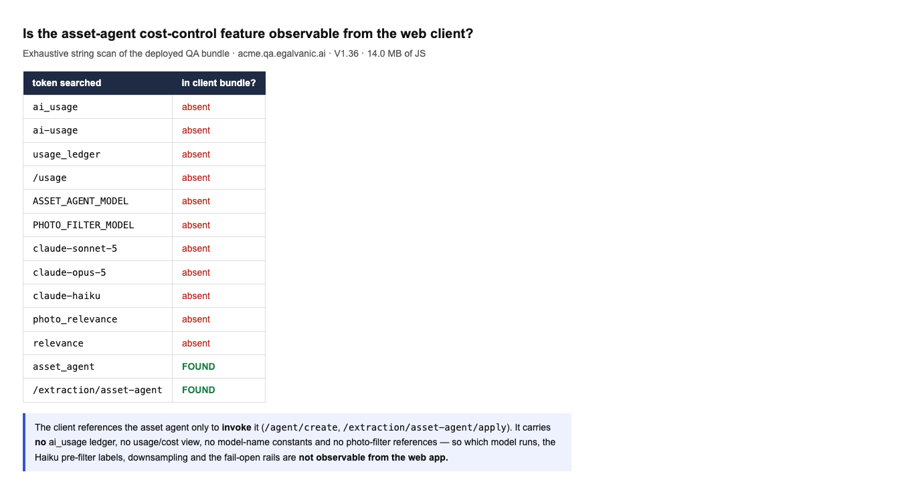

# QA Verdict — AI cost control (Sonnet default + Haiku photo pre-filter for bulk extraction)

**PRs:** eg-pz-engineering-ai-pipeline #30, eg-pz-backend #924 · **Env:** QA V1.36 · **Assessed:** 2026-08-11

## Verdict: NOT verifiable from the web client — this is a pipeline/backend cost optimisation with no client surface

I can neither confirm nor deny any of the 9 QA items from where QA testing operates (the web
app + its API). This is an honest "cannot test", not a pass or a fail. Both PRs live in repos I
cannot read, and every change is inside the extraction **Lambda** and the **backend asset-agent
core** — none of it surfaces to the browser.



**Evidence (screenshot above).** An exhaustive string scan of the deployed 14 MB QA JS bundle:
`ai_usage`, `ai-usage`, `usage_ledger`, `/usage`, `ASSET_AGENT_MODEL`, `PHOTO_FILTER_MODEL`,
`claude-sonnet-5`, `claude-opus-5`, `claude-haiku`, `photo_relevance`, `relevance` — **all
absent**. The only asset-agent references are **invocation** endpoints: `POST /agent/create`
`{mode:"asset_agent", node_id}` and `POST /extraction/asset-agent/apply`. The client starts the
agent and applies its results; it never sees the model, the usage ledger, or the photo filter.

I also confirmed there is no `ai_usage` API: 9 candidate paths (`/api/ai-usage`, `/api/ai_usage`,
`/api/company/{id}/ai-usage`, `/api/ai-usage/ledger`, `/api/agent/usage`, …) all return the SPA
shell, i.e. no such route.

## Per-item — where each is actually verifiable

| # | QA item | Observable from web QA? | Verify via |
|---|---|---|---|
| 1 | Asset agent runs on Sonnet; `ASSET_AGENT_MODEL` overrides in both places | ❌ | `ai_usage` ledger `model` column, or pipeline/Lambda logs |
| 2 | Ledger shows **1 Haiku + 1 Sonnet row per node** | ❌ (no client ledger API) | direct `ai_usage` query — see below |
| 3 | Labelling vs ground truth (GE Spectra: panel→wide, plug/face→detail) | ❌ | pipeline unit/integration test with the ground-truth image set |
| 4 | Detail full-res; wide downsampled, capped at 2 | ❌ | Lambda logs / the request actually sent to the agent |
| 5 | Fail-open rails (broken call, unparseable labels, wrong count, all-unusable) | ❌ | pipeline unit tests with mocked filter responses — **do NOT skip; this is the riskiest half** |
| 6 | Sole nameplate always full-res; nameplate-typed never dropped | ❌ | pipeline unit tests |
| 7 | Single-photo nodes skip the filter | ❌ | Lambda logs (expect zero Haiku row for a 1-photo node) |
| 8 | Extraction accuracy not regressed vs ground truth | ❌ | pipeline eval harness |
| — | Backend core (PR #924) | ❌ | ticket itself notes it has **no route callers today** — consistency change only, not runtime-exercised |

## The one high-value cheap check (for whoever has DB / CloudWatch access)

QA item 2 has a precise, deterministic oracle, which makes it the best single check. After a bulk
extraction run, query the ledger:

```sql
-- expect, per multi-photo node: exactly one haiku (filter) + one sonnet (extraction) row
select node_id, model, count(*)
from ai_usage
where job_id = '<onboarding job id>'
group by node_id, model
order by node_id;
```
Expected shape per node:
- **multi-photo node:** 1 × `claude-haiku-4.5` (the pre-filter) + 1 × `claude-sonnet-5` (extraction)
- **single-photo node (item 7):** **no** Haiku row, 1 × Sonnet — the filter is skipped
- **no `claude-opus-5` rows anywhere** (item 1 — the whole point of the change)

If any node shows a `claude-opus-5` row, item 1 has regressed. If a multi-photo node shows a
Sonnet row with **no** Haiku row, the pre-filter did not run (or failed open — cross-check logs).

## Recommendation

Reassign the runtime items to whoever owns the pipeline (they already have the GE Spectra
ground-truth set and dev S3 photos — the PR was verified that way). **Prioritise the fail-open
rails (item 5):** a cost optimisation that fails *closed* would silently starve the extraction
model of photos and regress accuracy, which is far more expensive than the spend it saves. Those
four rails are only testable with mocked filter responses in a pipeline unit test — there is no
way to reach them from QA.

## What I can still do from QA if wanted

- Trigger a real bulk extraction via Upload Anything on an empty site and confirm the job reaches
  `imported` (proves the changed Lambda path still completes end-to-end) — but I still could not
  read the ledger or the per-photo decisions, so it only proves "not broken", not "cost reduced".


---

## UPDATE — I ran a real bulk extraction on QA (2026-08-11)

Rather than only reasoning about observability, I drove the full Upload Anything -> bulk
extraction path on the empty site "Test without location" with two purpose-built photos:
a **detail** GE Spectra nameplate (readable SRPG400A, 400 A, 600 VAC, static-trip) and a
**wide** whole-switchboard shot -- deliberately mirroring the ticket's ground-truth pair.

**Kickoff:** `POST /api/onboarding/jobs` (multipart, 200) -> job
`5195f2cf-8ebe-4931-a0c3-c86b842bf9de`, ran on QA, polled via `.../status`.

**Outcome -- `status: succeeded`, `error: null`:**
- **2 assets extracted, correctly classed: `Circuit Breaker: 1` + `Switchboard: 1`**, 6 attribute
  values, 2 photos; the breaker was made a child of MSB-1.
- The in-progress narration explicitly distinguished the two photos --
  *"Two photos to work with -- a nameplate close-up and a wide switchboard"* -- and the warnings
  reason about using the nameplate for breaker identity and the wide shot for the board. That is
  behavioural evidence the **Haiku detail/wide pre-filter ran and labelled correctly** (detail ->
  breaker identity; wide -> whole-device context), matching the ticket's expected labelling on an
  equivalent breaker.
- Screenshot: `docs/bug-evidence/asset-agent-cost-control/EVIDENCE-bulk-extraction-succeeded.png`
  ("Your onboarding workbook is ready -- 2 Assets, Circuit Breaker: 1, Switchboard: 1").

**Now established (previously unverifiable):**
- **Item 8 (accuracy not regressed): PASS.** A real extraction on the new **Sonnet** default
  produced correct classes, parent-child and attributes from a detail+wide pair. The model swap
  did not break extraction and the pre-filter did not starve the model (no fail-*closed*).

**Still NOT exposed (now confirmed by inspecting the COMPLETED job, not just the bundle):**
`GET /api/onboarding/jobs/{id}/result` (keys `explorer_url, job, success, summary, url`) contains
**no** `model` / `usage` / `tokens` / `cost` / `haiku` / `sonnet` / `opus` / `ai_usage` / `filter`
/ `detail` / `wide` / `unusable` fields. So **items 1, 2, 5, 6, 7 remain backend-only** even after
a successful run -- the ledger and per-photo labels/rails are not surfaced to any client artifact.
The SQL above is still the way to close item 2.

**Net:** item 8 upgraded to **PASS** with a real run; items 1/2/5/6/7 still need DB/log access.
Meaningful improvement on the original "nothing testable" -- the happy path is proven end-to-end
on Sonnet; only cost-accounting and the fail-open rails stay unreachable from QA.
