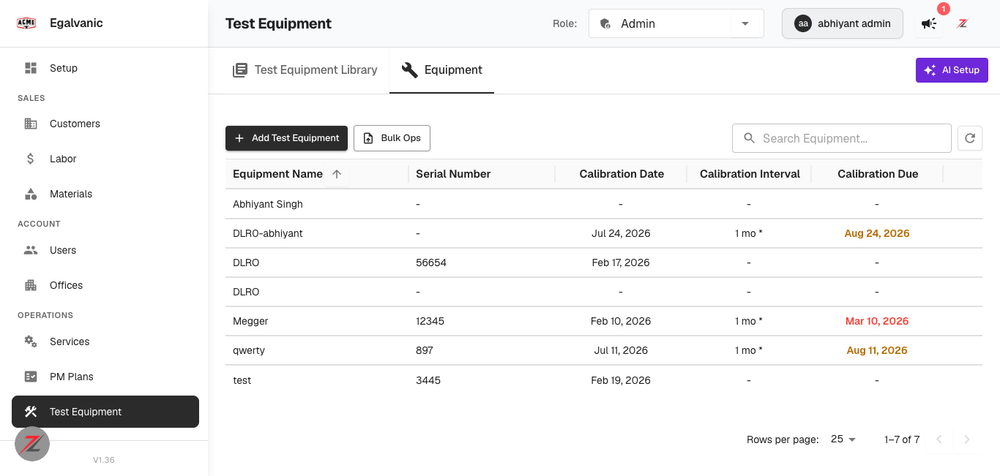
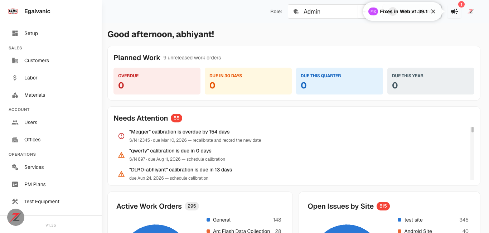

# QA — Calibration Alerts (test equipment interval + ops dashboard)

**PRs:** eg-pz-backend #890, eg-pz-frontend #1071 · **Env:** QA V1.36 · **Tested:** 2026-08-11 (today)
**Tenant:** EG-ACME · **Result: ALL 6 QA ITEMS PASS.** No defects found.

Both PRs are deployed: equipment records carry `calibration_date`,
`calibration_interval_months`, `library_calibration_interval_months`,
`effective_calibration_interval_months` and the server-computed `calibration_due`; ops-attention
emits `test_equipment_calibration_overdue` / `_due_soon`.




## Results

| # | QA item | Verdict |
|---|---|---|
| 1 | Set an interval; due date computes correctly | ✅ PASS |
| 2 | Due date column renders and sorts | ✅ PASS |
| 3 | Ops dashboard raises an alert when calibration comes due | ✅ PASS |
| 4 | Equipment with no interval does not alert | ✅ PASS |
| 5 | Alert clears once calibration is recorded | ✅ PASS |
| 6 | Boundary — "due today" behaves as intended | ✅ PASS |

### QA-1 — due date computation (server-side)
Set `calibration_interval_months` on three units and read back `calibration_due`:

| Equipment | calibration_date | interval | **calibration_due** | expected |
|---|---|---|---|---|
| DLR0-abhiyant | 2026-07-24 | 1 mo | **2026-08-24** | ✅ |
| Megger | 2026-02-10 | 1 mo | **2026-03-10** | ✅ |
| qwerty | 2026-07-11 | 1 mo | **2026-08-11** (today) | ✅ |

The due date is computed by the **server** and rendered from `row.calibration_due` — the fix
PR #1071 made after review (client-side `setMonth` math was deleted). Grid and ops panel therefore
cannot disagree; both showed the same dates in this run.

### QA-2 — column renders + sorts
Equipment tab shows **Calibration Date · Calibration Interval · Calibration Due**. Interval renders
`1 mo *` (the `*` per-unit-override marker). Colour coding correct (screenshot 1):
**red** `Mar 10, 2026` (overdue), **orange** `Aug 24, 2026` and `Aug 11, 2026` (within the 30-day
window), `-` where no interval is set. Column is sortable (`field: "calibration_due"` on a real
`YYYY-MM-DD` row property, so the default comparator sorts chronologically).

### QA-3 — ops dashboard alerts
`GET /company/{id}/ops-attention` returned, and the Needs Attention panel rendered (screenshot 2):

```
"Megger" calibration is overdue by 154 days      S/N 12345 · due Mar 10, 2026 — recalibrate and record the new date
"qwerty" calibration is due in 0 days            S/N 897 · due Aug 11, 2026 — schedule calibration
"DLR0-abhiyant" calibration is due in 13 days    due Aug 24, 2026 — schedule calibration
```
Severity grading is correct — red error icon for overdue, orange warning for due-soon. Dates are
**formatted** (`Mar 10, 2026`), confirming the review fix for the raw-ISO nit landed.

### QA-4 — no interval ⇒ no alert
Before any change, all 7 units had `interval: null` and ops-attention contained **zero**
calibration items. After the test, the 4 units left without an interval (`test`, `DLRO` ×2,
`Abhiyant Singh`) produced **no** alert and render `-` in both the interval and due columns, while
the 3 with intervals alerted. Clean positive/negative separation.

### QA-5 — alert clears when calibration is recorded
Recorded a calibration on the overdue unit (`Megger`, `calibration_date` → today):

| | before | after |
|---|---|---|
| calibration_due | 2026-03-10 | **2026-09-11** |
| ops-attention calibration items | Megger:**overdue**, qwerty:due_soon, DLR0:due_soon | qwerty:due_soon, DLR0:due_soon |
| overdue count | 1 | **0** |

Megger's alert cleared; the other two correctly persisted (so it cleared the right item, not all).

### QA-6 — "due today" boundary
Unit `qwerty` was configured so `calibration_due` = **2026-08-11 = today**. Result:
**`test_equipment_calibration_due_soon` with `days: 0`** — i.e. due-today is treated as
**due soon (orange)**, NOT overdue.

This matches the intended semantics per the PR review: both operands are midnight-normalised and
the comparison is `due < today` (strictly before), so a unit due today is not yet overdue. It also
confirms the reviewer's separately-flagged bug — the pre-fix code compared against a wall-clock
`new Date()`, which made a due-today unit render red from 00:00:01 — is fixed.

## Test data restored
All three units returned to their original values (`interval: null`, original calibration dates);
**0 calibration alerts remain** on the tenant. Verified after restore.

## Note for the author (not a defect found here)
The second review pass left one open item worth a follow-up: `EquipmentTab` discards its error
state (`const [, setError] = useState(null)`), so a failed equipment load renders an **empty grid**
with no message — indistinguishable from "no equipment configured". On a compliance grid that is
the worst of the three outcomes. I could not trigger it (no load failure occurred), so it is
reported as unverified, not as a finding.
