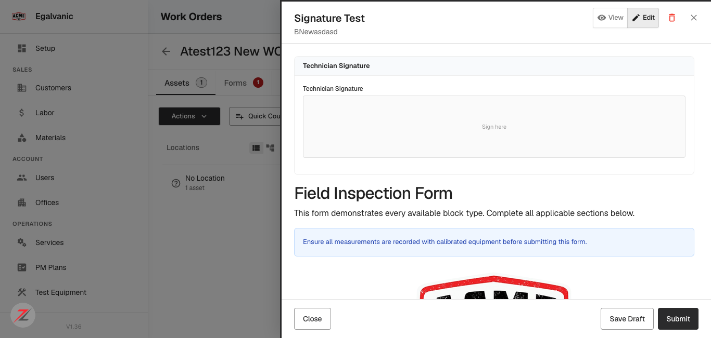
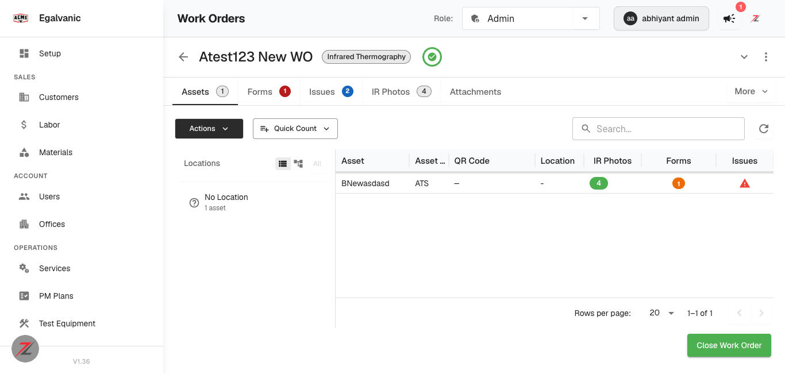
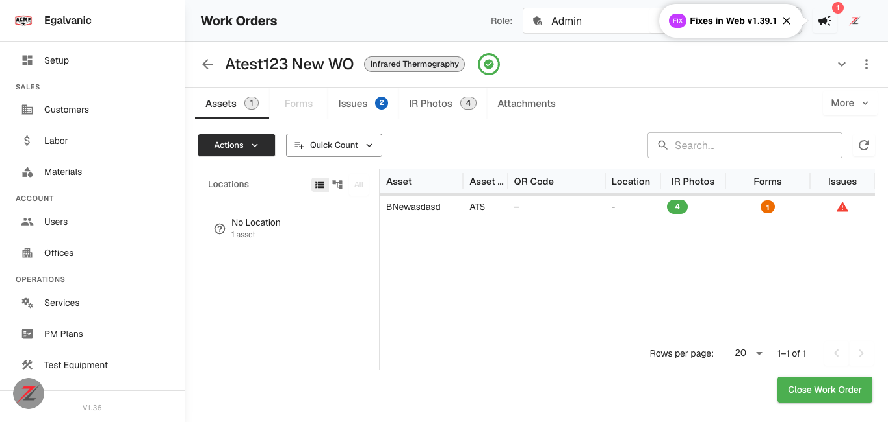
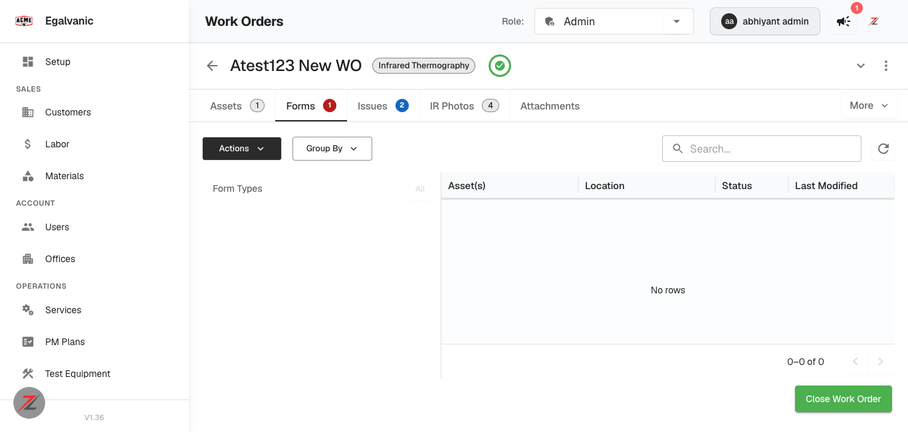

# QA verdict — EG Forms: addable and fillable on every work order type

**Tested:** 2026-08-11 · **Build:** QA **V1.36** · **Tenant:** `acme.qa.egalvanic.ai` (EG-ACME)
**PR:** eg-pz-frontend **#1107** (merged to `cicd/dev` 2026-07-31)

---

## Headline: the ticket says "dev only, not yet in QA" — it **is** in QA

The ticket's *Scope at filing* line reads *"dev only, not yet in QA"*. That is **stale**. The
change is live on QA and was tested there today:

- The Forms tab is present and **enabled** on all seven work types.
- On an **IR** work order the tab issues `GET /api/eg-form-instance/by-session/{id}` — that is
  `SessionEGFormsTab`, the component this PR made universal.
- The full attach → open → fill → save loop works on IR, which is precisely the dead end the
  PR set out to remove.

Worth correcting on the ticket so nobody re-tests on dev or defers QA. (Separately: the sidebar
badge reads **V1.36**, but the release panel advertises *"Fixes in Web v1.39.1"* — the two
disagree, which makes "is this build current?" unanswerable from the UI. Minor, but it cost me
time here and will cost the next person the same.)

**All 6 QA items PASS.** One new low-severity defect found (**EGF-1**).

| # | QA item | Verdict |
|---|---|---|
| 1 | EG Forms tab visible on every work type | **PASS** — all 7 |
| 2 | IR work order: attach a form, open and fill it | **PASS** — filled and persisted |
| 3 | Context menu keyed off form counts, not work type | **PASS** — before/after control |
| 4 | Forms column on non-PM-Forms WOs carrying forms; cell opens them | **PASS** |
| 5 | Regression: row click still opens IR photos / asset drawer | **PASS** |
| 6 | Tab disabled for a company without the `eg-forms` flag | **PASS** — flag injection |

---

## Item 1 — tab visible on every work type · PASS

QA has six service types plus General (`work_type_id: null`). One work order of each was opened:

| Work type | Tabs |
|---|---|
| General | Assets · Tasks · **Forms** · Issues · IR Photos · Attachments |
| PM Forms | Assets · **Forms** · Issues · Attachments |
| AF | Assets · SLD · Equipment Designations · **Forms** · Issues · Attachments |
| IR | Assets · **Forms** · Issues · IR Photos · Attachments |
| Checklist | Assets · Tasks · **Forms** · Issues · IR Photos · Attachments |
| Schedule | Assets · Panel Schedules · **Forms** · Issues · Attachments |
| COM | Assets · Condition Assessment · **Forms 1** · Issues · Attachments |

None disabled. The tab also **lists asset-linked instances**, not just task-linked ones: after
attaching a form on the IR work order the tab showed `BNewasdasd — Draft — Aug 11, 2026 06:40 PM`.

## Item 2 — the original IR dead end · PASS

On IR work order *Atest123 New WO*, asset *BNewasdasd* (ATS):

1. Row context menu → **Add Form** → `GET /api/eg-form-instance/available-for-node/{nodeId}`
   opened `AddFormToAssetDialog`, offering forms grouped **FOR THIS ASSET** / **OTHER FORMS**
   with subtype applicability.
2. Selected *Signature Test* → **Add (1)** → `POST /api/eg-form-instance/create-for-asset`.
3. Clicking the asset's Forms cell → `GET /api/eg-form-instance/by-session/{sid}/by-node/{nodeId}`
   opened the form.
4. Filled Inspector Name, Inspection Date, Contact Email, Ambient Temperature and Notes →
   **Save Draft** → `PUT /api/eg-form-instance/{id}`.
5. **Verified server-side**, not just by the 200: re-reading the instance showed all four typed
   values present.

*The "Signature Test" form open against asset BNewasdasd on an **IR** work order — signature pad,
General Information fields, Pass/Fail, and Close / Save Draft / Submit. Previously unreachable.*

## Item 3 — context menu keyed off counts, not work type · PASS

Tested as a **before/after on the same asset**, which is what makes this conclusive:

| State | Context menu |
|---|---|
| Asset with **0** forms (IR) | View Full Asset · **Add Form** · Add Issue |
| Same asset with **1** form | View Full Asset · **Open Forms (1)** · Add Form · **Copy Form Data To…** · Add Issue |

The two form-dependent entries appeared exactly when the count became non-zero — on an IR work
order, which the old code gated out entirely. Confirmed across types:

| Work type | `Add Form`? | Form-dependent entries |
|---|---|---|
| General | yes | — (asset has no forms) |
| IR | yes | appear once a form exists |
| Checklist | yes | — |
| Schedule | yes | — |
| COM | yes | — |
| AF (3 assets) | yes | — |
| AF (21 assets) | yes | — |
| PM Forms (2 assets) | yes | **Open Forms (1)** · Copy Form Data To… |

> **Method note.** My first sweep showed an *empty* context menu on AF and PM Forms. That was **not**
> a defect — those two work orders had **zero assets**, so there was no row to right-click. Re-run
> against work orders that actually have assets, both behave correctly. Worth recording because the
> obvious reading of that first result would have been a false bug report.

## Item 4 — the Forms column · PASS

The column is **conditional on the asset carrying forms**, and I saw it flip:

- IR work order **before** adding: `Asset · Asset Class · QR Code · Location · IR Photos · Issues` — no Forms column.
- **After** adding: `… · IR Photos · **Forms** (1) · Issues`, and the tab badge moved to **Forms 1**.

*The Forms column (`data-field="forms_status"`) present with a count of 1 after the attach.*

Present on COM and PM Forms (whose assets carry forms), absent on General/AF/Checklist/Schedule
(whose assets do not) — matching the rule rather than the work type. Clicking the cell opens the
viewer.

## Item 5 — regression · PASS

Left-clicking the asset row on the IR work order opened the **asset drawer** (Edit Asset · Asset
Photos · Profile/Nameplate/Schedule/Arc Flash Label) and fetched
`GET /api/ir_session/{sid}/photos`, rendering the IR photo-pair UI. It did **not** open the form
viewer. Row-click behaviour is unchanged; forms are reached via the Forms cell or the context menu.

## Item 6 — feature-flag gate · PASS

`feature-eg-forms` is **true** for EG-ACME (35 LaunchDarkly flags, all true), so the disabled state
does not occur naturally on this tenant. I produced it by intercepting the LaunchDarkly
evaluation response and forcing `feature-eg-forms = false` (streaming channel blocked so the real
value could not be pushed back):

| Flag value | Forms tab | Other tabs |
|---|---|---|
| `true` (real, control) | **enabled** — "Forms 1" | enabled |
| `false` (injected) | **DISABLED** | all still enabled |

*With `feature-eg-forms = false`, the tab is visible but disabled — exactly as the PR describes.*

Removing the interception restored the enabled state, so the flag is the cause, not a coincidence.

---

# EGF-1 — Forms tab count stays stale after deleting a form

**Severity:** Low · **Priority:** Low · **Component:** Work order → Forms tab

The **add** path refreshes the tab count; the **delete** path does not.

### Steps to reproduce

1. Open a work order, attach a form to an asset — tab correctly shows **Forms 1**.
2. Forms tab → open the instance → **Delete this form** → confirm
   (`PUT /api/eg-form-instance/{id}/delete`).
3. Look at the Forms tab label.

### Actual result

The grid empties correctly, but the tab still reads **Forms 1**. Still stale after a further 8 s,
so it is not a timing lag. Only a page reload corrects it to **Forms**.

| Moment | Tab badge | Server `/count` |
|---|---|---|
| Immediately after delete | **Forms 1** | `total: 0` |
| +8 s | **Forms 1** | `total: 0` |
| After reload | Forms | `total: 0` |

Reproduced twice by repeating the whole add→delete cycle.

*Grid shows no rows; the tab still claims "Forms 1". Server reports `{open: 0, total: 0}`.*

### Expected result

The count should drop to zero without a reload, as it already rises without one on add.

### Likely cause

Add fires `GET …/count` and `GET …/node-status` after mutating; delete fires only its `PUT` and
refreshes the grid. This is the same class of defect as PR **#1077** (Equipment Designations rows
stale until reload) — a mutation path that refreshes its own view but not the parent's counter.

---

## Test data hygiene

One form instance created and deleted; the IR work order is back to **0 instances**
(`/count` → `{open: 0, total: 0}`). No other work orders were modified — the sweep across the
other six types was read-only apart from opening context menus, which were dismissed with Escape.
