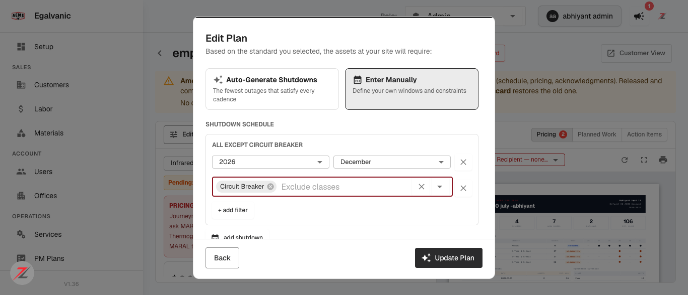
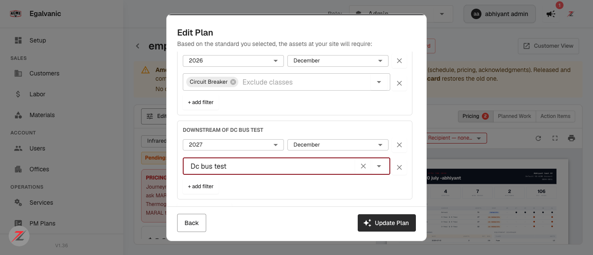
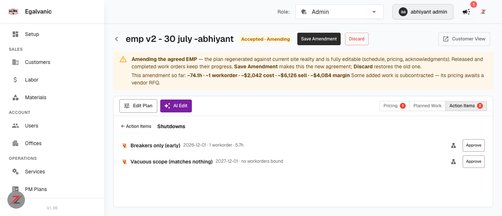
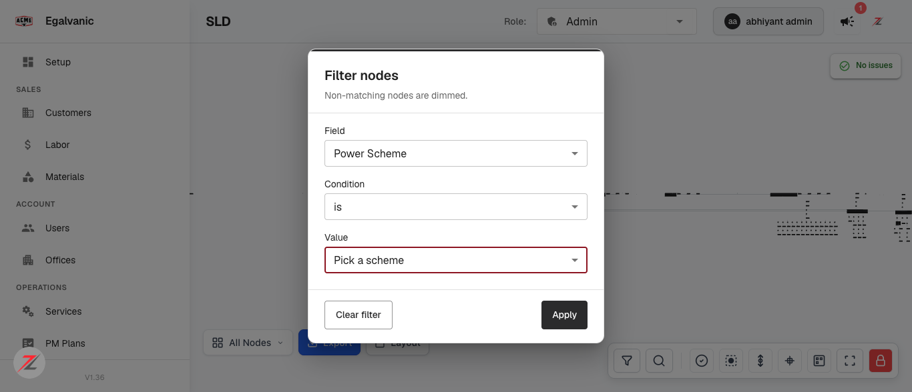

# QA verdict — Manual shutdown schedules: honour every declared window and its scope

**Tested:** 2026-08-11 · **Build:** QA **V1.36** · **Tenant:** `acme.qa.egalvanic.ai` (EG-ACME)
**Commits:** eg-pz-backend `dcb7810f` · eg-pz-frontend `caad2668` (both direct pushes to `cicd/dev`, 2026-08-07)

---

## Two things to fix on the ticket before anything else

**1. "dev-only, not yet in QA" is wrong — both halves are live on QA.** The backend half is
provably deployed: `GET /api/sld/{id}/power-scheme` (added by `dcb7810f` to derive the
power-scheme picker) returns real JSON on QA. The frontend half is equally visible — the wizard
offers all five scope filters and names declarations from them. Everything below was tested on QA,
not dev.

That note has now been stale on **three consecutive tickets** (this one, EG Forms #1107, and the
TEGG arc-flash ticket). It is costing real QA time and risks work being deferred that is already
shippable. Worth fixing at the source — the PR-merge ticket monitor appears to stamp the
environment at creation time and never revisit it.

**2. The named reproduction data does not exist on QA.** The ticket cites the **Dominos HQ SLD**
and plans `68ba5746`, `84a400d2`, `5a3f445f`. There is **no Dominos SLD** on this tenant (0 of 190)
and none of those plans exist. I rebuilt each scenario from scratch against plan
`72bbcf78` (site *Abhiyant test 12*) instead. That is why my numbers differ from the ticket's;
the *behaviours* are what I verified.

## Result: 7 of 9 items PASS, 2 partially verified. No defects found in the fix.

| # | QA item | Verdict |
|---|---|---|
| 1 | Window in the program's own start month produces a WO instead of vanishing | **PASS** |
| 2 | Class-scoped window binds its own assets, not a later catch-all | **PASS** |
| 3 | Two declarations on the same date each get their own work order | **PASS** |
| 4 | "Exclude classes" + "Downstream of" restored on re-edit | **PASS** |
| 5 | Each declaration shows its filter-derived name live above the row | **PASS** |
| 6 | A declaration matching no assets raises a named scope exception | **PASS** |
| 7 | Power-scheme picker shows per-scheme counts and a no-scheme warning | **PARTIAL** — counts verified, warning not reproducible on reachable data |
| 8 | Power Scheme filter on GoJS **and** ReactFlow; hidden in FLOW_ONLY_MODE | **PARTIAL** — GoJS verified; ReactFlow/iOS not reachable from web |
| 9 | Existing plans unchanged until regenerated; backfilled names don't re-open approvals | **PASS** |

One cosmetic defect found (**SD-1**, trivial).

---

## Item 1 — window in the program's own start month · PASS

Program start `2026-07-30`. Declared a catch-all window dated **`2026-07-01`** — the 1st of the
month, which is exactly what the wizard writes, and which is *earlier* than the program start.
This is the case that used to fail the `start <= d` test and vanish silently.

It produced a work order, and the window came back as:

```json
{ "label": "Combined Shutdown (3- and 5-Year items) — QA start-month catch-all",
  "window": { "start": "2026-07-30" }, "shutdown_id": "qa-startmonth" }
```

The declared `07-01` was **clamped up to the program start `07-30`** rather than discarded — the
fix behaving exactly as described. Nothing vanished, and no unserved row was orphaned.

## Item 2 — scope specificity beats date · PASS

This is the ticket's headline bug (plan `84a400d2`: breakers declared Dec 2026 bound to the Dec
2027 catch-all). Reproduced the shape exactly — class-scoped window **earlier**, catch-all
**later**:

| Declaration | Window | Lines | Class breakdown |
|---|---|---|---|
| `sc-breakers` — `node_class: [circuit-breaker]` | 2026-12-01 | 6 | **Circuit Breaker × 6** |
| `sc-catchall` — `applies_to: {}` | 2027-12-01 | 103 | Fuse 31 · ATS 24 · Panelboard 21 · Relay 12 · Motor Starter 6 · MCC Bucket 3 · Loadcenter 3 · Motor 3 |

Every breaker bound to its **own earlier window**, and the later catch-all contains **zero**
circuit breakers while correctly absorbing everything else. Binding now ranks by scope
specificity first and date second.

## Item 3 — same-date declarations · PASS

Two declarations, both dated **`2028-08-01`**, different scopes. Both produced their own work
order — `countOnThatDate: 2`:

```
"5-Year Shutdown — QA same-date A (breakers)"     window 2028-08-01  shutdown_id qa-same-a
"5-Year Shutdown — QA same-date B (panelboards)"  window 2028-08-01  shutdown_id qa-same-b
```

Work orders are keyed by **declaration**, not by date, so separate outages sharing a month no
longer merge.

## Items 4 & 5 — the filters reach the engine, and survive a round trip · PASS

**All five filters are offered** — Locations · Power schemes · **Downstream of** · Include classes ·
**Exclude classes**. The last two are the ones that were previously collected into state and
dropped.

**The name is derived live.** Adding an "Exclude classes → Circuit Breaker" filter changed the row
heading from **SITE-WIDE** to **ALL EXCEPT CIRCUIT BREAKER** immediately:


*One declaration, scoped by "Exclude classes". The heading is generated from the filters, not "Shutdown 1".*


*Two windows — **ALL EXCEPT CIRCUIT BREAKER** (Dec 2026) and **DOWNSTREAM OF DC BUS TEST** (Dec 2027).
Under the old naming both would have read "Shutdown 1"/"Shutdown 2", which is what made the collapse invisible.*

**They reach the engine.** Captured on the wire — `POST /api/plans/{id}/generate` carried both
previously-dropped keys:

```json
[{"id":"sd-1","label":"All except Circuit Breaker",
  "applies_to":{"exclude_node_class":["circuit-breaker"]},"dates":["2026-12-01"]},
 {"id":"sd-2","label":"Downstream of  Dc bus test",
  "applies_to":{"downstream_of":["010b2574-b818-41be-9394-bd680eb02f8c"]},"dates":["2027-12-01"]}]
```

**They are restored on re-edit.** Saved, reloaded the page, reopened the wizard to step 3 — both
rows returned with their scopes intact: the exclude row with its "Circuit Breaker" chip, and the
downstream row with its asset re-resolved from the stored UUID. The seed path now rebuilds all
five filters rather than three.

## Item 6 — a declaration that matches nothing · PASS

Declared `node_class: ["zzz-no-such-class"]`, which cannot match. It correctly produced no work
order, **and it is named** in the Shutdowns approval list with an explicit annotation:


*Action Items → Shutdowns. "Breakers only (early) — 2026-12-01 · 1 workorder · 5.7h" beside
"Vacuous scope (matches nothing) — 2027-12-01 · **no workorders bound**".*

> **Worth recording for whoever tests this next.** I nearly filed this as a failure three times.
> The plan JSON has **no `exceptions` key**; `content` never mentions the declaration; and
> Action Items → *PM Standard Compliance* reads "complete". The exception is surfaced in the
> **Shutdowns** approval list instead, as a "no workorders bound" annotation. Judging this item
> from the API payload alone gives the wrong answer.

## Item 9 — approvals · PASS

**Existing plans unchanged until regenerated:** plan `72bbcf78` carried four pre-existing approvals
(`shutdown:6a6f2caabdc5` "3-Year Shutdown", `shutdown:8bc72fd5e45a` "5-Year Shutdown", plus two
`pm_exceptions:*`). All four survived my testing intact, and discarding the amendment restored the
original `auto-36`/`auto-60` recurrence declarations exactly.

**Backfilled names do not re-open approvals** — tested directly by regenerating with *identical*
declarations whose labels were all rewritten:

| Declaration | Label before → after | Hash before | Hash after | Stable |
|---|---|---|---|---|
| `qa-startmonth` | "QA start-month catch-all" → "RENAMED-…" | `23155f8edd19` | `23155f8edd19` | **yes** |
| `qa-same-a` | "QA same-date A (breakers)" → "RENAMED-…" | `78a8dd1d5976` | `78a8dd1d5976` | **yes** |
| `qa-same-b` | "QA same-date B (panelboards)" → "RENAMED-…" | `ace1d55c25ca` | `ace1d55c25ca` | **yes** |
| `qa-nomatch` | "QA matches nothing" → "RENAMED-…" | `5469ee5ec538` | `5469ee5ec538` | **yes** |

Every hash byte-identical across a label-only change. The approval canon genuinely excludes label.

## Item 7 — power-scheme picker · PARTIAL

**Counts: verified.** The picker renders per-scheme asset counts, and the derivation loads on
first open of the filter dialog (`GET /api/sld/{id}/power-scheme`) exactly as designed:


*`UPS (0)` · `Generator (42)` · `Utility (142)` — a bare option list would have implied UPS coverage
that this drawing does not have.*

**The no-scheme warning: not verified.** It only renders when `unresolvedSchemeCount > 0`, and on
the diagram I could reach every node resolves a scheme, so its absence there is *correct*. I could
not stage a counter-example: **the SLD editor ignores the `sldId` URL parameter** and stays on the
active site, so navigating to a diagram with unresolved nodes (Android Site 2 returns 230 entries
of which only 109 carry a role) did not actually switch the canvas — both attempts read the same
counts. Reporting as unverified rather than claiming a pass I did not observe.

## Item 8 — Power Scheme filter on the SLD · PARTIAL

**GoJS renderer: verified.** "Power Scheme" appears in the node filter's Field list at index 2 —
between *Location* and *Voltage*, matching the insertion point in the diff — with the condition
auto-set to `is` (enum ops), and the value list carrying counts.

**Not verified:** the ReactFlow renderer (I could not find a way to switch renderers from the web
app) and `FLOW_ONLY_MODE`, which is the **iOS bundle** and is not reachable from a browser at all.
The hiding logic is a one-line guard (`FILTER_KINDS.filter(k => k.value !== 'powerScheme' || !!powerScheme)`)
and `fetchPowerScheme` returns `null` early in flow-only mode, so it is very likely correct — but
"likely correct from reading the diff" is not a QA pass, and I am not recording it as one.

---

# SD-1 — Double space in the "Downstream of" declaration name

**Severity:** Trivial · **Priority:** Low · **Component:** Plan detail → shutdown wizard

The generated label contains two spaces:

```
"label": "Downstream of  Dc bus test"
                       ^^
```

`shutdownScopeName` builds it as `` `downstream of ${s.downstreamOf.label || s.downstreamOf.id}` ``,
so the asset option's `label` carries a leading space. Cosmetic, but the label is **reused verbatim
on the work order**, so it reaches customer-visible output. A `.trim()` on the interpolated value
fixes it.

Not reproduced for the other filter kinds — include/exclude classes and site-wide all render clean.

---

## Test data hygiene

All work was done on plan **`72bbcf78`** (site *Abhiyant test 12*, an existing QA test EMP). The
plan was regenerated several times during testing and then **restored via Discard**, which the UI
documents as "restores the old one". Verified restored: original `auto-36`/`auto-60` recurrence
declarations with their original labels, 7 work orders, and all four original approvals present.
No other plan was modified — plan `62f9c764` was read-only (its Edit Plan is disabled: *"The plan
is accepted"*).
