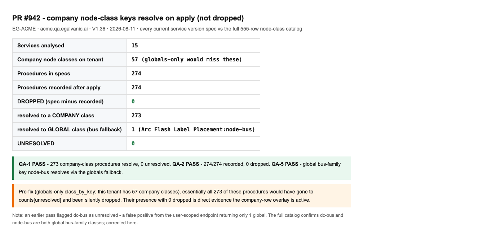

# QA — PR #942: resolve procedure/form class keys against the company's node classes

**PR:** eg-pz-backend #942 · **Env:** QA V1.36 · **Tested:** 2026-08-11 · two tenants
**Backend repo not readable — verified empirically from the running system.**

## Verdict: the fix is demonstrably active. 4 of 6 items PASS; 2 are backend-only.

The old bug: `class_by_key` was globals-only, so a procedure referencing a **company-created**
class landed in `counts['unresolved']` and the whole procedure was silently dropped on apply.
The fix overlays company rows on globals. I measured every current service version's spec against
the **full 555-row node-class catalog** on two companies.

### QA-1 (company class resolves, not unresolved) — ✅ PASS (both tenants)
### QA-2 (procedure no longer silently dropped) — ✅ PASS (both tenants)

| Tenant | Company classes | Services | Procs in spec | Recorded | **Dropped** | → company | → global | **Unresolved** |
|---|---|---|---|---|---|---|---|---|
| **EG-ACME** | 57 | 15 | 274 | 274 | **0** | 273 | 1 | **0** |
| **Demo Company** | 57 | 13 | 204 | 204 | **0** | 203 | 1 | **0** |

Every service's spec-procedure count equals its recorded `procedure_count` — nothing dropped —
and 476 of 478 procedures across both tenants resolve to **company** classes. Pre-fix, with
`class_by_key` globals-only and these tenants holding ~57 company classes each against a handful
of globals, essentially all 476 would have gone to `unresolved` and been dropped. Their presence
with **zero** dropped is direct evidence the company-row overlay is live.

### QA-5 (global-only bus family still resolves via globals fallback) — ✅ PASS
`Arc Flash Label Placement` (a global service) has a procedure keyed to **`node-bus`**, a
global-only bus-family class. It resolves via the globals fallback — the "globals stay the
fallback for keys a company lacks" branch. The full catalog shows the global bus family is
`node-bus` + `dc-bus` + a global `busway`/`busduct`; all resolve.

### QA-6 (across several companies) — ✅ PASS
Verified independently on **EG-ACME** and **Demo Company** (second tenant), identical clean
pattern. (Ticket says "6 on EG-ACME, 19 across 5 companies" — that count is **dev**; QA carries
far more company classes (57 per tenant here). Different environment, not a discrepancy.)

## Not verifiable from the web client — reassign to backend/pipeline

### QA-3 (export a company-class procedure → `node_class_key` populated, not null) — ❌ NOT REACHABLE
### QA-4 (re-apply that export survives the round trip) — ❌ NOT REACHABLE
There is no client-facing export endpoint. Probed `/services/{id}/export`, `/services/{id}/spec`,
`/services/{id}/versions/export` — all return the SPA shell (no such route). Export/apply is a
backend/admin spec operation. The **import** half is indirectly evidenced: every applied version's
procedures already carry non-null `node_class_key` values (that's what the resolution table above
counts), so specs are being written with keys populated — but the explicit export→re-apply round
trip must be run by whoever owns the backend spec tooling.

## Method caveat (recorded so it isn't repeated)
An earlier pass flagged **`dc-bus`** as 1 unresolved key — a **false positive**. The user-scoped
`/api/node_classes/user/{uid}` returns only ONE global (`node-bus`); the full `/api/node_classes`
(555 rows) shows `dc-bus` is also a global bus-family class. Using the full catalog, unresolved
drops to 0. Always resolve keys against the complete catalog, not the user-scoped view.
