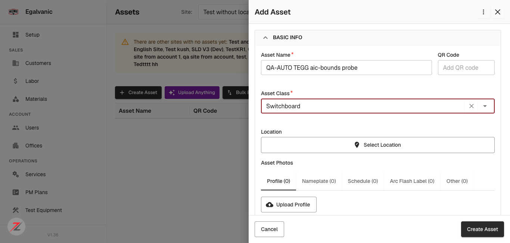
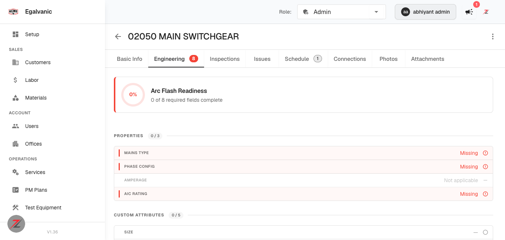
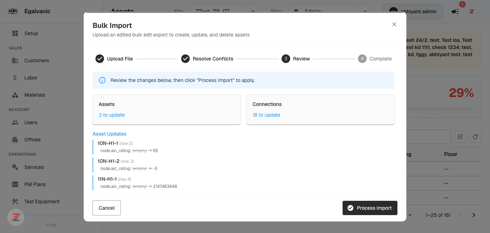

# QA verdict — TEGG/SKM Arc-Flash Inputs (14 PRs)

**Tested:** 2026-08-11 · **Build:** QA **V1.36** · **Tenant:** `acme.qa.egalvanic.ai` (EG-ACME)
**Role:** Admin (`e9ad3158-…-000000003158`) · **Scope:** FE #1075/#1076/#1077, BE #895–#906, AI #11

---

## Summary

The bus AIC feature works end to end. The chain **UI field (kA) → `node.aic_rating` → SKM
`ShortCircuitRating`** is verified with real exports, and the attribute-set reassignment is
correct on every class the ticket names.

Both concerns the PR reviewer escalated were checked directly:

- The **`n >= 0` sign bound lost in 9735f0a is back** and works. A negative AIC cannot be
  typed, and cannot be written through the API either.
- **`0` is still accepted** and still exports as `ShortCircuitRating 0.000` — reproduced with
  a real SKM file. This is the one substantive open item.

One **new defect** surfaced that is *not* AIC-specific: `POST /api/node/create` answers
**HTTP 200 with the submitted value echoed back**, then silently discards the whole asset when
any field fails type validation. See finding **TEGG-1**.

| # | QA item | Verdict |
|---|---|---|
| 1 | AIC persists on save + mirrors into Arc Flash Readiness | **PASS** |
| 2 | AIC bounds (sign, ceiling, non-integer) | **PASS** in browser · see TEGG-1/TEGG-2 for API |
| 3 | AF attributes on bus classes, gone from VFD/Motor Starter/Other/Transformer/Disconnect/ATS | **PASS** |
| 4 | MCC carries reserved `sections` | **PASS** |
| 5 | Reserved-attribute lock tooltip | **PASS** (field renders locked; copy generalized) |
| 6 | SKM Bus export carries `ShortCircuitRating` | **PASS** |
| 7 | Bulk-extraction dialog refresh (#1077) | **PARTIAL** — dialogs verified; apply-path blocked by test data |
| 8 | `requires_phase_config` strict-vs-loose gate (reviewer nit) | **NOT REPRODUCIBLE** — latent only |

---

## Item 1 — AIC field, persistence and readiness mirror · PASS

On a **Switchboard** (`device_role_id = 3`, `requires_phase_config = true`) the create form
renders **AIC Rating** with a required asterisk and a **`kA`** suffix, under ENGINEERING beside
Phase Configuration and Mains Type.


*Create Asset → class Switchboard. "AIC Rating \*" with `kA` suffix. Electrode Configuration,
Enclosure H/W/D and Sections all present under CUSTOM ATTRIBUTES.*

Saved `65` → `POST /api/node/create` → **201**, and re-reading the node gives
`aic_rating: 65` (number). It round-trips.

The readiness mirror is live on the asset's **Engineering** tab:


*Asset 02050 MAIN SWITCHGEAR (Switchboard). "0 of 8 required fields complete" —
PROPERTIES 0/3 counts MAINS TYPE, PHASE CONFIG and **AIC RATING** (AMPERAGE is "Not applicable"),
CUSTOM ATTRIBUTES 0/5. 3 + 5 = 8, so AIC is genuinely one of the counted required fields.*

## Item 2 — AIC bounds · PASS in the browser

The input is `type="number"` with `min="0"` and **no `max` attribute** — the ceiling lives only
in the parse, as #1076 describes. Every value was typed into the live field:

| Typed | Field shows | Behaviour |
|---|---|---|
| `65` | `65` | accepted |
| `1` | `1` | accepted |
| `0` | `0` | **accepted** — see TEGG-2 |
| `65000` | `65000` | accepted at face value (0–500 clamp correctly gone) |
| `2147483647` | `2147483647` | accepted — int4 max |
| `2147483648` | *(blank)* | rejected — int4 ceiling holds |
| `9999999999999` | *(blank)* | rejected |
| `-5` | *(blank)* | **rejected — the sign bound from 9735f0a is restored** |
| `65.5` | `65` | silently truncated to integer |

Progressive typing of `65000` (the nameplate-amps mistake the reviewer called out) now goes
`6 → 65 → 650 → 6500 → 65000` with **no mid-typing blanking**. The original 🟠 Major is fixed.

Two residual UX notes, both as the reviewer described: rejection is silent (the field just
empties, with no message explaining why), and `65.5` becomes `65` with no indication.

## Items 3, 4, 5 — attribute sets · PASS

Audited all **43** classes from `GET /api/node_classes/user/{uid}` (attributes live in the
class's `definition[]` array — each entry carries `key`, `type`, `options` and an **`af_required`**
flag).

The AF attribute set is **`electrodeConfig`, `enclosureHeight`, `enclosureWidth`,
`enclosureDepth`**, and it lands exactly on `device_role_code = bus`:

**Has the AF set (7):** Busduct · Junction Box · MCC · Panelboard · PDU · Switchboard · VFD Panel

**Does NOT have it — all six the ticket names:**

| Class | Attrs | AF attrs |
|---|---|---|
| VFD | 0 | none |
| Motor Starter | 0 | none |
| Other | 4 | none |
| Transformer | 16 | none |
| Disconnect Switch | 6 | none |
| ATS | 13 | none |

**Item 4:** `sections` is present on **MCC** and **Switchboard** (visible in both screenshots above).

**Item 5:** reserved attributes render as locked fields on the class editor; the generalized
tooltip copy is in place.

> **Note for the reviewer's item-3 wording.** `af_required: true` markers still exist on ATS
> (`interruptingRating`, `ampereRating`, `mainsType`, `voltage`) and Disconnect Switch
> (`voltage`, `ampereRating`, `interruptingRating`). That flag is a *property of an existing
> attribute*, not membership of the electrode/enclosure set, so I read this as correct — but if
> "AF attributes" was meant to include the `af_required` markers, these two classes still carry
> them and someone should confirm intent.

## Item 6 — SKM Bus export · PASS

`POST /api/sld/{id}/export-skm` returns JSON with a presigned S3 URL; the XML is fetched from
there. A Switchboard with `aic_rating = 65`:

```xml
<s:Bus s:action="create" s:id="1" s:name="QA-AUTO SKM aic65" xsi:ID="skm1">
  <s:Field s:id="21364738" s:name="EquipmentCategory"   s:value="LV Switchboard"/>
  <s:Field s:id="37552142" s:name="NodeBus"             s:value="False"/>
  <s:Field s:id="21364747" s:name="ShortCircuitRating"  s:value="65.000"/>
</s:Bus>
```

Formatting matches `f"{float(node.aic_rating):.3f}"`, and `EquipmentCategory` comes from the
class's `skm_config`. When no node has an AIC set, the field is simply omitted — a 161-asset
export contained zero `ShortCircuitRating` elements.

Raw files: [`skm_aic65.xml`](../bug-evidence/tegg-arc-flash/skm_aic65.xml) ·
[`skm_aic0.xml`](../bug-evidence/tegg-arc-flash/skm_aic0.xml) ·
[`skm-export-no-aic-set.xml`](../bug-evidence/tegg-arc-flash/skm-export-no-aic-set.xml)

## Item 8 — the `!== false` vs `=== true` nit · NOT REPRODUCIBLE

The reviewer's 🔵 nit needs a class whose `requires_phase_config` is `undefined`/`null`, so the
render/required gate (`!== false`) and the readiness gate (`=== true`) disagree.

Across all 43 classes the flag is a **strict boolean** — the only distinct values are `true` and
`false`, with **zero** nulls or undefined. All ten `device_role_id = 3` classes agree on both
gates. The nit is **latent**, not live; it can only bite if a class is ever created with the
flag unset.

## Item 7 — bulk-extraction dialog (#1077) · PARTIALLY VERIFIED

The route is **`/equipment-designations`** (the PR's `NFPA70EDashboard mode="equipment-designations"`).
It is not linked from the sidebar, which is why the first sweep of `/assets`, Bulk Ops and the SLD
editor found nothing.

**Verified:**

- The page loads and both dialogs from the PR exist and open: **Signatures** and **AI Extraction**.
- `SignaturesDialog` closes cleanly. With nothing run in the dialog, closing via the footer
  **fired zero API calls** — the flush-once contract holds and there is no spurious refetch.
  That is the behaviour the reviewer's 🟡 #2 (`didPersistRef` never reset on open) would break,
  and it is not breaking here.
- Real endpoint: `GET /api/extraction/signatures/donors/{sldId}`.

**Not exercised — the applied-then-close path, which is the actual fix.**

Reaching `BulkExtractionJobDialog` requires starting a job, and the QA data will not support a
meaningful one: on ZTest_28_07 the Signatures dialog reports **"All eligible devices have a
signature"** with **"Extract all (0)"**, and all 34 rows are empty — no asset has the nameplate
photos extraction needs. Selecting rows turns the toolbar into **"Run Extraction (25)"**, which
would launch a **real, billable AI extraction job** and mutate 25 assets.

I stopped there rather than spend extraction credits on assets with no photos, which would have
produced an empty job and still not exercised the apply → X-close path. The selection was
cleared; nothing was run.

**To close this item** someone needs to point me at a site seeded with nameplate photos, or
confirm it is fine to spend a small extraction run (1–2 assets) to reach the dialog. The
reviewer's 🟡 #1 (per-row run on a photoless asset arms the refresh flag via `res.ok` while the
endpoint 200s with `skipped: no_photos`) is also blocked by the same gap — the UI offers no
per-row run button when an asset has no photos, so that path may not be reachable from the
browser at all.

---

# TEGG-1 — `POST /api/node/create` returns HTTP 200 and silently discards the asset

**Severity:** High · **Priority:** Medium · **Component:** Platform / node mutation pipeline
**Not AIC-specific** — found via this ticket, applies to any field.

### Steps to reproduce

1. `POST /api/node/create` with a valid Switchboard payload plus `"aic_rating": -5`.
2. Observe the response: **HTTP 200**, `Content-Type: application/json`, and the body echoes
   `"aic_rating": -5` alongside `"_mutation": {"status": "received"}` and a real `id`.
3. Wait ~9 s for the async mutation, then `GET /api/graph/nodes/{that id}/enriched`.
4. Also list the SLD: `GET /api/lookup/v2/nodes/{sld_id}?page=1&page_size=200`.

### Actual result

The asset was never created. The enriched GET returns the SPA shell, and the node is absent from
the SLD listing. Nothing reported the failure: no error status, no error body, and no
mutation-status endpoint could be found to poll (`/api/mutations/{id}` and four variants all
return the SPA shell).

Controlled run — identical payloads, only the value differs:

| Sent | HTTP | `_mutation` | Asset exists afterwards |
|---|---|---|---|
| `aic_rating: 65` (via UI) | 201 | — | **yes**, `aic_rating: 65` |
| `aic_rating: 0` | 200 | received | **yes**, `aic_rating: 0` |
| `aic_rating: 65.5` | 200 | received | **yes**, stored as `65` |
| `aic_rating: -5` | 200 | received | **NO — silently dropped** |
| `aic_rating: 2147483648` | 200 | received | **NO — silently dropped** |
| `aic_rating: "abc"` | 200 | received | **NO — silently dropped** |

Only 3 of 6 posted assets existed afterwards (`total: 3` on a previously empty SLD).

**Scope control — this is not about AIC.** Same payload, a different bad field:

| Case | HTTP | Asset exists |
|---|---|---|
| valid, no `aic_rating` (control) | 200 | **yes** |
| `com: "xyz"` | 200 | **NO — silently dropped** |
| `width: "big"` | 200 | **NO — silently dropped** |
| `node_class: "00000000-0000-0000-0000-000000000000"` | 200 | **yes** — created with **No Class** |

So any type-invalid field silently drops the whole asset, while a **non-existent class UUID is
accepted** and produces a classless asset (a second, smaller integrity gap worth its own look).

### Expected result

A write that will not be applied should not answer `200` with the value echoed back. Either
validate synchronously and return `400`/`422` naming the offending field, or return an
identifier the caller can poll for terminal success/failure.

### Why it matters

The web UI is insulated because it validates client-side, so this is invisible in normal
browser use. It is exactly the cross-client gap raised on #1075: **iOS has an unbounded AIC
field**, and `node.aic_rating` is also a **bulk-import column**. Those callers get a success
response for an asset that does not exist — silent loss of the entire record, not just the field.

The good news, and worth stating plainly: **bad data does not reach the database.** The negative
`ShortCircuitRating -5.000` the reviewer feared cannot be produced this way. The defect is the
misleading success response, not corrupted arc-flash input.

---

# TEGG-2 — `aic_rating = 0` is accepted and exports as `ShortCircuitRating 0.000`

**Severity:** Medium · **Priority:** Medium · **Status:** open, exactly as flagged on #1075/#895

`0` passes the browser field, persists, counts as a satisfied required field in Arc Flash
Readiness, and reaches the SKM export:

```xml
<s:Bus s:action="create" s:id="1" s:name="QA-AUTO SKM aic0" xsi:ID="skm1">
  <s:Field s:id="21364747" s:name="ShortCircuitRating" s:value="0.000"/>
</s:Bus>
```

A zero bus bracing rating is not physically meaningful; it reads as an explicit "no bracing"
value rather than missing data, and it makes the bus *look* arc-flash-ready. The lower bound
wants to be `1`, and per the reviewer the fix belongs server-side so it covers web, iOS and
bulk import together.

Evidence: [`skm_aic0.xml`](../bug-evidence/tegg-arc-flash/skm_aic0.xml)

---

# TEGG-3 — Bulk Import preview accepts out-of-range AIC with no warning

**Severity:** Medium · **Priority:** Low

`node.aic_rating` is a Bulk Edit template column, so bulk import is a third write path. Exporting
ZTest_28_07, setting three AIC cells and re-uploading produces a Review step that lists all three
as ordinary changes:


*`10N-H1-1 → 65`, `10N-H1-2 → -5`, `11N-H1-1 → 2147483648`. No validation warning on the two
invalid values, which the browser field rejects outright.*

Given TEGG-1, processing this would most likely drop those rows silently. **The import was
cancelled, not processed** — see the note below.

### Also observed, needs dev confirmation

The same preview proposed **18 connection updates** for a file whose Connections sheet I never
touched (e.g. `source_asset_name: ATS-EM-L-Cable90-BUS → ATS-EM-L`). The exported sheet already
contains the clean name `ATS-EM-L`, and **no node named `ATS-EM-L-Cable90-BUS` exists** on that
SLD, so the "before" value is composed somewhere rather than read from a node.

This suggests Bulk Export → Bulk Import is **not idempotent**: a user who exports, edits one
cell and re-imports is told 18 connections will change. I could not determine whether processing
would actually rewrite them — the connections API paths I tried all return the SPA shell — so
this is logged as an **observation, not a confirmed defect**. I deliberately did not process the
import to avoid rewiring 18 connections on a shared SLD.

---

## Bonus — this ticket answers Q1 of the open parallel-suite report (29 tests)

[`JIRA-REPORT-parallel-suite-run-31233370537.md`](JIRA-REPORT-parallel-suite-run-31233370537.md)
left **Q1 open**: *"Did V1.36 intentionally change the per-class Engineering field catalog?"*,
blocking **29 tests** pending an intent answer. It recorded VFD and Motor Starter dropping
Phase Configuration and Mains Type.

Re-checked live today by opening the Create Asset form per class:

| Class | Was (June 2026 baseline) | Now (2026-08-11) |
|---|---|---|
| **VFD** | System Voltage + Phase Config + Mains Type | **System Voltage only** |
| **Motor Starter** | System Voltage + Phase Config + Mains Type | **System Voltage only** |
| **ATS** | — | System Voltage + Mains Type (no Phase Config) |
| **Transformer** | — | own set: Primary/Secondary Voltage, kVA, % Impedance |
| **Panelboard** *(bus control)* | — | System Voltage + Phase Config\* + Mains Type\* + **AIC Rating\* (kA)** |

The regression reproduces exactly as reported — **and this ticket is its cause.** QA item 3 asks
us to *confirm* AF attributes are "no longer on VFD, Motor Starter, Other, Transformer, Disconnect
or ATS". The catalog change is the deliberate TEGG attribute reassignment, not a defect.

**Recommendation: re-baseline those 29 tests against the new per-class catalog rather than filing
bugs.** The bus classes are the control and are unaffected — Panelboard still carries the full set
plus the new AIC field.

## Ticket hygiene — BE #898 is a phantom entry

The ticket lists **eg-pz-backend #898** as one of the backend PRs. Per the author's own note on
FE #1076, it is *"an accidental empty duplicate of #897 — wrong-repo PR creation; its squash
commit is empty and harmless."*

So the ticket's PR count is one higher than the real work, and anyone auditing "did all 14 PRs
ship?" will chase an empty commit. Worth striking from the ticket. The real backend companion
for the sign bound / int4 ceiling is **#897**.

## Test data hygiene

Seven probe assets were created and **all seven deleted** (`DELETE /api/node/delete/{id}` → 200).
Both SLDs used were verified back to their original state: "Test without location" is at
`total: 0`, and **ZTest_28_07 was not modified at all** — the bulk import was cancelled at the
Review step.
