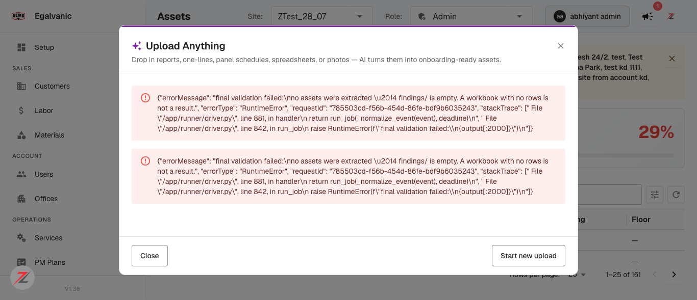
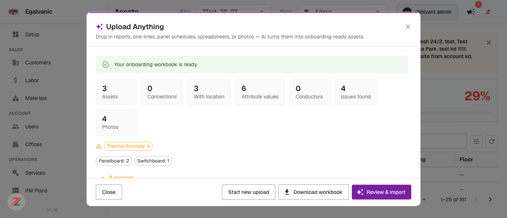
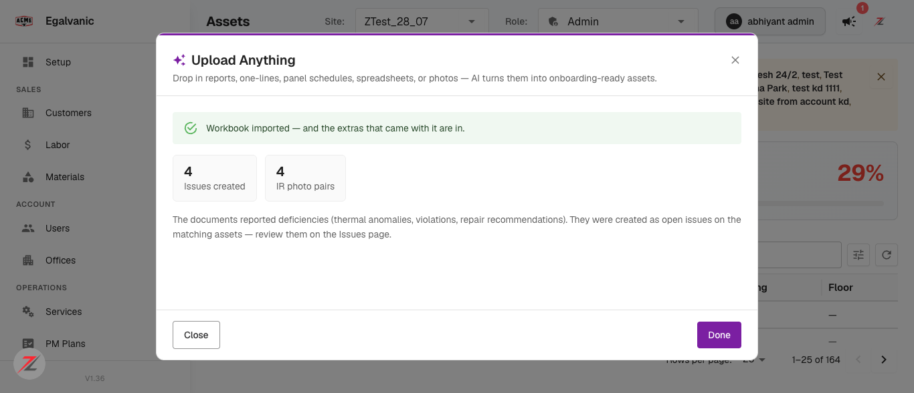
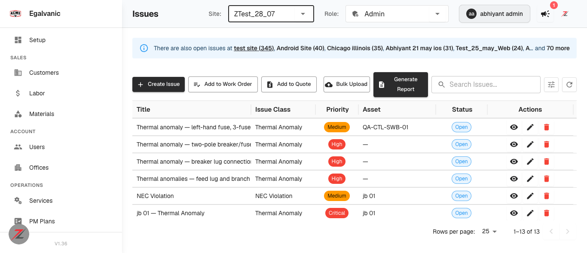
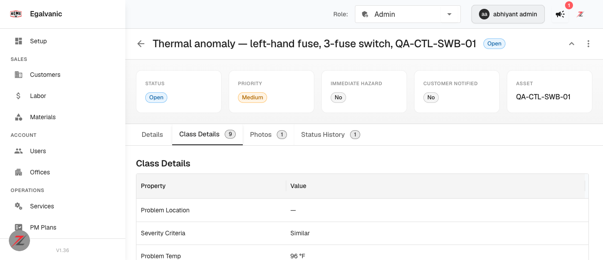
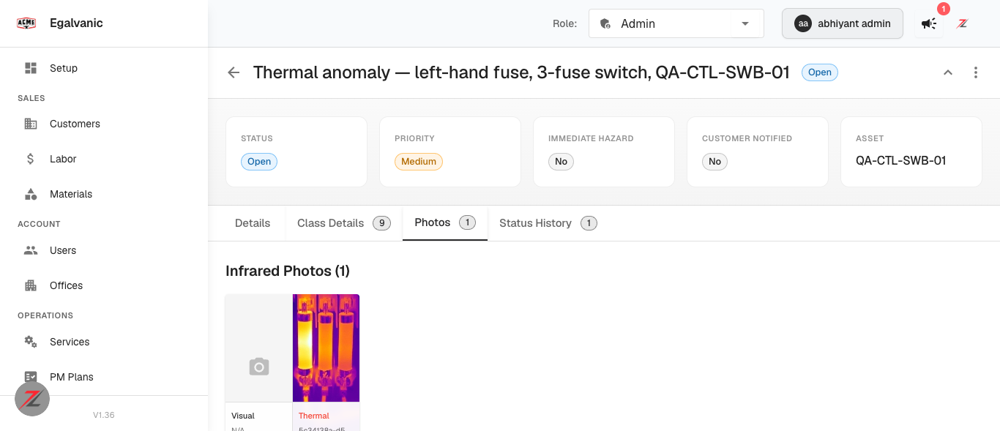

# QA verdict — Upload Anything: extract issues and photos (incl. IR pairs)

**Tested:** 2026-08-12 · **Build:** QA **V1.36** · **Tenant:** `acme.qa.egalvanic.ai` (EG-ACME)
**PRs:** eg-pz-engineering-ai-pipeline #38 · eg-pz-backend #958 · eg-pz-frontend #1129
**Inputs:** real FLIR radiometric JPEGs supplied by the repo owner (`testcase/IR_video/IR_FLIR/`)

---

## Summary

The feature works. Issues and photos are extracted, land on import, link to both node and issue,
and carry the class-definition-shaped details array. Verified end to end against **real thermal
imagery**, not synthetic fixtures.

**One real defect (SD-A, High):** a run that produces extras but **zero assets** is rejected by
final validation, and the already-extracted issues and photos are **discarded**. Whether a thermal
photo yields assets is an AI judgment call, so the same class of input succeeds or fails
non-deterministically.

**One UX defect (SD-B, Medium):** that failure surfaces to the user as a **raw Python stack trace**,
rendered twice.

| # | QA item | Verdict |
|---|---|---|
| 1 | Extras land; counts + per-issue-class chips on results screen | **PASS** |
| 2 | Issues carry the class-definition-shaped details array | **PASS** |
| 3 | IR pairs link to both node and issue | **PASS** |
| 4 | Unresolvable asset ref skips with a warning, doesn't block import | **PASS** (observed) |
| 5 | Force the extras pass to fail; retire still happens | **NOT OBSERVABLE** |
| 6 | Call `imported` twice; idempotency guard holds | **PASS** |
| 7 | Checkbox gated by `doc_extraction_extras`, defaults ON | **PASS** (gate-on half) |
| 8 | AI tier mapping advanced→opus-5, ultimate→fable-5, metering | **NOT OBSERVABLE** |
| 9 | TEGG shim parses long/short/summary, joins by tag id | **NOT OBSERVABLE** |
| 10 | HEIC rejected at validation; HEIC dumps convert | **NOT TESTED** — see note |
| 11 | en + fr strings | **NOT TESTED** — see note |

---

## How this was tested

Two runs on `ZTest_28_07`, plus one run by the repo owner on `Test franchb`:

| Run | Input | Assets | Issues | Photos | Outcome |
|---|---|---|---|---|---|
| **A** (mine) | 4 FLIR JPEGs only | **0** | 4 | 4 | **FAILED** — extras discarded |
| **B** (mine, control) | same 4 FLIR JPEGs **+ 3-row equipment CSV** | 3 | 4 | 4 | **succeeded**, imported |
| **C** (owner) | `IR_0199.jpg` only, all 3 checkboxes | **3** | 1 | 1 | **succeeded**, imported |

Runs A and B differ by **one variable** — the presence of an asset-bearing CSV — with the same four
images. Run C is the decisive counter-example that narrowed the defect (see SD-A).

Extraction takes **11–17 minutes** for 1–5 files. Worth knowing for anyone scheduling this work.

---

# SD-A — a run with extras but zero assets is rejected, and the extras are thrown away

**Severity:** High · **Priority:** High · **Component:** AI pipeline final validation

### What happens

Run A uploaded four FLIR thermal images with "Extract issues & photos" ON. The agent completed its
work and self-verified:

> *"0 asset rows, 0 connections, **4 issues, 4 photos shipped**, matching what I extracted.
> Nothing looks wrong."*

The pipeline then killed the job:

```
final validation failed:
no assets were extracted — findings/ is empty. A workbook with no rows is not a result.
  File "/app/runner/driver.py", line 881, in handler
  File "/app/runner/driver.py", line 842, in run_job
```

Four issues and four photos were successfully extracted and then discarded. The user gets a failed
job, no results screen, and nothing landed — after an 17-minute wait.


*The failure as the user sees it. Note also SD-B below.*

### Why it is not simply "photo-only uploads are unsupported"

My first reading was that photo-only uploads are categorically rejected. **The repo owner's run C
disproves that** and is what makes this finding precise.

Run C uploaded a *single* thermal image (`IR_0199.jpg`) with no document at all — and it
**succeeded**, because the agent derived three assets *from the photo itself*:

```
Left Fuse (IR_0199)    class Fuse
Center Fuse (IR_0199)  class Fuse
Right Fuse (IR_0199)   class Fuse
```

with the issue *"Thermal anomaly — left fuse of three-fuse assembly"* correctly attached to
**Left Fuse (IR_0199)**. Verified in the API against site `Test franchb`.

So the rule is not about file types. It is:

> **A run is rejected whenever the extraction yields zero assets — and whether a thermal photo
> yields assets is an AI judgment call.**

Run C's image showed three cleanly separated cartridge fuses, so the agent named them. Run A's
images were dense panelboard interiors where the agent explicitly declined to invent equipment
(*"none matches confirmably… left unattached — please confirm which panel(s) are shown"*). That
caution is **correct behaviour** — and it is precisely what causes the job to be thrown away.

The perverse incentive is worth stating plainly: the agent is punished for being honest. Had it
guessed at asset identities, the job would have succeeded.

### Expected

A run that produced issues and/or photos is a result. Either let final validation pass when
`issues + photos > 0`, or fail early — before spending 17 minutes — with a message explaining that
no assets could be identified and offering to keep the extras.

### Scope note

This lives in the AI pipeline's final validation (`driver.py`), which predates this ticket. The
extras feature appears not to have updated the guard. I could not read
`eg-pz-engineering-ai-pipeline` to confirm.

---

# SD-B — the failure is shown to the user as a raw Python stack trace, twice

**Severity:** Medium · **Priority:** Medium · **Component:** Upload Anything dialog

On failure the dialog renders the raw exception payload — `errorMessage`, `errorType`, `requestId`
and a `stackTrace` containing `/app/runner/driver.py` paths and line numbers — **rendered twice**,
with no human-readable message, and no mention of the 4 issues and 4 photos that were successfully
extracted before the failure.

See the screenshot under SD-A. Internal file paths and line numbers should not reach an end user,
and a customer-facing dialog should say what went wrong in plain language.

---

## Item 1 — extras land, with counts and per-issue-class chips · PASS

Run B's results screen:


*`3 Assets · 0 Connections · 3 With location · 6 Attribute values · 0 Conductors ·` **4 Issues found**
`·` **4 Photos**, with the per-issue-class chip **Thermal Anomaly: 4** alongside the asset-class chips
Panelboard: 2 / Switchboard: 1, and an expandable **8 warnings**.*

Job counts confirmed the same server-side:

```json
{ "issues": 4, "photos": 4, "ir_photos": 4,
  "issues_by_class": { "Thermal Anomaly": 4 },
  "by_class": { "Panelboard": 2, "Switchboard": 1 }, "total_assets": 3 }
```

After **Review & import** → `POST /bulk-edit/process` then `POST /onboarding/jobs/{id}/imported`,
the confirmation phase appears exactly as #1129 describes:


*"Workbook imported — and the extras that came with it are in." · **1 Issues created** · **1 IR photo
pairs** (run C shown) · with the Issues-page pointer. Run B showed 4 / 4.*

And the issues are really there:



## Item 2 — class-definition-shaped details array · PASS

Opening the issue attached to `QA-CTL-SWB-01` shows tabs **Details · Class Details (9) · Photos (1)
· Status History (1)**. The Class Details tab renders the Thermal Anomaly class's nine properties as
Property/Value rows:



| Property | Value |
|---|---|
| Severity Criteria | Similar |
| **Problem Temp** | **96 °F** |
| **Reference Temp** | **90 °F** |
| Problem Location · Delta T · Severity · Current Draw (A) · Current Rating (A) · Voltage Drop (mV) | — |

The AI populated only what the image supports, and said so in the description: *"approx. 96°F vs.
~89–90°F reference, estimated by sampling the image's printed thermal color scale (25.5–36.3°C)
since no digital spot reading was placed on the fuse itself."* Status history was created too.

## Item 3 — IR pairs link to both node and issue · PASS

The `ir_photos` row carries **both** foreign keys:

```json
{ "id": "5c34138a-…", "ir_photo_key": "5c34138a-….jpg",
  "issue_id": "4b2576de-…",                        ← the issue
  "node_id":  "2e3d8c88-…",                        ← QA-CTL-SWB-01
  "ir_session_id": "8d8757c3-…",  "sld_id": "1e1d7a5a-…",
  "visual_photo_key": null }
```


*"Infrared Photos (1) — Visual: N/A, Thermal: 5c34138a-….jpg". `photos_created: 0`,
`ir_photos_created: 4` — the IR bucket, not the standard photo bucket, as intended.*

> **Terminology note.** The UI counts these as "IR photo **pairs**", but `visual_photo_key` is
> `null` and the UI shows *Visual — N/A*. That is correct for these inputs (the FLIR files are
> IR-only: a single JPEG stream with no embedded visual image, verified by parsing the APP1
> segments), but "pair" implies two halves where only one exists. Consider "IR photos" when no
> visual is present.

## Item 4 — unresolvable asset refs · PASS (observed in passing)

Three of run B's four issues could not be tied to an asset — the agent warned that the panelboard
photos carry *"no visible nameplate or label… left unattached to a specific asset"*. Those issues
were still **created**, left unattached, the warnings surfaced in the 8-warning list, and the
**import was not blocked**. The fourth attached by inference to `QA-CTL-SWB-01`, with the inference
disclosed as a warning.

## Item 6 — `imported` idempotency · PASS

Called `POST /api/onboarding/jobs/{id}/imported` a **second** time after a successful import:

| | Before | After |
|---|---|---|
| status | `imported` | `imported` |
| `counts.extras_result` | `{issues_created: 4, ir_photos_created: 4, photos_created: 0}` | **identical** |

Returned **200** with the cached extras result rather than re-applying. The status-flip guard holds;
no duplicate issues were created.

## Item 7 — feature gate · PASS (gate-on half)

`feature-doc-extraction-extras = True` for EG-ACME (confirmed in the LaunchDarkly evaluation — all
35 flags true). The **"Extract issues & photos"** checkbox is present and **defaults ON**, while
"Include connections" defaults OFF, matching the ticket. Copy names the use case: *"thermal
anomalies, violations, repairs… including IR image pairs."*

**Not verified:** that the checkbox *disappears* for a company without the feature. EG-ACME holds
every flag, so the off-state cannot occur naturally here. It is reproducible by intercepting the
LaunchDarkly response (the technique used for the EG Forms ticket) — say the word and I will.

---

## Items not observable from the client

These are backend/pipeline-internal and I have **no read access** to `eg-pz-backend` or
`eg-pz-engineering-ai-pipeline`. Listing them honestly rather than implying coverage:

- **Item 5 — force the extras pass to fail, confirm the retire still happens.** Requires injecting a
  failure inside the `imported` handler. Not reachable from a browser.
- **Item 8 — AI tier mapping** (`advanced`→opus-5, `ultimate`→fable-5, default sonnet-5) **and usage
  metering recording the resolved model.** Neither the company's `model_tier` nor the resolved model
  appears in any client-visible payload I found.
- **Item 9 — the repaired TEGG shim** (long/short/summary in one call, join by tag id, save the short
  form's embedded photos). Requires a TEGG-format document; none available, and the parse is
  internal to the pipeline.
- **Item 10 — HEIC.** Rejection at validation is client-observable in principle, but the Upload
  Anything button is **job-aware and disables to "Extracting…" while a job runs on that site**, which
  blocked the attempt during my runs. The pillow-heif conversion half is pipeline-internal. Worth a
  short dedicated pass.
- **Item 11 — en + fr strings.** No language switcher was located in the app; the fr bundle is likely
  only reachable by changing the account/browser locale.

---

## Two smaller observations

- **"Start new upload" retains the previous job's files.** After the failed run I clicked *Start new
  upload* and added 1 file; the dialog showed **5** — the 4 previous images plus mine. A user
  starting over would expect a clean slate. (It made a cleaner control for me, but it is still
  surprising.)
- **Deleting an asset leaves its issues behind pointing at it.** After deleting `QA-CTL-SWB-01`, its
  issue still lists `QA-CTL-SWB-01` in the Asset column. Cosmetic, but the reference is dangling.

## Test data — action needed

- **Assets:** 3 `QA-CTL-*` assets created on `ZTest_28_07` and **deleted** (161 → 164 → 161 ✓).
- **Issues:** **4 thermal-anomaly issues remain on `ZTest_28_07`** and I could not remove them:

  ```
  Thermal anomaly — left-hand fuse, 3-fuse switch, QA-CTL-SWB-01
  Thermal anomaly — two-pole breaker/fuse position (IR_0245)
  Thermal anomaly — breaker lug connection (IR_0216)
  Thermal anomalies — feed lug and branch breaker terminal, unidentified panelboard (IR_0018)
  ```

  `DELETE /api/issue/{id}` returns **405**; `PUT /api/issue/{id}/delete` returns 200 but with the
  SPA shell (a masked 404), and the issues remain. The row action menu did not open under
  automation. Rather than keep guessing at routes — the trap this codebase punishes — I stopped and
  am flagging it. They are clearly labelled and safe to leave, but should be removed by hand or with
  the correct route.
- Run C's data on `Test franchb` (3 Fuse assets + 1 issue) was created by the repo owner and left
  in place.
