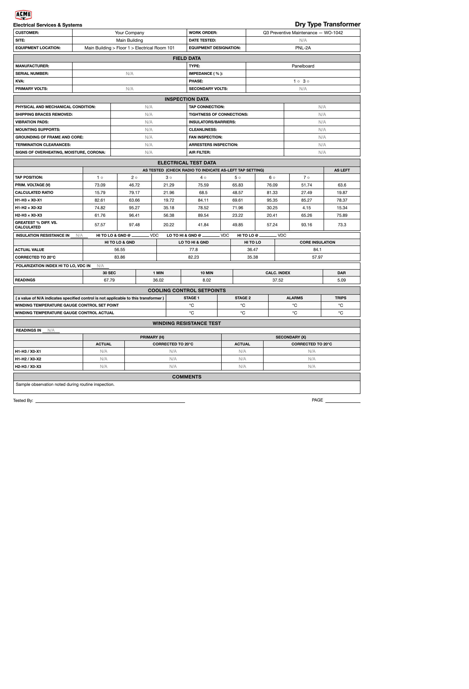
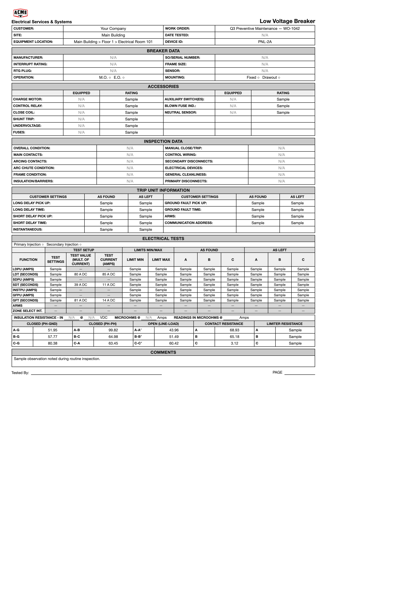

# EG Forms v2.1 (PowerDB carbon-copy) — QA verification: **PRESENT and RENDERING**

**Checked:** 2026-08-14 · **Build:** QA **V1.36** · **Tenant:** `acme.qa.egalvanic.ai`
**Ticket:** *EG Forms v2.1: renderer + builder support for PowerDB carbon-copy constructs* — PR **eg-pz-frontend #1079** (merged into `cicd/dev`), companion backend **#905**, iOS **#412**.
**Question asked:** "check the carbon-copy one is there now."

---

## Answer

**Yes — it is live on QA.** All **7** PowerDB carbon-copy forms are seeded, every v2.1 construct is present in their definitions, the definitions honor the contracts the PR pinned, and the app's renderer draws the full carbon-copy layout correctly. I found **no defect** in the shipped carbon-copy forms.

I did not take this on trust (this repo has a history of "dev-only, not in QA yet" notes being stale). Every claim below was pulled from the live QA API or rendered in the live QA app.

## 1. Presence — the 7 forms are on QA

Filtered the EG Forms library (and `GET /api/eg-forms`, 358 forms) to "PowerDB":

| # | Form (type 70B) | Asset Class | v2.1 constructs in its definition |
|---|---|---|---|
| 1 | Dry Type Transformer (PowerDB) | Transformer | option_sets, column_groups, pairs_per_row, meta_fields, density |
| 2 | Switchgear / Switchboard (PowerDB) | Switchboard | option_sets, column_groups, pairs_per_row, meta_fields, density |
| 3 | Low Voltage Breaker (PowerDB) | Circuit Breaker | option_sets, column_groups, pairs_per_row, **disabled_cells**, meta_fields, density |
| 4 | Molded Case CB — Thermal/Magnetic (PowerDB) | Circuit Breaker | option_sets, column_groups, meta_fields, density |
| 5 | Medium Voltage Switch (PowerDB) | Disconnect Switch | option_sets, pairs_per_row, meta_fields, density |
| 6 | Panelboard (PowerDB) | Panelboard | option_sets, pairs_per_row, meta_fields, density |
| 7 | Low Voltage Disconnect Switch (PowerDB) | Disconnect Switch | option_sets, pairs_per_row, meta_fields, density |

The PR's "7 seeded PowerDB carbon-copy forms (transformer, switchgear, panelboard, MV switch, LV disconnect, LV breaker, thermal-mag MCCB)" — all 7 accounted for.

## 2. Structural integrity — the seeds honor the pinned contracts

Audited all 7 definitions against the exact issues the PR reviewers raised and fixed:

| Check (from the PR review thread) | Result across all 7 forms |
|---|---|
| Every `options_ref` resolves to a root `option_sets` key | ✅ 0 dangling refs |
| Every `option_sets` value is an array (Array.isArray guard) | ✅ 0 malformed |
| `column_groups` **never** on a `key_value` table (banned + auto-stripped per the PR) | ✅ 0 violations (13 key_value tables checked) |
| `option_sets` referenced actually used | ✅ refs == defined keys on every form |

So the contract the reviewers pinned ("column_groups invalid on key_value") holds in the shipped seed data, and there are no dangling option references that would render an empty picker.

## 3. Renderer — the carbon-copy layout draws correctly

Opened two forms in the app's own preview (`EgFormPreviewDialog` → `EGFormRendererV2`), on QA, non-destructively (no instance created). Both rendered the full NETA/PowerDB carbon-copy sheet with every construct working:

**Dry Type Transformer** (`docs/bug-evidence/egforms-powerdb-carbon-copy/transformer-carbon-copy-rendered.png`):
- `column_groups` nested bands — "AS TESTED (check radio to indicate as-left tap setting)" over the tap columns; "PRIMARY (H) / SECONDARY (X)" each over "Actual / Corrected to 20°C"; "Stage 1 / Stage 2 / Alarms / Trips"
- `radio` cells — Phase `1○ 3○`, Tap Position `1○–7○`
- `pairs_per_row` key-value grids — FIELD DATA, INSPECTION DATA
- `meta_fields` caption strips with units — "Insulation Resistance in [N/A] @ VDC", "Polarization Index HI to LO, VDC in [N/A]"
- `density: compact` — the tight multi-column tables

**Low Voltage Breaker** (`docs/bug-evidence/egforms-powerdb-carbon-copy/lvbreaker-carbon-copy-rendered.png`):
- `disabled_cells` — the `ARMS` and `ZONE SELECT INT.` rows render as gray, non-editable `—` across every column (calc-exempt)
- carbon-copy `column_groups` — ACCESSORIES (`EQUIPPED/RATING` ×2), TRIP UNIT (`CUSTOMER SETTINGS / AS FOUND / AS LEFT` ×2), ELECTRICAL TESTS (`TEST SETUP → Settings/Value/Current`, `AS FOUND → A/B/C`, `AS LEFT → A/B/C`)
- `radio` cells — Operation `M.O.○ E.O.○`, Mounting `Fixed○ Drawout○`

### Screenshots — rendered on live QA

**Dry Type Transformer (PowerDB)** — column_groups nested bands, radio tap row, pairs_per_row, meta_fields unit strips:

**Low Voltage Breaker (PowerDB)** — carbon-copy column_groups, disabled_cells (gray `—` on ARMS / ZONE SELECT INT.), radio cells:

## Not bugs (called out to prevent confusion)

- **Sample-data genericness.** The preview's "Regenerate sample data" fills synthetic context, so the Transformer preview shows `TYPE: Panelboard` / `DEVICE ID: PNL-2A` and "Sample"/"N/A" placeholders. That is illustrative preview data, **not** a form-definition defect — the form's own `node_class_names` is correctly `["Transformer"]`.

## Not independently re-tested (scope note)

- **The live required-field Submit gate** (the calc-locked exemption — the 🟠 Major fixed in review round 2) is client-side logic that ships in `egFormRendererShared.js`; the PR included a 14/14 proof harness and the reviewer verified the cell context matches the renderer byte-for-byte at all four `renderCell` call sites. Re-testing it live requires **creating a form instance** on a work order and submitting — a mutation with cleanup cost — so I verified the *forms and renderer* here, not that one gate at runtime. Flag if you want me to spin up a throwaway instance and exercise Submit.
- **iOS parity** (companion #412) — out of scope for a web check.

## Method

- `GET /api/eg-forms` on QA (bearer auth, acme subdomain); scanned all 358 forms for the six construct tokens; deep-audited the 7 PowerDB definitions for dangling refs / malformed option_sets / column_groups-on-key_value.
- Rendered two forms via the app's preview dialog on live QA; extracted the renderer's own output HTML and captured it with headless Chrome (the in-app screenshot path times out on the live socket).
- Evidence: `docs/bug-evidence/egforms-powerdb-carbon-copy/` (two PNGs + the two rendered-HTML captures).
