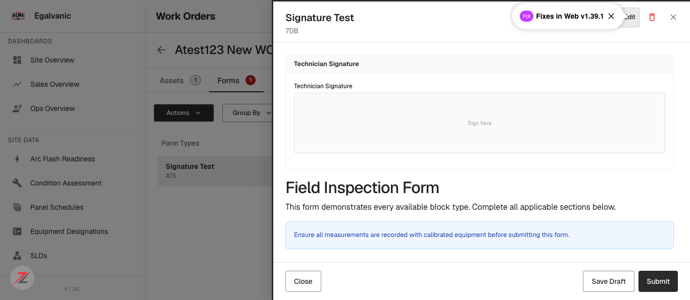
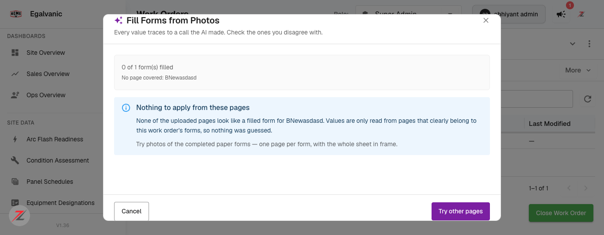

# QA verdict — Fill Forms from Photos: form-fill job API + decision review dialog

**Tested:** 2026-08-14 · **Build:** QA **V1.36** · **Tenant:** `acme.qa.egalvanic.ai` (EG-ACME)
**PRs:** eg-pz-backend #977 · eg-pz-frontend #1151 (merged 2026-08-07) · pipeline ZP-3662 (#40)
**Work order:** `465df0c4` *Atest123 New WO* (IR) · form instance `78709624` *Signature Test* on asset *BNewasdasd*

---

## Summary

The feature works end to end. A photographed sheet was read, matched to the right form on the
right asset, and **9 values were applied** with correct type handling — a label mapped to its
option key, a number stored as a number, a date parsed. Decisions carry per-page pixel bounding
boxes, and apply-side validation refused a bad value with an exemplary message.

**Three defects**, one of which defeats the ticket's own stated safety requirement.

| # | QA item | Verdict |
|---|---|---|
| 1 | Upload pages → job starts, completes, applies | **PASS** |
| 2 | Same flow from attachments already on the work order | **NOT TESTED** |
| 3 | Multi-page PDF routes by page count, not file count | **PARTIAL** |
| 4 | Hover a decision row → bbox lights on the right page/source | **PASS** (data) / **NOT TESTED** (hover) |
| 5 | Accept, reject, cycle through multiple sources | **NOT TESTED** |
| 6 | Unread value → typed input matches the field definition | **FAIL** — see FF-3 |
| 7 | Apply validates against the form's field index | **PASS** |
| 8 | Dialog opens from both Forms tab and Assets tab | **PASS** |
| 9 | Tenancy — foreign work order unreachable on any handler | **PASS** |
| 10 | Polling terminates on 4xx, failure cap, wall clock | **FAIL** — see FF-1 |

---

# FF-1 — Two of the three polling guards cannot fire; a forgotten job polls for 45 minutes

**Severity:** High · **Priority:** High · **Component:** `formFillJobService.pollJob`

The PR states the requirement plainly: *"a job the server has forgotten cannot spin forever"*,
with three exits — a terminal 4xx, a consecutive-failure cap, and a wall clock. On QA **only the
wall clock works**.

### Why

`getStatus()` keys the terminal branch on the HTTP status:

```js
if (response.status >= 400 && response.status < 500) { err.terminal = true; throw err; }
const data = await response.json().catch(() => ({}));
if (!response.ok) throw new Error(...);
```

On this host a missing or foreign job does **not** return 4xx. Measured:

| Request | Expected | **Actual on QA** |
|---|---|---|
| status of a nonexistent job id | 404 | **200 · `text/html`** |
| status of a malformed job id | 4xx | **200 · `text/html`** |
| status of a real own job *(control)* | 200 JSON | 200 · `application/json` ✓ |

So the terminal branch is skipped (status is 200), `response.json()` throws on HTML and is
swallowed by `.catch(() => ({}))`, and `response.ok` is **true** — so nothing throws.

I ran `getStatus()` exactly as shipped against a nonexistent job. It **returns `{}`**.

### Consequence in `pollJob`

`{}` is treated as a **successful poll**:

```js
data = await this.getStatus(jobId);
failures = 0;            // ← the consecutive-failure cap is reset by the very case it exists for
wait = intervalMs;       // ← backoff reset
...
if (data && this.isTerminal(data.job?.status)) return data;   // isTerminal(undefined) === false
if (Date.now() > deadline) throw ...                          // only after 45 minutes
```

A forgotten, deleted or foreign job therefore polls every **2.5 s for the full 45-minute
ceiling — roughly 1,080 polls**, each one (per the author's own comment) *"a DescribeExecution
plus a paginated DynamoDB query"*. That is the exact load the author's flapping-endpoint comment
set out to avoid, and the exact user-facing symptom ("running" forever) the 4xx guard was written
to prevent.

Bounded in practice by `shouldStop()` when the dialog closes — but the requirement is about the
job being gone, not the dialog being open.

### Fix direction

Treat a non-JSON body as terminal, not transient — the content type is the reliable signal here,
not the status code. This is the platform-wide masked-404 behaviour (unknown `/api/` paths return
200 + the SPA shell); any client keying on 4xx has the same hole.

---

# FF-2 — A multiselect loses ticked options: two read, one written

**Severity:** Medium-High · **Priority:** High · **Component:** proposal → apply

The sheet ticked **two** of four boxes. The model read both correctly — its own decision says so:

```json
{ "id": "d4", "kind": "reading", "confidence": "high",
  "summary": "Two of four test checkboxes ticked (Visual Inspection, Thermography); …",
  "affects": [ { "label": "Tests Performed",
                 "path": "general_info.tests_performed",
                 "type": "multiselect",
                 "value": "visual_inspection" } ] }     ← ONE entry, scalar string
```

The proposal itself flags the collision:

```
warnings: ["BNewasdasd: `general_info.tests_performed` written twice (decisions d4 and d4)"]
```

And the applied value is a **scalar**, not an array:

```json
"general_info.tests_performed": "visual_inspection"
```

**Thermography is silently dropped.** For a `multiselect` whose field index defines four option
keys, the value should be a list. Note the warning names *"decisions d4 and d4"* — the same
decision twice — so two writes from one decision collapse onto the same path and the last one
wins instead of merging.

This is silent loss of inspection data: a technician ticks four tests, one lands. It is only
visible if someone reads the warnings array.

---

# FF-3 — Option fields in questions/gaps ship without their options, so the typed input cannot be a real picker

**Severity:** Medium · **Priority:** Medium · **Component:** proposal contract → review dialog
**This is QA item 6.**

The ticket requires: *"Where the model could not read a value, the question renders as a typed
input built from the field's own definition — an option field is a picker, a number field takes
numbers."*

The descriptor the dialog is handed for those questions **omits the options**:

```json
questions[0].fields[0] = { "label":"Verdict", "path":"verdict.verdict",
                           "section":"Verdict", "type":"select", "unit":null }
```

Every key present — no `options`. Same for the `gaps` entries. Yet `field_index`, in the same
payload, carries them for the identical path:

```json
field_index["verdict.verdict"] = { "type":"select",
  "options":[{"key":"pass"},{"key":"pass_with_conditions"},{"key":"fail"}] }
```

So `type` alone tells the dialog *"render a picker"* while giving it nothing to populate it with,
unless it cross-references `field_index` by path.

**Observed symptom consistent with it not doing so:** the value that reached apply for that field
was **`'Verdict'` — the field's own label**, which is what an option input degrades to when it has
no options. Apply refused it (see item 7). Verified as a data fact; I did not drive that specific
input myself, so I am reporting the contract asymmetry as the finding and the label-as-value as
the corroborating symptom.

**Fix direction:** include `options` on question/gap field descriptors, or have the dialog resolve
them from `field_index` by path.

---

## Item 7 — apply validates against the field index · PASS (exemplary)

The bad value was refused, and the message is a model of its kind:

```
Skipped: 78709624 (`verdict.verdict` = 'Verdict' is not one of
                   ['fail', 'pass', 'pass_with_conditions'] (use the option KEY))
```

It names the field path, the offending value, the permitted keys **and** the remedy. Nothing else
in the payload was affected — the other 9 values applied.

> **On the literal test wording.** The checklist says "apply refuses a value that is not in the
> field index". The apply contract is `accept: [{instance_id, submit, reject_decisions}]` — the
> caller cannot inject a raw field path; values flow from the model's decisions. So the validation
> is exercised by the model's own out-of-range read (`'Verdict'`), which is the realistic case, not
> a synthetic one. I also confirmed the sibling guard: applying with an `instance_id` **not in this
> job** returns `400 {"error":"nothing was applied","skipped":[{"reason":"not in this job"}]}` and
> leaves the applied job untouched. Both the value and the membership are validated.

## Item 1 — end to end · PASS

`POST /form-fill/jobs` → `succeeded` → proposal → apply → job status **`applied`**, `applied_at`
set. Nine values written to instance `78709624`, left as **draft** (`submitted: false`):

| Field | Type | Written | Note |
|---|---|---|---|
| Inspector Name | text | `Marcus Webb` | |
| Inspection Date | date | `2026-08-04` | |
| Contact Email | email | `m.webb@fieldserv.com` | |
| Ambient Temperature | number | `78` | stored as a **number**, not `"78"` |
| Asset Condition | select | `fair` | label *"Fair"* → **option key** `fair` |
| Additional Notes | textarea | *"Cabinet interior dusty. Recommend cleaning at next outage."* | verbatim |
| Equipment ID | text | `BNewasdasd` | |
| Tests Performed | multiselect | `visual_inspection` | **see FF-2** |
| Conditions / Notes | textarea | `Conditions good` | answered in the review dialog |

The type handling is genuinely good — the select→key mapping and the numeric coercion are the two
places this would most easily have gone wrong.


*The Signature Test instance after apply, opened fresh: Inspector, Date, Email, Ambient, Notes and
(under Equipment Details) **Equipment ID = BNewasdasd** all populated.*

> **Equipment ID rendering — checked because it looked blank at one point.** It stores and renders
> correctly. `form_submission.equipment_details_columns.equipment_id` = `"BNewasdasd"`, and the form
> editor shows it (verified twice on fresh opens). The apparent blank was an editor opened *before*
> that apply landed — the write timestamp never moved (`07:01:35`), so it was the same data seen
> mid-flight. Worth knowing for testers: Equipment ID lives in the two-column **Equipment Details**
> section, not General Information, so it is easy to look at the wrong row.

**A first run deserves recording as a positive, not a defect.** My initial page did not name the
asset or form, and the run correctly refused to guess:

> *"0 of 1 form(s) filled · No page covered: BNewasdasd — None of the uploaded pages look like a
> filled form for BNewasdasd. Values are only read from pages that clearly belong to this work
> order's forms, **so nothing was guessed**. Try photos of the completed paper forms — one page per
> form, with the whole sheet in frame."*


*The empty state names the uncovered asset, states the no-guessing policy and gives actionable
advice. Adding the form title, work order and asset name to the sheet made the next run succeed.*

## Item 4 — bounding boxes · PASS at the data level

Every decision carries a per-page pixel box against a named source file:

| id | kind | conf | bbox | source |
|---|---|---|---|---|
| d1 | match | high | `[73,130,816,160]` | `paper_form2_page1.jpg` |
| d2 | reading | high | `[73,130,816,300]` | header block — 5 fields |
| d3 | match | high | `[73,300,816,330]` | *"'Fair' maps to option key fair"* |
| d4 | reading | high | `[73,345,800,392]` | the checkbox row |
| d5 | reading | high | `[73,410,816,455]` | notes |

The page is registered at 900×700 with a presigned URL, and the boxes line up with the rows in
that order. **The hover interaction itself I did not exercise** — reported as data-verified only.

## Item 9 — tenancy · PASS

Tested from a **second tenant** (`demo.qa.egalvanic.ai`, company `93611164`) in an isolated
browser context, in both directions, against every handler:

| From demo → acme resource | Result |
|---|---|
| `/jobs/{acmeJob}/status` · `/proposal` · `/apply` · `/cancel` · `/revert` | no data |
| `/jobs/active?session_id={acmeWO}` | no data |
| **CONTROL — demo's own work order** | **`application/json`** `{"job": null, "success": true}` |

Also acme → demo work orders: no data, while acme's own returned its real job. The control is what
makes this conclusive — the session reaches the endpoint for its own tenant and gets proper JSON,
and nothing for the other's. A random UUID would only have tested *unknown id*, a different path.

## Item 8 — both entry points · PASS

**Fill from Photos** appears in the **Actions** menu on the Forms tab *and* the Assets tab. Worth
noting it is not a top-level button on either — only opening Actions reveals it.

## Item 3 — routing · PARTIAL

The submit button reads **"Read 1 page"**, i.e. page-count language, and the progress line reads
*"Matching 1 page(s) to 1 form(s) across 1 form type(s)…"*. The two runs routed differently —
`route: "agent"` for the first, **`route: "direct"`** for the second — with the same single page,
so route selection is not a pure function of page count. **A multi-page PDF was not submitted**, so
the actual claim (60 pages in one file routes by pages, not files) is untested.

---

## Not tested, and why

- **Item 2 (existing attachments)** — the service supports `attachment_ids`, but the work order had
  no attachments to drive it from the UI. Needs a work order with attachments staged.
- **Item 5 (accept / reject / cycle sources)** — needs a multi-source run; both of mine were single
  page. The `sources` array exists on each fill for cycling.
- **Item 4 hover** — the bbox data is verified; the hover-to-highlight interaction is not.

## Test data

- One **Signature Test** form instance on work order `465df0c4`, now holding 9 applied values in
  **draft**. The dialog offers **Undo** (`POST /form-fill/jobs/{id}/revert`) which reverts to draft
  and removes what the job wrote — I have left the values in place so the result is inspectable;
  say the word and I will revert it.
- Two form-fill jobs created (`792069e3` refused-to-guess, `2617c325` applied).
- **Still outstanding from the previous ticket:** 4 thermal-anomaly issues on `ZTest_28_07` that I
  could not delete — `DELETE /api/issue/{id}` is 405 and `PUT …/delete` returns the SPA shell.
