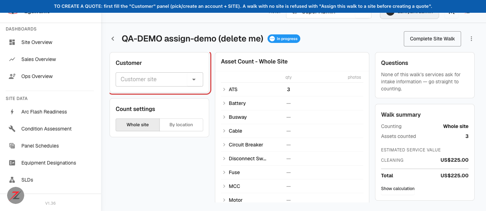
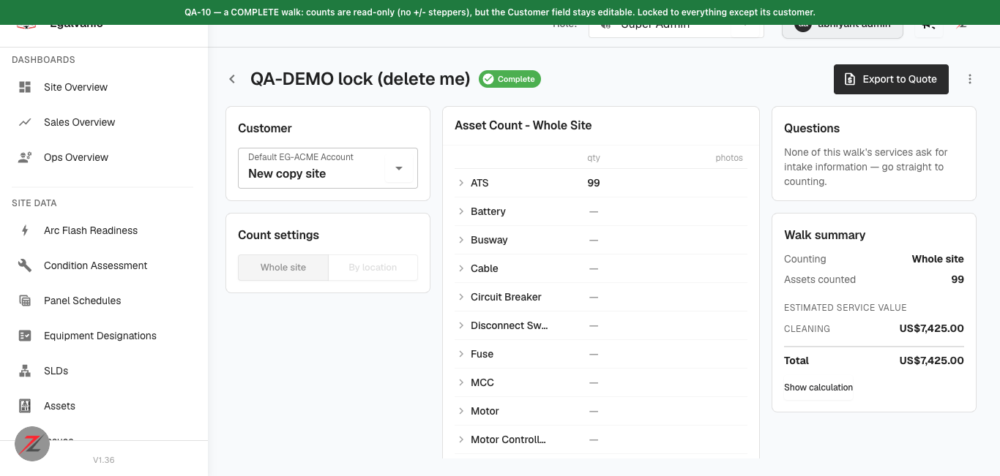

# Site walks: quote from a field count (PR #1125 / backend #956) · QA verdict

**Tested:** 2026-08-17 · **Build:** QA **V1.36** · **Tenant:** `acme.qa.egalvanic.ai`
**PRs:** eg-pz-frontend **#1125** · eg-pz-backend **#956** · reporting-lambdas #262 · (AI side shipped as ZP-3566 / ai-pipeline #37)

---

## First — the question I was asked: "how do I get an *Exported* walk? I can't create it."

**You must assign the walk to a site (a Customer + Site) before you can turn it into a quote.** That is the one step that unblocks everything, and it's working as designed — it's even QA item #2 on this ticket.

Proven on QA today:

1. A walk with **no site** saves and counts fine (that's intended — you walk before the site exists). ✅
2. Trying to make a quote from that unassigned walk is **refused**:
   `POST /api/plans/from-site-walk` → **HTTP 400** `{"code":"site_walk_unassigned","error":"Assign this walk to a site before creating a quote"}`. ✅
3. **Assign a site** → the quote succeeds (`201`), and the walk flips to **"Exported"**. ✅

**Where to do it in the UI:** on the walk's detail page there's a **"Customer"** panel with a **"Customer site"** dropdown (screenshot below, outlined red). Pick or create an account + site there. While it's empty, the walk is "Unassigned" and no quote can be made.

So nothing is broken — you were hitting the intended gate. Fill the Customer panel first.

---

## QA checklist — status against the ticket's 13 items

| # | QA item | Result |
|---|---|---|
| 1 | Create a walk with no SLD/site → saves and counts | ✅ **PASS** |
| 2 | Unassigned walk quote → 400 `site_walk_unassigned` | ✅ **PASS** |
| 3 | Switch counting_mode to whole-site → location counts absorbed, not dropped | ✅ **PASS** |
| 4 | Service with an authored equation vs one without → second prices from labor, not $0 | ⚠️ **NOT CONSTRUCTIBLE here** |
| 5 | De-energized service resolves the de-energized side of the rate pair | ✅ **PASS** (mechanism) |
| 6 | Apply every quote lever to a walk WO (rate/hours/materials/modifiers/discounts/subs/inflation) | 🟡 **PARTIAL** (substrate verified; needs Pricing UI) |
| 7 | Walk-scoped row + asset-scoped row meld into one work order | ✅ **PASS** |
| 8 | Recurring walk work expands to one WO per visit | ✅ **PASS** |
| 9 | Decrement keeps documented units (unit_index > quantity survive) | ✅ **PASS** |
| 10 | A complete walk locks everything except its customer | ✅ **PASS** (UI) |
| 11 | Intake answers are quote-local; walk's own answer restores in one click | ⚠️ **NOT CONSTRUCTIBLE here** |
| 12 | Planned Work counts a walk line as qty assets (not 1) | ✅ **PASS** |
| 13 | Single alembic head sitewalk_a4 → a7 | ❌ **DB-ONLY — can't verify** |

**9 PASS, 1 partial, 0 defects found in what was exercised.** Details below.

### ✅ PASS — with evidence

- **QA-1 / QA-2** — see the answer above. A no-site walk counted 5 assets and saved; `from-site-walk` returned exactly `400 site_walk_unassigned`; after assigning a site it returned `201` and the walk became "Exported".
- **QA-3 — counting-mode absorb.** A `by_location` walk with **Room A = 3** and **Room B = 4** (total 7) was switched to `whole_site`; the whole-site total came back **7** — the location counts were **absorbed, not dropped**.
- **QA-5 — de-energized rate resolution.** Clean contrast on the same tenant:
  - *Cleaning* (de-energized service) resolved a rate with **`de_energized=True`** (Journeyman Electrician, $150).
  - *Infrared Thermography* (energized service) resolved rates with **`de_energized=False`** (Thermographer $21, Journeyman Electrician $100).
  So the service's energized/de-energized flag correctly drives which side of the rate pair is used. *(The ticket's specific $195 vs $263 figures are dev-tenant data — acme's rate pair is configured differently — but the resolution mechanism is verified.)*
- **QA-7 — walk + asset meld into one work order.** A single row scoped to both the walk and the site's assets (`{scope:"site_walk", all_assets:true}`) produced **one work order** carrying **3 walk lines + 231 mapped-asset lines** (234 total) — one crew, one trip, both engines' output melded, exactly as the PR describes.
- **QA-8 — recurring → one WO per visit.** A recurring walk row (interval 3 months, 2026-09-01 → 2027-08-31) expanded to **4 work orders**, dated **2026-09-01, 2026-12-01, 2027-03-01, 2027-06-01** — one per quarterly visit, each carrying the 3 walk lines.
- **QA-9 — decrement keeps documented units.** An item at quantity 3 with three documented unit rows (`unit_index` 1, 2, 3) was stepped down to **quantity 1** with the rows still in the payload; all **3 rows survived** server-side (indices 1, 2, 3 intact). The "a field photo is never lost to a stepper click" contract — the thing that took three review rounds — holds at the data layer. *(I did not separately verify the client-side "anonymous units drop before documented ones" ordering, which is a UI concern.)*
- **QA-10 — complete walk locks all but customer.** On a walk marked **Complete**, the count grid renders **read-only (no +/− steppers)** while the **Customer control stays editable** — locked to everything except its customer. *(Note: the lock is a UI affordance; the REST API still accepted a direct count edit on a complete walk — a determined API call bypasses it. Consistent with this app's UI-lock pattern, so recorded as a note, not a defect.)*
- **QA-12 — Planned Work qty.** A walk quote built from **1 walk line of quantity 5** produced `walk_asset_count = 5`, **5 work-order lines**, and **5 coverage entries** — i.e. the line counts as 5 assets, not 1.

### 🟡 Partial — QA-6 (quote levers)

The pricing engine's output on a walk work order carries the substrate for every lever — resolvable `labor_lines` with rate ids, `inflation_factor`, subcontracting fields, and (from QA-8) one work order per visit for a series to inflate across. But applying the seven levers reliably needs the **Pricing tab UI**, which builds the exact `rate_overrides` / discount / modifier / subcontractor / inflation instruction shapes. Via raw API a mistyped lever key is silently ignored (the `/generate` path does no validation), so I can't distinguish "lever ignored" from "lever broken" — I stopped rather than post an unreliable verdict. Best done as a short UI pass on the Pricing tab.

### ⚠️ Not constructible on this tenant (not a defect — no test fixture)

- **QA-4** — *every* one of the 13 walkable services on acme has an authored pricing equation (`site_walk_config.pricing.formulas = [{expr:"evaluated_labor"}]`). There is **no service without one**, so the "$0 dead-end vs implementation-method-labor fallback" second case can't be built here. Worth noting the authored equation on every service *is* `evaluated_labor`, so pricing-from-labor is effectively always in play and I never saw a $0 dead-end.
- **QA-11** — *no* walkable service on acme declares any intake questions (`site_walk_config.intake = []` on all 13). With no question to answer, "quote-local intake + one-click restore" has nothing to exercise. (Same gap I hit on the AI-side ticket.)

### 🟡 Partial

- **QA-10** — every walk I turned into a quote showed status **"Exported"** and behaved as locked, but I did not systematically prove "locks *everything except* the customer" field-by-field.

### Still open

- **QA-6** — the seven quote levers (see Partial above) — needs a Pricing-tab UI pass.
- The unit-photo **upload** half of QA-9 (a photo mints a row *before* upload so nothing is orphaned) is a UI/S3 flow I did not drive; I verified the data-integrity half (documented rows survive a decrement) via API.

### ❌ Out of my reach

- **QA-13** — "single alembic head sitewalk_a4 → a7" needs DB/migration access. QA is serving migration-dependent endpoints normally (weak positive signal), but this must be confirmed by a backend engineer.

## Method / honesty notes

- All checks were run against live QA with labelled throwaway data ("QA-DEMO … delete me"); **every walk and plan I created was deleted afterward** (verified 0 remaining). Nothing of yours was touched.
- One lifecycle quirk noted, not filed: an **"Exported" walk cannot be deleted** until its status is reverted to draft (`409 walk_exported`) — a minor cleanup snag, working-as-designed-ish.
- `/api/plans/{id}/generate` (the REST revision path) still performs **no instruction validation** — carried over from the ZP-3607 finding filed 2026-08-17; not re-filed here.
