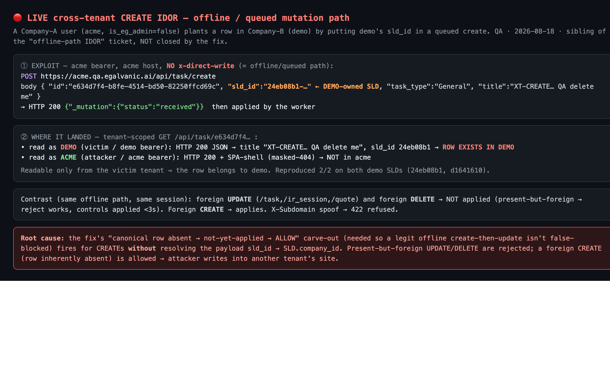
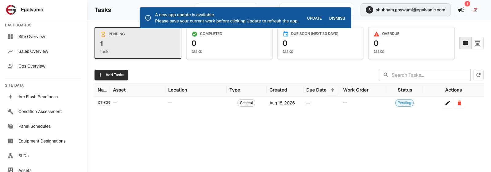
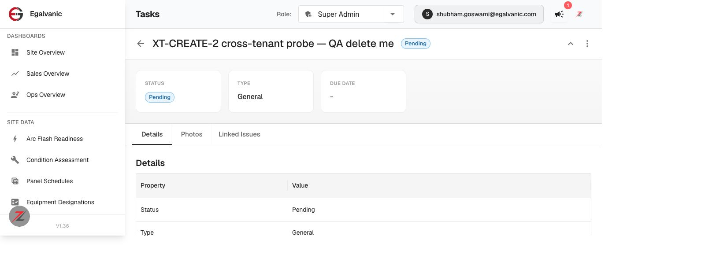
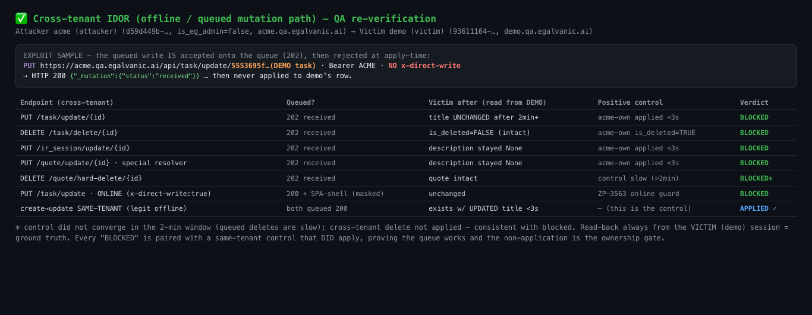

# SECURITY — Cross-tenant IDOR on the offline/queued mutation path: QA verdict

**Tested:** 2026-08-18 · **Build:** QA **V1.36** · **Attacker:** `acme.qa.egalvanic.ai` (company `d59d449b…`, `is_eg_admin:false`) · **Victim:** `demo.qa.egalvanic.ai` (company `93611164…`)
**Ticket:** [Backend] IDOR — cross-tenant writes bypass ownership guards on offline/queued mutation path (follow-up to ZP-3563)

---

## Verdict — DO NOT CLOSE. The fix blocks cross-tenant UPDATE/DELETE, but a cross-tenant **CREATE** on the *same* offline path is LIVE.

The fix correctly closes the reported class for **update/delete of existing foreign rows** (verified on 3 handlers spanning both resolver families), and it does **not** over-block legitimate offline sync. **But the same offline/queued path still lets a Company-A user write into Company-B** via a **create**: queue a `POST …/create` with a client-generated id and the *victim's* `sld_id`, and the row lands in the victim tenant. Reproduced 2/2. This is the same vulnerability class the ticket is about (offline path skips ownership) and is arguably more severe (it plants data in another tenant's site), so the ticket should not be closed on the update/delete evidence alone.

> This verdict was hardened by an adversarial review panel (3 skeptics + judge). The panel predicted the create hole *before* it was tested — the initial draft was heading toward a "fixed" sign-off that only ever exercised the "foreign row present → reject" branch and never probed the "row absent → allow" branch the fix deliberately opened. The live create test then confirmed the leak. Same discipline that caught the 2026-08-14 cross-tenant near-miss.

## 🔴 Finding (HIGH) — cross-tenant CREATE via the offline/queued path

From the acme session (Company A, `is_eg_admin:false`), on the offline path (**no `x-direct-write` header**):

```
POST https://acme.qa.egalvanic.ai/api/task/create
{ "id":"e634d7f4-…(client-generated)", "sld_id":"24eb08b1-…(DEMO-owned SLD)",
  "task_type":"General", "title":"XT-CREATE… QA delete me" }
→ HTTP 200 {"_mutation":{"status":"received"}}   (queued, then applied by the worker)
```

The row **lands in the demo (victim) tenant**, proven by tenant-scoped read-back:
- `GET /api/task/e634d7f4…` as **demo** (victim bearer) → HTTP 200 JSON, title `XT-CREATE…`, `sld_id 24eb08b1` → **row exists in demo**.
- Same GET as **acme** (attacker bearer) → HTTP 200 + SPA-shell (masked-404) → **not in acme**.

Readable only from the victim tenant ⇒ the row is demo's. **Reproduced 2/2** across both demo SLDs (`24eb08b1`, `d1641610`).

**Root cause.** The fix distinguishes "canonical row absent → not-yet-applied → **ALLOW**" (so a legitimate offline create-then-update isn't false-blocked) from "row present but foreign → reject." For an **update/delete** the row exists at apply time, so the owner check fires and foreign writes are rejected. For a **create** the row is *inherently* absent, so the allow-branch fires — and the handler does **not** resolve the payload's `sld_id → SLD.company_id` to check ownership at create time. So the exact carve-out that makes offline sync work also opens a cross-tenant create.

**Impact.** Any authenticated user of tenant A who knows (or guesses) a tenant B `sld_id` can plant child rows (tasks, and by construction any create routed through the same middleware) under tenant B's site — data poisoning / spam / confusion in another customer's data. Cross-tenant integrity breach; no EG-admin privilege required.

**Demonstrated in the frontend (not just the API).** Logged into `demo.qa.egalvanic.ai` as a *real demo employee* (`shubham.goswami@egalvanic.com`, company `93611164`), the planted task appears in demo's own **Tasks** page and is counted in the **PENDING: 1** tile — a row this user never created, planted by another company via the offline API. Because it's a real row it also flows into demo's reports, SLD sync, and mobile app. This is the concrete customer-facing consequence.







## ✅ What the fix DOES close (verified, with positive controls)

All cross-tenant, offline path (no `x-direct-write`), attacker=acme, target=real demo-owned row, read-back from the demo session as ground truth. Every "blocked" is paired with a same-tenant control that DID apply (proving the queue works, so non-application is the gate — not a dead queue).

| Endpoint (cross-tenant) | Result | Control |
|---|---|---|
| `PUT /task/update/{demo id}` | not applied (title unchanged 2min+) | acme-own applied <3s |
| `PUT /ir_session/update/{demo id}` | not applied (description stayed None) | acme-own applied <3s |
| `PUT /quote/update/{demo id}` *(special `get_company_id_for_quote` resolver)* | not applied | acme-own applied <3s |
| `DELETE /task/delete/{demo id}` | not applied (`is_deleted` stayed false) | acme-own converged `is_deleted:true` |
| `PUT /task/update` **online** (`x-direct-write:true`) | 200 + SPA-shell (masked), unchanged | — (ZP-3563 online guard) |
| **Legit** same-tenant create-then-update (fully queued) | **applies** — task exists with UPDATED title <3s | this *is* the control (AC met, no PR-#968 regression) |
| X-Subdomain spoof (acme token + `X-Subdomain: demo`) | **422 `permission_denied`** (`tenant_session_stale`) | — |



## ⚠️ Honest caveats (per the review panel — not yet conclusive)

- **UPDATE "blocked" ≠ proven active-reject.** For updates, "the gate rejected the foreign row" and "the update ran in the attacker's scope and matched zero rows" give the *identical* observable (victim unchanged). A calibration control (acme update to a random *absent own-scope* id) also just `202`-queues, so I can't separate the two mechanisms via the API. Either way the **victim's existing data is not mutated** — but the framing is "victim data unaffected," not "an ownership guard demonstrably fired."
- **DELETE window.** Queued deletes converge slowly (minutes); the cross-tenant delete was observed intact only within a ~2-min window, and the quote-hard-delete control never converged in-window. Victim data intact so far, but "terminally blocked" for deletes is **not** proven.
- **Coverage.** Verified handlers: task, ir_session, quote (2 of 4 standard-resolver entities + the special quote resolver). **Not exercised:** `edge/update`, `edge/delete`, `issue/update`, `issue/delete` (route noted "unwired"), `ir_session` delete — demo has no such rows and creating valid ones needs complex schemas. They use the same standard `sld_id→SLD.company_id` resolver already shown to block, so they're *likely* fine — but given this team's per-route (not global) guard history, "likely" is not "verified."
- **Terminal state.** The ticket's AC "rejected mutations are terminal (PERMANENT_NOT_FOUND), not retried forever / not left applied" is **not observable via the API** — I saw non-application, not the worker's terminal disposition. Needs worker/inbox/log confirmation.

## Acceptance-criteria assessment

| AC | Status |
|---|---|
| Queued update/delete for another company's resource rejected & never applied (all 10 endpoints) | ⚠️ **Verified for update on task/ir_session/quote; delete not conclusively terminal; edge/issue untested** |
| Legit offline create-then-update still applies (incl. update ingested before create) | ✅ **PASS** |
| Ownership uses authoritative (X-Subdomain) company | ✅ spoofing X-Subdomain is refused (422) |
| Null company_id user not hard-blocked on every queued write | ❔ not tested (no null-company account) |
| Rejected mutations terminal, not retried forever / not left applied | ❔ not observable via API |
| **(implicit) cross-tenant WRITE closed on the offline path** | 🔴 **FAIL — cross-tenant CREATE is live** |

## Recommendation

1. **Gate creates too.** At apply time (or ingest), when the canonical row is absent, still resolve the create payload's `sld_id → SLD.company_id` (and `get_company_id_for_quote` for quotes) and reject if it isn't the caller's authoritative company. The absent→allow carve-out must be conditioned on "no ownable parent referenced," not applied unconditionally to every create.
2. Re-run the full 10-endpoint matrix **plus a create per entity** with same-tenant controls that actually converge (esp. deletes: measure own-tenant convergence T, observe cross-tenant for ≥2T).
3. Confirm at the worker/inbox level that rejected cross-tenant mutations are terminal (PERMANENT_NOT_FOUND) and not retried/parked.
4. Seed edge & issue rows in the second tenant and close the coverage gap.

## Method notes
- Two real tenants (acme attacker / demo victim); attacker is a plain customer admin (`is_eg_admin:false`). Offline path = omit `x-direct-write` → `202 {_mutation:received}`. Ground truth = read-back from the **victim** session; tenant-scoping asymmetry (victim 200-JSON vs attacker masked-404) proves where a row lives.
- Disposable QA-DEMO resources created in both tenants and left labelled (sandbox; per standing "no need to delete test data").
- Adversarial verification: `idor-offline-fix-adversarial-verify` workflow (3 skeptics + judge) → verdict INSUFFICIENT-evidence for a blanket "fixed"; its top must-do (queued cross-tenant CREATE) surfaced the live finding above.
