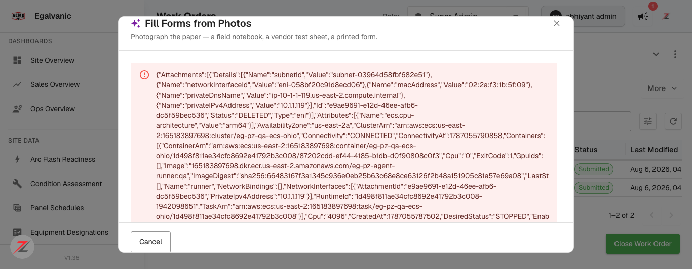

# Fill Forms from Photos: no-match empty state + assets-grid Forms-column refresh — QA verdict (CORRECTED)

**Tested:** 2026-08-18 · **Build:** QA **V1.36** · **Tenant:** `acme.qa.egalvanic.ai` · **Session:** `fcc37c67` (Infrared Thermography I.R)
**PRs:** eg-pz-frontend **#1176** (empty state / "Try other pages") · eg-pz-frontend **#1175** (Forms-column refresh)

> **Correction notice (2026-08-18, later same day).** An earlier version of this verdict claimed the *read pipeline is down on QA* and that *every run dumps a raw AWS ECS descriptor*. **That was wrong — it was based on only two failed runs and I did not retest with a real photo on a fillable form.** After re-driving the flow with genuine photographs (a FLIR T420 thermal JPEG and a real IR photo) and watching the `/api/form-fill/jobs/{id}/status` transitions directly, the pipeline **succeeds** and #1176's empty state **works exactly as specified.** The corrected findings are below. The raw-ECS-descriptor leak is real but **rare/transient**, not systemic.

---

## Verdict — #1176 PASS (empty state works). Pipeline is healthy. One real defect: a *crashed* read job leaks the raw ECS descriptor (rare).

## ✅ #1176 — no-match empty state: PASS (verified live with two real inputs)

Re-ran "Read pages" on this WO after adding a fresh unsubmitted form (so the read would actually execute). Two runs, both **`status: "succeeded"`** at the API, both rendering the polished empty state:

**Run A — real FLIR T420 thermal photo (`FLIR0123.jpg`, 1.5 MB):** job succeeded, `counts = {targets:3, filled:0, review:0, unmatched:0}`. Dialog:
> **0 of 3 form(s) filled** · No page covered: Switch 2 · Switch 7 · ATS-BEQJ
> **Nothing to apply from these pages** — "None of the uploaded pages look like a filled form for Switch 2, Switch 7, ATS-BEQJ. Values are only read from pages that clearly belong to this work order's forms, so nothing was guessed."
> "Try photos of the completed paper forms — one page per form, with the whole sheet in frame." · **[Cancel] [Try other pages]**

**Run B — the UI-screenshot PNG (`create-service-forms-pricing-sections.png`):** job succeeded, `counts = {targets:3, filled:0, unmatched:1}`. The AI even explained the miss per-asset:
> "**ATS-BEQJ** — the only image supplied is a product UI screenshot of a 'Create Service' dialog, which contains no contact resistance test data for any asset."

Every QA-review item for #1176 checks out:

| # | QA item | Status |
|---|---|---|
| 1 | No-match → explicit empty state naming the asset; "values only read from pages that clearly belong…"; describes a usable page | ✅ **PASS** — names Switch 2 · Switch 7 · ATS-BEQJ; the "clearly belong / nothing was guessed" copy is present verbatim; "Try photos of the completed paper forms — one page per form, with the whole sheet in frame" |
| 2 | "Try other pages" replaces disabled Apply; returns to an empty upload step; second run completes | ✅ **PASS** — "Try other pages" button present; clicking it returned to a clean upload step; a second run completed |
| 3 | Positive control — real photos → Apply enabled and applies | ⚠️ **Not exercised** — I had no photo of an actual *completed paper form* to trigger a positive fill; both real inputs correctly produced *no-match*. The success path (job succeeds, matching runs) is proven; an actual auto-fill was not. |

## ⚠️ #1175 — Forms-column grid refresh after Apply: NOT VERIFIED (no successful Apply reached)

#1175 improves what happens *after* a successful Apply (the assets-grid Forms column updates with no reload). Because both my real inputs produced **no-match** (nothing to apply), I never reached an Apply, so the three grid-refresh paths (button refresh, dialog-close refresh, counts/sections refresh) remain **untested**. This is a coverage gap, **not** a defect — I'm simply not asserting on #1175 either way. To test it, upload a photo of a genuinely completed form so at least one field fills and Apply enables.

## 🟠 Real defect — a *crashed* read job leaks the raw AWS ECS task descriptor (rare / transient)

This is the one genuine finding, and it stands — but **narrower** than first reported.

There is a **prior failed job on this session** (`bb8c21c8-752c-4e52-8415-a5a75a978b92`, created 11:36, failed 11:38) whose `job.error` is the **raw ECS/Fargate task descriptor**, served verbatim by `GET /api/form-fill/jobs/active` and `…/status`. Re-fetched live today; it exposes:

- **AWS account id** `165183897698` · **ECS cluster ARN** `arn:aws:ecs:us-east-2:165183897698:cluster/eg-pz-qa-ecs-ohio`
- **ECR image** `165183897698.dkr.ecr.us-east-2.amazonaws.com/eg-pz-agent-runner:qa` + image digest
- **VPC internals** — `subnetId`, `networkInterfaceId` (eni-…), `macAddress` `0a:39:c8:df:7b:05`, `privateIPv4Address` `10.1.3.192`, `privateDnsName` `…compute.internal`
- Step-Functions **execution ARN**, task ARN, Fargate sizing (`Cpu 4096`, `Memory 16384`, arm64), and the `JOB_JSON` env, with `ExitCode: 1`, `LastStatus: STOPPED`

**Crucial correction on the trigger.** That job's inputs were a UI-screenshot PNG + a composite "photo-pair" PNG. **I re-uploaded the exact same UI-screenshot PNG today and the job SUCCEEDED** (graceful no-match, above). So the earlier crash was a **transient agent-runner failure** (the Fargate task died once, ExitCode 1) — **not** caused by the input and **not** reproducible on demand. The pipeline is not "down."

The **defect that remains** is purely how such a crash is *surfaced*: when the agent-runner task does die, the backend stores the raw ECS `Cause` in `job.error` and hands it to the client, and the dialog renders it. That's an error-handling + minor internal-infrastructure-disclosure defect on the crash path — real, but rare, and independent of any input. See the standalone ticket: `JIRA-TICKET-fill-forms-raw-ecs-dump.md`.

## ⚪ Minor UX gap — precondition failure shows a bare "Failed"

When every form in the WO is already submitted, the read job fails a precondition and the API returns a **readable** reason — `units[].message = "every form in this work order is already submitted"` — but the dialog only shows the bare word **"Failed"** (with the spinner/Stop still visible), not the reason. Low severity; worth surfacing the message. (This is *not* the ECS-leak path; no infra is exposed here.)

## Evidence

## Method notes
- Real UI drive (Playwright, non-headless): IR session `fcc37c67` → Forms tab → Actions → **Fill from Photos** → upload → **Read pages**. Watched every `/api/form-fill/jobs/*/status` response body via an in-page `fetch` recorder (job status + `units[]` + `counts`), not just the rendered UI.
- To reach the read stage I added one fresh unsubmitted form (Contact Resistance Testing on asset **ATS-BEQJ**) via Actions → Manage Forms, because the WO's two original forms are already Submitted (which legitimately short-circuits the read). QA-sandbox tenant; the added form is left in place (labelled here) per standing "no need to delete test data" guidance.
- Inputs used: `FLIR0123.jpg` (genuine Teledyne FLIR T420, 2048×1536, EXIF intact) and `create-service-forms-pricing-sections.png` (the exact PNG from the earlier failed job).
- Runs A and B both returned `job.status: "succeeded"` with **no ECS descriptor anywhere in the response** — verified by scanning every captured body for `networkInterfaceId|macAddress|privateIPv4Address|ExitCode|dkr.ecr`.
