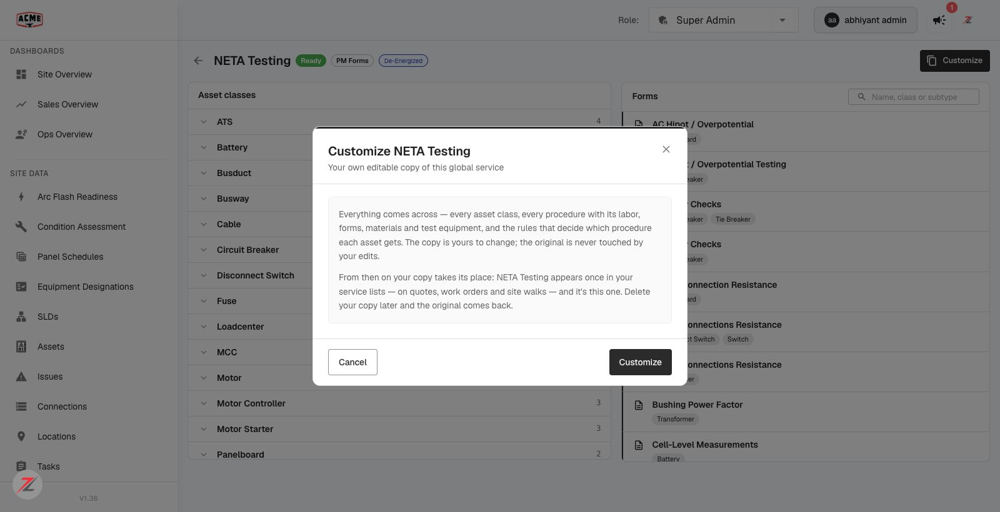

# Global services fork ("Make it mine") — QA verdict + finding

**Tested:** 2026-08-19 · **Build:** QA V1.36 · **Tenant:** `acme.qa.egalvanic.ai` (attacker/second tenant: `demo`)
**PRs:** eg-pz-backend **#1000** (fork) · eg-pz-frontend **#1182** (UI "Make it mine") · Environment: **live on QA** (despite the ticket's "dev only" note — verified directly)

---

## Verdict — functionally PASS. One finding: the UI says **"Customize"**, not **"Make it mine"**.

The fork works end to end and every backend behavior in the QA checklist passed. The one discrepancy vs the ticket is a **label**: the ticket (frontend #1182, checks 10–13) says the action + dialog read **"Make it mine"**; on QA they read **"Customize"**. The feature itself is correct — this is a wording mismatch to confirm, not a broken flow.

## 🔎 Finding (Low) — CTA/dialog labelled "Customize", ticket specifies "Make it mine"
The global service detail view leads with a **"Customize"** button, and the confirm dialog is titled **"Customize NETA Testing"** — not "Make it mine". Either the #1182 rename didn't reach QA or it shipped as "Customize". The dialog *content* is otherwise exactly as specced (see below). Worth a one-line confirm with the PR author on the intended wording.

## ✅ Verified (live on QA)

| # | Ticket check | Result |
|---|---|---|
| 1 | Fork the heaviest global (NETA Testing); counts match the original | ✅ procedures **19=19**, methods **518=518**, forms **92=92**, labor **119=119**, rules **126=126** |
| 3 | Copy company-owned, records origin | ✅ `company_id=acme (d59d449b)`, `is_global=false`, `forked_from_id=` the global |
| 4 | Global superseded in service list once forked; copy appears | ✅ default list **hides** the global, shows the copy |
| 5 | `?include_superseded=1` brings the original back | ✅ global returns (+ copy) |
| 6 | Re-fork the same global → 409 with the existing copy id, no second copy | ✅ `already_forked`, carries `existing_service_id` |
| 9 | **Negative** — fork a service belonging to another company → rejected, not a copy | ✅ acme forking demo's private copy → **HTTP 400 "only global services can be forked"**; acme got no copy |
| 10–11 | Detail leads with the fork action; confirm dialog names what comes across + "takes its place" | ✅ content matches spec (screenshot) — **but labelled "Customize"** (see finding) |
| 12 | Confirm → land on the copy | ✅ URL navigates from the global to the new copy id |
| — | Delete the copy restores the global | ✅ (matches "delete your copy and the original comes back") |

## ⚠️ Not fully verified (honest — so this is a functional PASS, not a 100% checklist sign-off)
- **#2 Edit the fork, reopen the global unchanged (incl. form template HTML)** — I relied on *counts match + company-owned + `forked_from_id` + no second copy*; I did **not** do a live rename-a-procedure / edit-a-form then re-read the global to prove non-mutation. (The PR states isolation was verified with no shared form/template rows.)
- **#3 Every rule resolves to a method inside the fork** — couldn't parse the export-spec schema to trace method refs; relied on counts + company-owned isolation.
- **#7 Pricing-ready** (fork a global carrying site-walk pricing → "ready" not "Needs pricing") — didn't locate a priced global to test.
- **#8 PM-plan-driven WO still resolves the global plan** (the documented limit) — not tested.
- **#4 (UI) the five pickers** (WO creation, quote/plan, site walk, reporting config, Services page) — verified the underlying `list_services` supersede (the single endpoint behind all pickers), but did **not** click each of the five dropdowns.
- **#13 (UI) re-fork navigates to the existing copy** — the backend 409 carries the existing id (verified); the UI navigation-to-it wasn't separately driven.

## Method
Live UI (acme, real user): Services → NETA Testing → **Customize** → confirm dialog (screenshot) → fork navigates to the copy. Live API: `POST …/services/{id}/fork`, `GET …/{id}` (ownership), `GET …/services[?include_superseded=1]` (supersede), `…/export-spec` (counts), re-fork (409). Cross-company: demo forks NETA → acme forks demo's copy → 400. All test forks deleted after; global restored.
