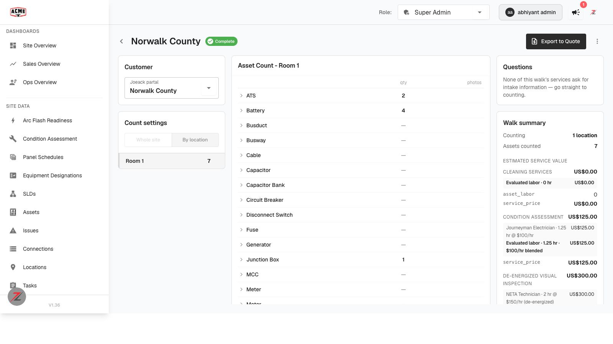

# Pricing setup: every labor rate + blended_rate — QA verdict

**Tested:** 2026-08-19 · **Build:** QA V1.36 · **Tenant:** `acme.qa.egalvanic.ai`
**PRs:** eg-pz-backend **#1022** · eg-pz-frontend **#1214** · Environment: **on QA**

---

## Verdict — core PASS (headline bug fixed; blended_rate correct). A few checks not exercised (listed below).

The two most important things are verified with real data **and** shown in the live UI:

## ✅ Verified

| # | Check | Result |
|---|---|---|
| De-energized regression (the specific bug) | Open a de-energized service; picker + quote resolve the **de-energized** rate | ✅ **PASS** — on de-energized NETA Testing, every labor type with a de-energized rate resolved to it (Journeyman **$150 de-energized** beat 4 energized options; Manufacturer Tech; NETA Tech), correct fallback where none exists. UI confirms: "**$150/hr (de-energized)**". If the old bug were present it'd have picked an energized rate. |
| Every rate row in `pricing-context` | `options[]` per labor type, winner flagged, real labor-type name | ✅ **PASS** — each rate carries `amount`, `is_de_energized`, `is_default`, `labor_union`, and `resolved` (the winner); `labor_type` is the real name. |
| `blended_rate` = hours-weighted mean $/hr | Hand-check, not trust the number | ✅ **PASS** — equals `evaluated_labor ÷ evaluated_hours` on 4 services: 100.0 = 125/1.25; 150.0 = 300/2; **60.5 = 201.67/3.333** (a real non-round blend); 150.0 = 675/4.5. Exposed in both `labor.blended_rate` and `inputs.blended_rate`. |
| `blended_rate` in the walk receipt | Shown beside evaluated labor | ✅ **PASS** — UI shows "Evaluated labor · 1.25 hr · **$100/hr blended**" (screenshot above). |
| Sell vs cost data present | | ✅ each resolved line carries `sell_rate` **and** `cost_rate` (Journeyman sell $100 / cost $10); blended used the **sell** side ($100), consistent with "sell unless `assumes_burden_rate`". |

## ⚠️ Not exercised (so this is a core-PASS, not a full sign-off)

- **Insert-a-value picker display** — the `$213/hr · IBEW Local 134 · energized` list with exactly one bold per type + the "how a walk picks" note. (Backend data is correct; I did not screenshot the picker widget itself.)
- **Cross-check** that the picker's bold rate = `rates.<slug>` = the walk's price for the *same* service. (Walk side verified; `rates.<slug>` eval not driven — `explain-formula` returned null for a bare token.)
- **Sell vs cost toggle** — running the *same* equation with the burden checkbox off/on to see $100 vs $10. (Data supports it; not toggled end-to-end.)
- **Negatives** — subcontracted hours excluded from the blend; `blended_rate` erroring like `evaluated_labor` when a labor type has no rate.
- **Existing-quote parity** — that pre-change quotes/walks price identically (`load_company_rate_slugs` unchanged).

## Method
Live API: `GET /procedures-v2/services/{id}/pricing-context` (rate resolution) and `GET /site-walk/{id}/evaluate` (blended_rate hand-check via `evaluated_labor/evaluated_hours` across the walk's services). Live UI: the Norwalk County walk → **Show calculation** (screenshot). De-energized service = NETA Testing (`de_energized:true`).
