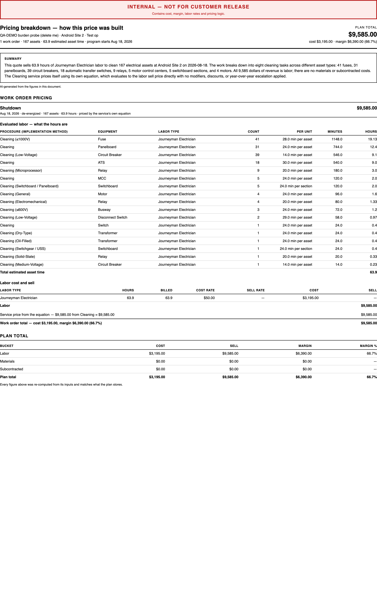

# Pricing summary template (git↔S3 sync) — QA verdict

**Tested:** 2026-08-19 · **Build:** QA V1.36 · **Tenant:** `acme.qa.egalvanic.ai`
**PR:** eg-pz-reporting-lambdas **#280** · template-only git↔S3 reconciliation (behavior already live on QA since 2026-08-12)

---

## Verdict — PASS. Rendered live on QA; the per-line sell is correctly blanked, evaluated-labor is not shown as revenue, and it renders without error.

I rendered the actual **Pricing breakdown** on QA (reporting pipeline, plan_standard config "Pricing Breakdown (Internal)") against a de-energized engine work order.

## What the render proves

| Ticket check | Result |
|---|---|
| Renders without error on QA | ✅ full "Pricing breakdown" rendered (plan total, work-order pricing, evaluated-labor table, labor cost/sell, plan total) |
| Evaluated-labor sell **not** surfaced as revenue | ✅ the Journeyman Electrician line shows **SELL RATE "—"** and **SELL "—"** — the stored evaluated-labor figure is blanked on the line; revenue ($9,585) is sourced from **"Service price from the equation — $9,585.00 from Cleaning"** |
| Per-line honoring (blank where the flag says, not the whole doc) | ✅ COST RATE/COST are populated ($50 / $3,195) on the same line whose SELL is blanked — so the blanking is scoped to the sell figure per line, not applied document-wide or ignored |
| Engine work order, de-energized | ✅ rendered against "Shutdown · de-energized · priced by the service's own equation" |

## Honest scope notes
- This is a **template-only git↔S3 reconciliation** — per the PR, "nothing deploys from this file, no runtime risk," and QA has rendered the corrected S3 copy since 2026-08-12. So this confirms the **already-live** behavior is correct; there is no before/after render delta on QA (the PR's own check #4 expects identical output).
- I rendered **one** engine work order (a service-equation-priced Cleaning plan) which cleanly demonstrates the blank-per-line-sell / evaluated-labor-not-revenue behavior. I did **not** separately render a distinct site-walk summary or a work order carrying a *mix* of `no_sell` and non-`no_sell` lines to show per-line granularity across several lines — the single labor line here is blanked correctly, but a multi-line mix wasn't exercised.
- "Compare before vs after → identical" is inherently a no-op here (the S3 copy was already live); not separately diffed.

## Method
`GET /reporting/configs/{id}/preview-entities` → `POST /reporting/configs/{id}/preview-html` (plan_standard config `105e75e4…`, entity = plan `c65c91bd` "QA-DEMO burden probe"); extracted the rendered `pages[].html` and rendered it to the screenshot above.
