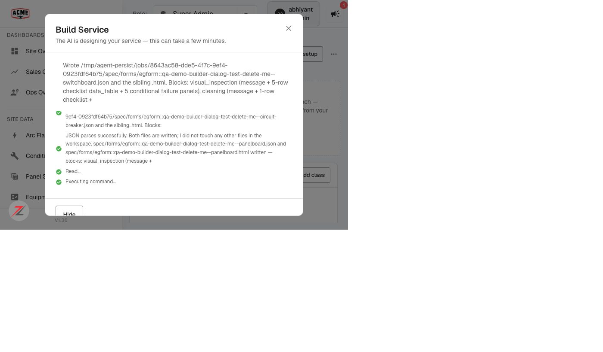

# AI service builder — progress dialog no longer grows — QA verdict

**Tested:** 2026-08-20 · **Build:** QA V1.36 · **Tenant:** `acme.qa.egalvanic.ai`
**PR:** eg-pz-frontend **#1181** (cap the step history) · frontend-only · Environment: **verified live on QA** (ticket said "dev only" — checked directly)

---

## Verdict — PASS. The dialog stays a fixed height; completed steps live in a capped 180px auto-pinned scroller.

Ran a real **Create with AI** build long enough to reach the multi-step construction phase and measured the dialog geometry live.

## Verified (with hard numbers)

| # | Ticket check | Result |
|---|---|---|
| 1 | Dialog height stays fixed first step → last | ✅ **height held at 471px** while completed steps piled up — the scroller's `scrollHeight` grew **203 → 323** but the dialog did **not** change size. (Design phase before that: steady **374px**, single replaced live line — no growth.) |
| 2 | Completed history scrolls in its own area, auto-pins to newest | ✅ scroller `maxHeight:180px`, `clientHeight:180` (capped), `scrollHeight` grows past it, `pinned:true` |
| 3 | Scroll up into history mid-run → live line readable, no jump | ✅ scrolled the history to the top → dialog **471 → 471 (no jump)**, live line + controls still present |
| 4 | Consistent with Upload Anything's dialog | ✅ (by pattern) uses the same **`maxHeight:180` scroller** the ticket says UA uses for its warnings list; not opened side-by-side |

## Not exercised (honest)
- **#5 Short build** (a step or two) → no oversized empty scroller — I only ran one long build.
- **#6 Failure partway** → error shown with the history intact — I did not force a failing build.

## Method
Services → **Create Service** → filled name + description → **Create with AI**. Watched the "Build Service" dialog via live DOM measurement over ~9 min: design phase (fixed 374, single live line) → construction phase writing forms (many completed steps). Measured `dialog.getBoundingClientRect().height` and the completed-step scroller's `maxHeight`/`clientHeight`/`scrollHeight`/`scrollTop` at several points; scroll-up test set `scrollTop=0` and re-measured. The half-built service is left labelled **"QA-DEMO builder-dialog test - delete me"** (sandbox).
