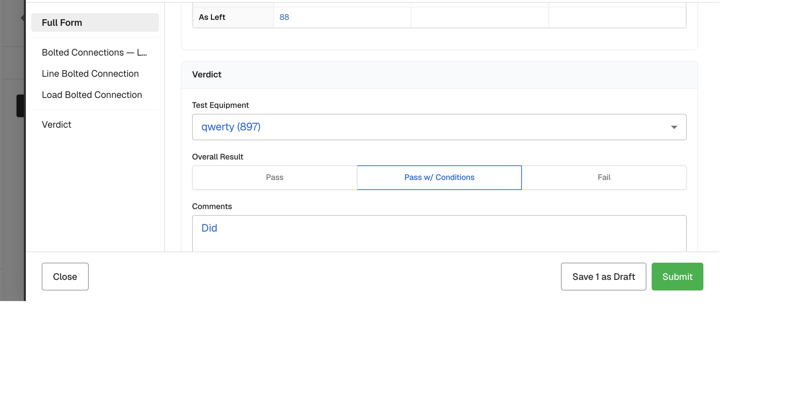
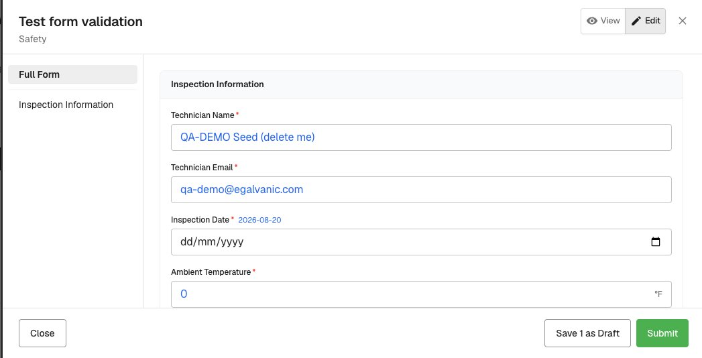

# EG Forms: preload previous values as blue ghosts (neta-2) — QA verdict (deep)

**Tested:** 2026-08-20 · **Build:** QA V1.36 · **Tenant:** `acme.qa.egalvanic.ai` (2nd tenant: `demo`)
**PRs:** eg-pz-backend **#999** (harden + wire the previous-submission lookup) · eg-pz-frontend **#1180** (blue ghosts)

---

## Verdict — PASS. Both halves are live on QA and every exercised behavior checks out, proven by direct persisted-record reads and a captured submit payload — including the falsy-`0` ghost and the required-field cases, verified on TWO templates.

## ✅ Backend #999 (the security fix)

| Check | Result |
|---|---|
| acme → `previous/{DEMO form}/{DEMO node}` must not leak | ✅ **no `form_submission` returned** (masked-404); demo→acme also blocked |
| own-tenant lookup (positive control) | ✅ JSON **slim payload** with `form_submission` — the differential is real |
| malformed `?exclude=` | ✅ **400 "exclude must be a UUID"** |
| `?exclude={newest}` → next-newest | ✅ no-exclude returned the newest; `exclude=newest` returned the next-newest |

*(The cross-tenant reject surfaces as the platform's usual 200+SPA masked-404, not a clean JSON 404 — so no foreign data leaks; I verified the no-leak outcome, not which server-side gate produced it.)*

## ✅ Frontend #1180 — ghost preload + materialization

| Check | Result |
|---|---|
| New instance starts blank | ✅ `form_submission = None` at create — any later value must come from ghosts |
| Calls the wired lookup with `?exclude=self` | ✅ `GET …/previous/{form}/{node}?exclude={thisInstance}` returned the prior, not self |
| Blue ghosts across field types | ✅ data_table cell (88), select ("qwerty (897)"), choice-paint (not solid-selected), text ("Did"), email, date, number — all blue-italic |
| **Materialize on Submit** (untouched, template 1) | ✅ zero keystrokes; read-back = the prior's **exact 6 values** (line 80/58, load 545/88, verdict `pass_with_conditions`, comment "Did") |
| **Materialize on Submit** (untouched, template 2) | ✅ second template ("Test form validation"): all 5 fields materialized identically |
| **Mechanism = frontend** (#1180 attribution) | ✅ captured the submit request: `PUT /eg-form-instance/bulk-patch` — **the browser itself sent the full ghost payload** with `submitted:true`. Not a backend copy-forward, and network-logged proof nothing was typed |
| **Signature / photo never materialize** | ✅ prior had photos; the untouched-submit record has **no signature and no photo** |

## ✅ The edge cases the ticket called out — now exercised

| Ticket item | Result |
|---|---|
| **#5 previous `0` must ghost, not blank** | ✅ seeded a prior with `ambient_temp_f = 0` → fresh instance ghosts **"0"** in blue (screenshot) **and** untouched Submit persists it as a **literal integer `0`** — survives the classic `value \|\| placeholder` data-loss trap |
| **#8 required field showing only a ghost must not block Submit** | ✅ form with **5 required fields**, all showing only ghosts → Submit is **not blocked** and all 5 materialize. (The "incomplete sections / Submit Anyway" prompt is a section-completion advisory, **not** a required-field gate — it appeared identically on the fully-typed seed submission, a built-in control.) |
| **#4 Save Draft must NOT bake ghosts — with positive control** | ✅ typed `POSCTRL-777` into one field of a ghost-filled draft → Save Draft → read-back holds **exactly that one typed value** (proves Save Draft persists real input, not a silent no-op) and **zero ghost values** (proves ghosts aren't baked) |

## ⚠️ Not exercised (honest, with exact reasons)
- **#9 calc-on-submit** — QA has exactly one template with a true calculated field (Dry Type Transformer (PowerDB), `calc_index = r_10min / r_1min`). I created an instance and selected its "Electrical Test Data" test (selection persists across save/reopen), but the section content — the PI table holding the calc field — **never renders** on my Switch-class node, so the calc field was unreachable. Likely class-conditional section rendering rather than a defect; to close #9, run the same seed→untouched-submit cycle on a **transformer-class asset**, ideally typing one input over its ghost so recompute (new value) is distinguishable from stale-copy (old value).
- **data_table multi-row keying** — materialization was verified on nested data_table *cells* (exact leaf values), but not on a ≥2-row table's row count/ordering/per-row keying.
- **`false`/unchecked prior** — `0` is proven; an explicit boolean `false` prior wasn't seeded (no suitable checkbox on the test templates).
- **#11 no-prior → no ghost** — partially observed (fields with no prior value show plain grey placeholders, no ghosts).
- **#12 pinned participants ghost** — genuinely not applicable: the pin UI is not surfaced on QA (established in the pinning-ticket QA).

## Method
Backend: `previous/{form}/{node}` across acme+demo (tenancy both directions with a positive control, malformed exclude, exclude-newest). Frontend: `create-for-asset` (confirmed blank) → viewer (fetch-recorder caught `previous?exclude=self`) → ghost styling by computed style + screenshots → untouched Submit → persisted-record read-back, on two templates; a third run captured the submit network payload to prove frontend materialization; Save-Draft verified with a typed positive control; `0`-ghost verified by seeding a prior via the real UI. Test data labeled QA-DEMO. Verdict pressure-tested by an adversarial review panel (3 skeptics + judge); every reachable objection it raised was closed by an additional live test.
