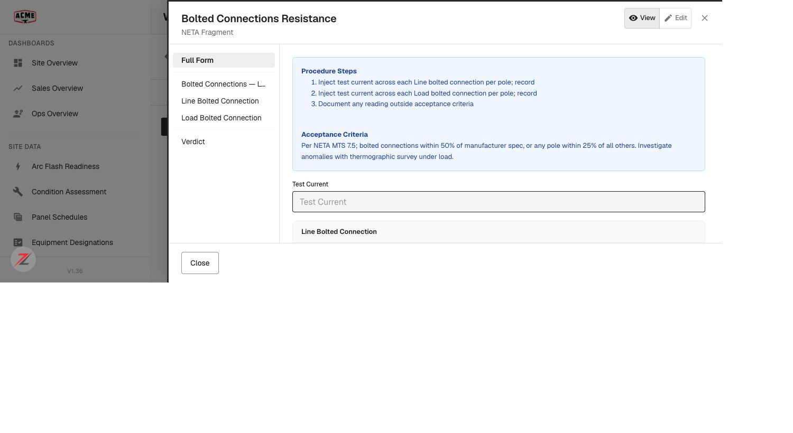
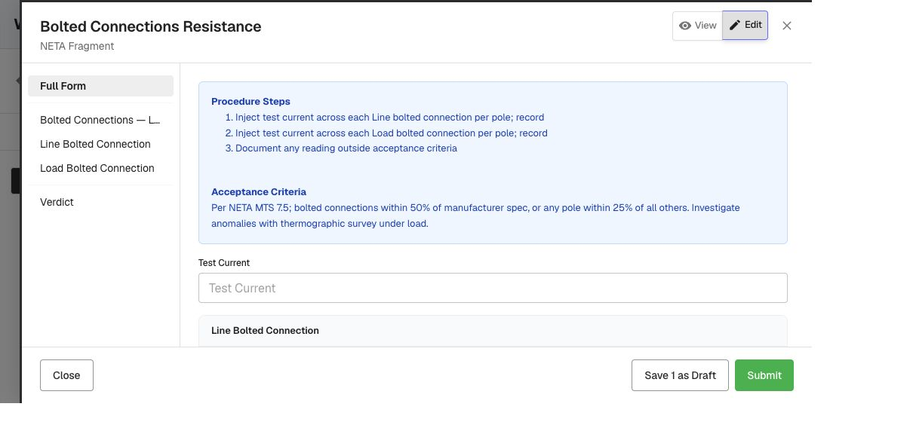

# EG Forms: pinnable form instances + renderer redesign — QA verdict

**Tested:** 2026-08-20 · **Build:** QA V1.36 · **Tenant:** `acme.qa.egalvanic.ai` (2nd tenant: `demo`)
**PRs:** eg-pz-backend **#989** (pinning + Test Selector docs) · eg-pz-frontend **#1166** (renderer redesign + pin UI)

---

## Verdict — Backend PASS (on QA, working). Frontend PARTIAL — the pin UI is not surfaced on QA, so the end-to-end pin flow can't be exercised.

The backend pinning half is live on QA and every API behavior checks out. The frontend got a **partial** renderer redesign (index nav, single-form viewer, delete relocated), but the **pinning interactions** (a pin control, multiple participants with dashed borders, batch "Save N", validation spanning) do **not** appear on QA — matching the ticket's own note that the frontend PR is "dev only." So checks #1–#4 (the multi-pin fill flow) are not verifiable here yet.

## ✅ Backend (#989) — verified on QA

| # | Check | Result |
|---|---|---|
| — | Pin an instance (same session, same template) | ✅ `POST …/pin` → 200, `pinned_instances:[ddb02914]`, confirmed in `/pins` |
| — | Unpin | ✅ `PUT …/unpin/{id}` → 200, pins list back to empty |
| 9 | **Negative** — pin an instance from a **different session** | ✅ HTTP 400 "Can only pin an instance of the same form" — no pin created |
| 9 | **Negative** — pin an instance from **another company** (demo) | ✅ rejected (masked-404) — no pin created; confirmed neither foreign id entered the pins list |
| 10 | Full SLD sync returns the `eg_form_instance_pin` rows | ✅ `GET /sld/v2/{sld_id}` (the ~50 MB mobile full-sync payload) contains an `eg_form_instance_pin` row **and** the pinned id `ddb02914`. (v1 payload does not; mobile uses v2.) |
| — | `to_dict()` returns a bulk `pinned_instances` summary (no N+1) | ✅ single-instance GET returns the full pinned summary (form_submission, linked node "Switch 7", photos). ⚠️ the **by-session list** response did **not** include that summary field in my read — only the single-GET did. |

## 🖥️ Frontend (#1166) — renderer redesign PARTIAL on QA

**Present (redesigned viewer shell):**
- ✅ **Single-form viewer** (not the old chip switcher).
- ✅ **Left index nav — "Full Form" + one entry per container** (Line Bolted Connection, Load Bolted Connection, Verdict) — check #5's structure. A container label is truncated ("Bolted Connections — L…") — the ticket wants a hover tooltip there (not verified).
- ✅ View/Edit toggle; taller container headers.
- ✅ **Delete is NOT inside the open form** (only Close / Save / Submit) — part of #7 ("delete moved out of the open form").

**🔎 Finding — the pin UI is not surfaced on QA.** With a pin **active in the backend** (Switch 7 pinned to Switch 2), opening Switch 2 in the viewer shows **a single instance** and **"Save 1 as Draft"** — not two participants, no dashed borders, and there is **no pin control** anywhere in the viewer. So the headline flow (pin others → fill N together → batch persist) can't be exercised. This blocks checks **#1** (three render, own values/calcs, dashed borders), **#2** (validation spans pinned), **#3** (batch persist + independent reopen), **#4** (unpin cleanup in the UI).

*(Caveat: I created the pin via the API. There is no pin control in the QA viewer to create one via the UI, and the viewer did not render the API-created pin as a second participant. Most consistent with the frontend pin UI not being deployed to QA — but I can't fully rule out that an API-made pin surfaces differently than a UI-made one.)*

## ⚠️ Not verified
- **#1–#4** — the multi-pin fill flow (see the finding: no pin UI on QA).
- **#6** data_table `calculated`/`can_overwrite` meta_fields — didn't reach a form with calculated fields.
- **#7 (rest)** — the form picker's new **Add Form** entry (confirmed only that Delete is out of the open form).
- **#8** — **Test Selector** as a builder block alongside Verdict — couldn't open a template builder in the window.

## Method
Backend: `pin`/`unpin`/`pins`, `by-session`, single-GET, and `sld/v2` full-sync via API across acme + demo (cross-session and cross-tenant negatives). Frontend: opened session `fcc37c67` → Forms → Switch 2 (with Switch 7 pinned via API) → View + Edit; measured DOM + screenshots. Test pin unpinned after; a Draft form left labelled on ATS-BEQJ (sandbox).
