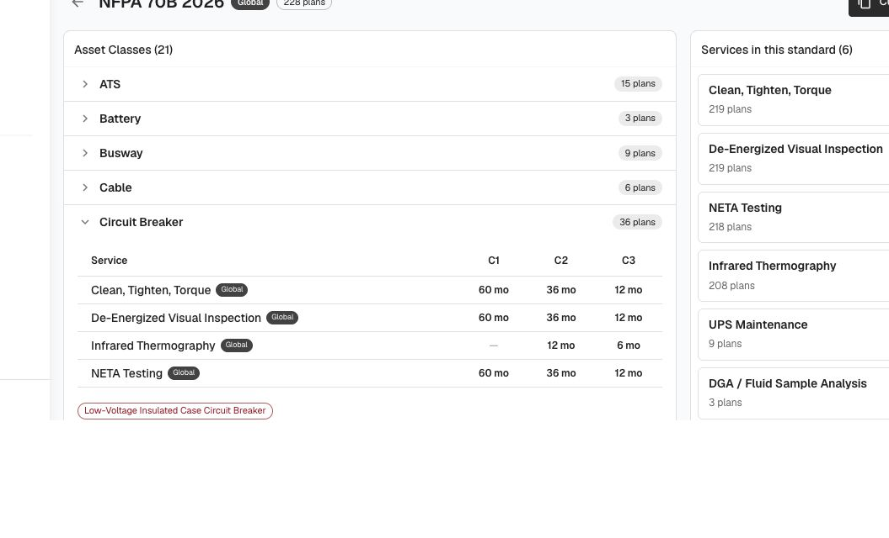

# Env cleanup: slim clone, deterministic labor lookup, PM Standards rebuilt on Services, NETA fragments as ordinary forms — QA verdict

**Tested:** 2026-08-21 · **Build:** QA V1.36+ (PM area badged v1.40.1) · **Tenant:** `acme.qa.egalvanic.ai`
**PRs:** eg-pz-backend **#1035** · eg-pz-frontend **#1222** · eg-pz-reporting-lambdas **#292**

---

## Verdict — LIVE on QA (matches the ticket's "dev + QA"). Everything reachable on QA **PASSES**. Two items can't be closed on QA and are flagged, honestly, as unverified — neither is a defect found.

## ✅ Frontend #1222 — admin cleanup + PM Standards rebuild (all verified by clicking through)

| Claim | Result |
|---|---|
| 7 library grids drop the **Global** column | ✅ Labor (Rates/Types/Unions) + Materials (Library/Presets/Types/Units) — no Global column on any |
| Uniform tab bar (~40px, icon-less, sentence-case), **Customers included** | ✅ every tab bar 42px (incl. border), icon-less — Labor, Materials, Classes, Customers all match |
| **Classes** flattened to one tab row | ✅ single row: Asset / Connection / Issue Classes |
| **AI Setup** in grid actions beside Bulk Ops | ✅ actions bar = [Bulk Ops, AI Setup] |
| **Legacy Forms** own sidebar entry (beside Legacy Procedures) | ✅ `/legacy-forms` present |
| Forms tab bar gone; retired views reachable by URL | ✅ `/eg-forms` has 0 tabs; `?view=neta-fragments` and `?view=class-forms` both load (14 rows each, no 404) |
| **PM Standards rebuilt on the Services pattern** | ✅ list at `/pm-plans`; standard at `/pm-plans/:id`; **Customize is the primary action on a global**; right rail "Services in this standard (6)"; matrix pivoted **Service × C1/C2/C3** with real cadences (60/36/12 mo) and a **dash = prescribes that criticality** (screenshot) |

## ✅ Backend #1035 — PM Standard service-swap suite (verified live, incl. dry-run→apply)

**Route note for the dev/QA:** the ticket's paths are one level off. The **live** routes are under `pm-plans/`:
`GET /procedures-v2/pm-plans/standards/<id>/service-usage`, `POST …/standards/<id>/swap-service`, `GET /procedures-v2/pm-plans/classes/<nodeClassId>/matrix?pm_standard_id=<id>`, `POST /procedures-v2/pm-plans`. (The ticket's `/procedures-v2/standards/…` and `/procedures-v2/classes/…/matrix` are masked-404.) Confirmed against `/swagger.json` + the SPA bundle.

| Check | Result |
|---|---|
| `service-usage` per-service plan counts | ✅ global NFPA 70B → 6 services (219/219/218/208/9/3) |
| **Customize/fork reproduces exactly** (no silent substitution) | ✅ fork of the global → owned copy whose service-usage is **byte-identical** (same 6 service_ids, all `is_global`, same counts). Fork is order-independent because it copies verbatim. |
| `swap-service` **dry_run** preview count == `service-usage` count | ✅ `{swapped:218}` == from-service's 218 plans; overlap control `{merged:199,swapped:19}` sums to 218 |
| `swap-service` **apply** repoints every plan; dry-run == apply | ✅ apply `{swapped:218}`; re-read shows the from-service gone, to-service now on all; **global standard untouched** (no leak into global) |
| `POST /procedures-v2/pm-plans` creates a plan on an owned standard | ✅ 201; bare POST → 400 naming required fields |
| Matrix is service × plan/criticality pivot with editable cadence cells | ✅ `classes/<id>/matrix` returns cells; UI edits cadence per cell via popover |

## ✅ Negative authorization — writes gated to owned standards, reads wider, foreign FKs refused
| Check | Result |
|---|---|
| **Read** a global (not-owned) standard's `service-usage` / `matrix` | ✅ **200 JSON** — the wider read gate works (you read a global to decide whether to customize) |
| **Write** (`swap-service`) on a global (not-owned) standard | ✅ **blocked** — the call does not go through (positive control: same call on an owned fork = 200 JSON). **Caveat:** the block surfaces as the platform's masked-404 (200 + SPA HTML), not a clean `403 permission_denied` JSON. Effective, but a clean 4xx would be better hygiene. |
| Matrix write + `POST /pm-plans` on a not-owned standard | ✅ blocked the same way (owned-fork positive controls succeed) |
| **Foreign / random FK** on an owned-standard write | ✅ clean **400 JSON**: `service not available to this company`; foreign `node_class_id` (another tenant's) → `unknown asset class`, identical to a random UUID (no cross-tenant existence leak) |

## ✅ `company_labor_type_prefs` — subcontracted flag round-trip
| Check | Result |
|---|---|
| Set / clear `is_subcontracted`, survive reload | ✅ `PUT /labor-types/<id> {is_subcontracted:bool}` → 200; fresh GET confirms; set→read→clear→read all clean |
| Mutation touches only the flag | ✅ `is_global`/`is_override`/`for_entity`/`company_id` unchanged; only `is_subcontracted` + `modified_at` move |
| Per-company | ✅ `/labor-types` returns only acme rows; unauth PUT → 401 |

*(The write route is the item route `PUT /labor-types/<id>`, not a separate `…/prefs` resource — the named prefs routes are masked-404.)*

## ⚠️ Deterministic labor-type resolution — **precondition confirmed, resolver output UNVERIFIABLE on QA** (not a defect found)
The nondeterminism the fix targets is real and present on acme: 9 global+override **name collisions** exist (e.g. "Journeyman Electrician" = global `e08f8c64` vs acme override `a11acf70`, linked by `for_entity`), and `/labor-rates` shows the same trade name bound to **both** ids on different rows (the pre-fix signature). **But** there is no synchronous, repeatable by-name resolver exposed on QA — the only live resolver is the async AI service-builder (Step Functions, LLM-content-nondeterministic, >10 min, didn't complete). The one already-materialized resolution readable (acme "70B", built 2026-08-12 — likely **before** #1035 landed) resolved to the *global* id, i.e. a stale pre-fix artifact, not a live regression. **Cannot confirm "company row wins" via any user-reachable QA surface.** Recommend a DB check of the `by_name` `ORDER BY` (globals-first) or a controlled AI build run to completion. Filed as unverified, **not** as a bug.

## ⚠️ / ℹ️ Not closable on QA
- **Slim onboarding clone (empty new-tenant shape):** can't create a company on QA. Indirectly OK — the four keep-families (node classes, node subtypes [embedded on classes], issue classes, test equipment) are live and per-tenant for acme, and the app functions post-slim. The empty-shape of a *brand-new* tenant is untested.
- **neta_fragment count:** the ticket says 3,958 fragments exist; acme's tenant-scoped `/eg-forms` exposes **316** neta-fragment forms (`eg_form_type=4`), all individually inspectable — the 3,958 is the global/all-tenant total, not reproducible on one tenant. Fragments-stay-inspectable **holds**.
- **Reporting lambda (#292) NETA-once vs twice, and the `env-cleanup-neta-configs.sql` ordering:** these are report-render + DB-migration-ordering claims, not exercisable from the web/API here. Not tested. (The ticket's own warning — never run the SQL before the lambda deploy — is a deploy-runbook item, not a QA-clickable check.)
- **iOS:** out of scope for this web/API pass.

## Method
Live QA. UI cleanup + PM Standards rebuild driven in-browser (screenshot). Backend contracts verified by a 5-lens adversarial API panel (labor determinism, subcontracted prefs, PM-swap incl. real fork+dry-run+apply, negative-auth, onboarding shape) + independent hand re-verification of the write-gate (global-vs-owned) and read-gate. Real route paths recovered from `/swagger.json` + the SPA bundle. Masked-404 (200 + SPA HTML) always treated as route-not-served/rejection, never success. Test data labelled `QA-DEMO … delete me`, left per sandbox policy (owned forks `ddec757b`, `0ccfe8d2`; a labor-build fork `b5e4be62` still rendering).
