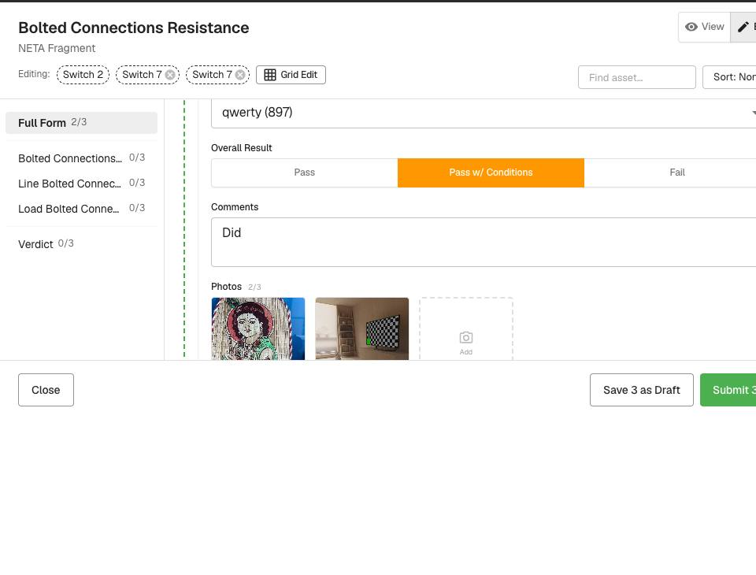

# NETA-3 Forms: multi-edit working sets, bulk export, instance tags — QA verdict

**Tested:** 2026-08-21 · **Build:** QA V1.36 · **Tenant:** `acme.qa.egalvanic.ai` (2nd tenant: `demo`)
**PRs:** eg-pz-backend **#1011** · eg-pz-frontend **#1197** · eg-pz-reporting-lambdas **#273**

---

## Verdict — the feature is LIVE on QA (contra the "dev only" note) and the functional half PASSES across the board. One **Critical** security defect: the new endpoints are not tenant-gated (separate ticket).

The ticket says "dev only, none has reached QA — verify on dev." It's actually **fully deployed on QA V1.36**: the Tags column, Bulk Ops working sets, bulk export, and the `bulk-patch` save contract all respond live. iOS not covered here (web + API only).

## 🟥 Blocker — cross-tenant leak → **[JIRA-TICKET-neta3-eg-form-instance-cross-tenant.md](JIRA-TICKET-neta3-eg-form-instance-cross-tenant.md)**
The ticket calls tenant gating "the important negative test." It **fails**: a Company B user reads Company A's `eg-form-instance/by-session` data (with real `form_submission`) from their own host, and the session list is self-discovering. Write vectors (tag/export) also cross the boundary but only via request-tampering at the other tenant's host. Filed Critical; details in the linked ticket. This is the exact "latent `eg-form-instance/by-session` route" the Aug-14 cross-tenant P1 predicted would leak once populated.

## ✅ Multi-edit working sets (web)

| Check | Result |
|---|---|
| Select several instances of one form → open as a **stacked working set** | ✅ Bulk Ops → select → **Edit** opens `EGFormInstanceDialog`; header shows *"Editing: Switch 2 · Switch 7 · Switch 7"* and sections are namespaced per asset (Line/Load/Verdict × each) |
| Save/Submit act on **every** open form, not just the one in view | ✅ footer reads **"Save 3 as Draft"** and **"Submit 3 Forms"** — literally names n |
| Per-section done stamps show **full-set index counts** | ✅ *"Full Form 2/3"*, *"Verdict 0/3"* — counts span the set |
| Close without saving persists nothing | ✅ typed a probe across the set → a *"Discard changes?"* guard → confirmed via API none of the 3 instances kept it |
| PinFormsDialog / ManagePinnedDialog gone; no pinning entry point | ✅ zero "pin" text anywhere in the Forms UI |

## ✅ Save contract — `PUT /eg-form-instance/bulk-patch` staged save + staleness
| Check | Result |
|---|---|
| Stale write is rejected | ✅ old `expected_modified_at` → per-item `{"error":"stale","success":false}`, no mutation (see note) |
| Fresh write succeeds | ✅ correct `expected_modified_at` → item `success:true`, value changed, `modified_at` bumped |

**Contract note (not a bug, but flag for the client/iOS):** staleness does **not** use HTTP 409. The call returns **HTTP 200** with a per-item `results[]`, and the **top-level `success` stays `true` even when every item was stale-rejected**. `expected_modified_at: null` is treated as **stale**, not skip-check. The ticket's QA text says "409-stale"; the server signals stale in-band instead. Callers must inspect `results[].error === "stale"`, not the HTTP status or top-level success.

## ✅ Bulk export
| Check | Result |
|---|---|
| PDF (joined) | ✅ 200 + `execution_arn`; polled `/reporting/status` → SUCCEEDED; downloaded a real merged `%PDF` |
| PDF Archive (`pdf_zip`) | ✅ real PK-zip; members named per asset+form+short-id, **unique & Windows-safe** — e.g. `Switch 7 — Bolted Connections Resistance (ddb02914).pdf`, `Switch 7 — Test form validation (d04cf056).pdf` (two same-form-same-asset instances deduped by id) |
| DOCX / DOCX Archive on an all-HTML set → **rejected** | ✅ **HTTP 400 `docx_not_supported`**, no job started (server-side, not just greyed UI). The UI also greys the DOCX options with the reason. |
| empty `instance_ids` | ✅ 400 `instance_ids is required` |
| bogus `output_format` | ✅ 400 `bad_output_format` naming the 4 allowed values |
| foreign / unknown instance id in the list | ✅ 400 `targets_not_in_scope`, offending id named in `missing[]` — **the id-scope check works** |

**Minor (not blocking):** the export endpoint reads **`output_format`**; an unknown key like `format` is silently ignored and the request falls through to a default PDF job. Worth rejecting unknown keys, but low impact. *(This ignored-key behavior is also what produced a false "DOCX accepted" reading in the first automated pass — the real DOCX gate is correct.)*

**Not testable on QA:** the DOCX **happy path** — all 642 forms on QA acme have `.html` templates (0 docx), so a successful docx/docx_zip render couldn't be exercised. `skipped_no_template` likewise couldn't be driven (no templateless form exists on QA).

## ✅ Instance tags + colour registry
| Check | Result |
|---|---|
| bulk add / remove (`PUT …/bulk-tags`) | ✅ add & selective remove both correct; verified via listing |
| cap 50 chars | ✅ 400 `invalid_tags "limited to 50 characters"`, none applied |
| cap 20 per request | ✅ 400 `invalid_tags "At most 20 tags per request"`, none applied |
| cap 30 per instance | ✅ at exactly 30, a 31st → 400 `too_many_tags` naming the instance; count stays 30 |
| **atomicity** (one valid + one invalid in a request) | ✅ whole request 400s; the valid tag is **not** applied |
| registry `GET/PUT /eg-form-tags` | ✅ GET → `[{name,color}]`; PUT one tag at a time `{name,color}` |
| colours are palette **keys, not hex** | ✅ `#ff0000` → 400 `invalid_color`; error enumerates the 20-key palette (red…grey); bogus key also 400; `null` clears |
| UI surfaces | ✅ Tags column of coloured chips; Bulk Ops **Tag** ("Add or remove tags on N forms"); Include/Exclude filters present |

**Observation (not a bug):** `GET /eg-form-tags` returns only **colour-registered** tags, so it's a colour map, not a used-tag vocabulary — a tag used on instances but never colour-registered doesn't appear. If it's meant to double as the cross-work-order suggestion source (as the ticket describes), suggestions would miss uncoloured tags. Also `GET /eg-form-instance/tags` → **500** (non-UUID path segment hits the `/{id}` route) — the known bad-GET-path-param family, harmless but noisy.

## Not covered
iOS (working sets, Forms tab on both views, offline per-item fallback, UUID-casing tombstone regression, calculated-field parity) — web/API only. DOCX happy path + `skipped_no_template` — no docx/templateless forms exist on QA.

## Method
Live QA. Web working set + tag/export dialogs driven in-browser (screenshots). API contracts verified by a 6-lens adversarial panel (tags/caps, registry, export-happy incl. real zip download + member inspection, export-negatives, staleness, tenant-gating) + independent hand re-verification of the security finding and the DOCX gate. Cross-tenant tested demo↔acme with own-tenant positive controls; masked-404 (200 + SPA HTML) always treated as a rejection. Test data labelled `qa-demo-*` / `xt-demo-*`, left in place per sandbox policy.
