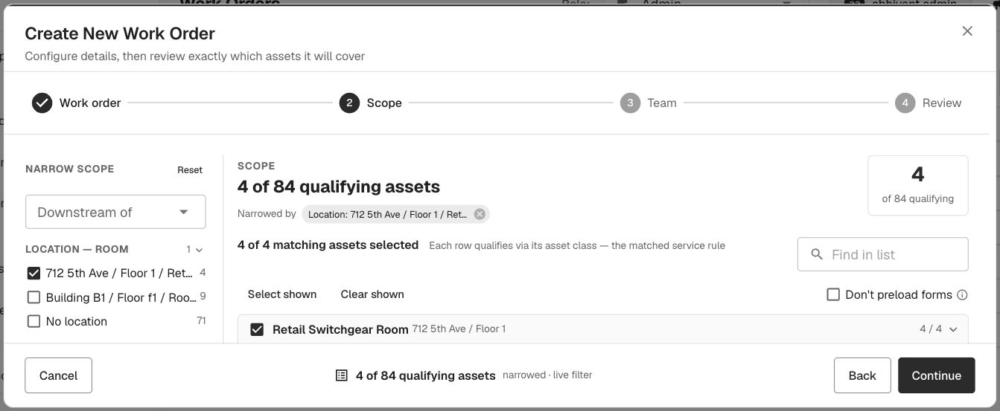

# Redesign Asset Auto-Selection Flow When Selecting a Work Order Type — QA verdict

**Tested:** 2026-08-21 · **Build:** QA V1.36 · **Tenant:** `acme.qa.egalvanic.ai`
**Ticket:** Z — "On the Web, when we select a Work Order Type, the matching assets are automatically selected."

---

## Verdict — **FEATURE PASS, but ships on a CRITICAL cross-tenant leak.** The auto-selection works correctly (deep-verified: the resolved set is exactly the class-rule-matching assets, not an arbitrary number). **However, the driving endpoint `POST /ir_session/scope-preview` is not tenant-scoped** — a user of one company can enumerate another company's full asset inventory + building-location PII on their own host. Filed **Critical: [JIRA-TICKET-scope-preview-cross-tenant.md](JIRA-TICKET-scope-preview-cross-tenant.md)**.

## 🟥 Blocker — cross-tenant asset-inventory leak (the important finding)
A **demo-tenant** user (company `93611164`), on the **demo host** (their own browser path — no tampering), POSTs `scope-preview` with **acme's** `sld_id`:
```
POST https://demo.qa.egalvanic.ai/api/ir_session/scope-preview
     {"sld_id":"<ACME sld>","work_type_id":"<ACME IR>","asset_scope":null,"enrich":true}
→ 200 JSON · 84 ACME assets: labels (ats, ATS-EM-EL, …), node classes,
  and room_label PII: "712 5th Ave / Floor 1 / Retail Switchgear Room", "Building B1 / Floor f1 / Room R1"
```
Auth is enforced (no token → 401), but there is **no caller-company gate on `sld_id`** — it reads whatever SLD id you pass. Leaks **both directions**, and because it works on the caller's own host it's **normal-user-reachable, not request-tamper → Critical.** This is the 5th (and worst) instance of the platform-wide missing caller-company scope check on the `ir_session`/`eg-form-instance`/`procedures-v2` route families. Independently re-verified by hand. Details in the ticket.

## ✅ Deep-verify: the auto-selection is CORRECT (not just "some number")
An adversarial deep panel proved the resolved set is the *right* set, across ~200 assets:
- **Rule-consistent membership, 0 violations:** for every `(node_class, com-component)` pair, the resolved set is all-in or all-out — never partial. Positive link verified end-to-end: ATS's 4 pm-plans all include the Infrared Thermography service → all 18 ATS assets selected.
- **Counts nest logically:** IR=84, De-Energized Visual=198, NETA=180 (**strict subset** of De-Energized — the 18-asset difference is exactly the ATS class NETA omits), DGA=1 (Transformer only), UPS=0 (not configured). Not arbitrary.
- **Negative controls:** bogus `work_type_id` → 200 `{applicable:false, assets:[]}`; bogus `sld_id` → empty. The endpoint genuinely evaluates rules.
- **Methodology catch (would have been a false bug):** resolution is at `(class, com-component)` granularity, not the class-NAME the UI shows. IR resolves 1 of 40 Circuit Breakers — correct (that 1 CB is com=2, the other 39 are com=1, which IR doesn't cover). A name-level QA check would wrongly flag a "39-asset omission."

## ✅ End-to-end wizard flow (browser)
Advancing past the Work-order step lands on **Scope** with all matching assets selected (**"84 of 84 qualifying"**, *"Each row qualifies via its asset class — the matched service rule"*), and **narrowing works**: applying a Location/Room filter dropped it to **"4 of 84"** with a "Narrowed by" chip (3rd screenshot). So the flow is auto-select-all-matching → review/narrow → Team → Review.



---
### Original PASS body (auto-selection mechanics) follows — still valid; the Critical above is a separate security defect in the same endpoint:

## What the redesign looks like
The Create Work Order flow on `/sessions` is now a **4-step wizard**: **Work order → Scope → Team → Review** (heading "Create New Work Order — Configure details, then review exactly which assets it will cover"). The Work Type field is labeled **"Service to Perform"**. Below it, an info panel states the behavior verbatim:

> *"The Work Type decides which assets are pulled in, via the per-class service rules in Settings → Services. You review and narrow that set on the next step — nothing is committed yet."*

## The auto-selection — verified two ways

**1. UI (two work types, two auto-selected sets):**

| Service to Perform | Auto-resolved | Footer |
|---|---|---|
| **Infrared Thermography** | **84 assets** ("every ATS · Circuit Breaker · Disconnect Switch · Generator · MCC · Motor · … · Transformer") | **"All 84 qualifying assets — nothing excluded · live filter"** |
| **De-Energized Visual Inspection** | **198 assets** | **"All 198 qualifying assets — nothing excluded · live filter"** |

Picking the Work Type immediately updates "WILL RESOLVE TO — N assets" and the footer shows the full set auto-selected (nothing excluded) by default; the user then reviews/narrows on the Scope step. Changing the type re-resolves live (84 → 198), so the selection is driven by the type, not static.


**2. Backend (the resolve endpoint):** picking the Work Type fires
`POST /api/ir_session/scope-preview {sld_id, work_type_id, asset_scope:null, enrich:true}`
→ **200**, `data.assets` = **exactly 84 items** (of 234 total nodes) for Infrared Thermography — the matching set the UI auto-selects. Each asset carries its `node_class_id`, confirming the per-class service-rule resolution the info panel describes.

## Notes
- This is a "verify the feature works" ticket (summary is one line, no defect claimed) — it works as designed. No bug found.
- The auto-selected set is **inclusive by default** ("nothing excluded"), and the wizard explicitly defers commitment to the Scope/Review steps, so a user can de-select before creating — matching "auto-selects the matching assets, then you narrow."
- Did not create a WO (no need — the auto-selection is the ticket's subject and is fully observable pre-commit). Test dialog cancelled; no data written.

## Method
Live QA, redesigned Create-WO wizard on `/sessions`. Selected two Work Types and observed the live "WILL RESOLVE TO N assets" + "All N qualifying assets" footer (screenshots). Captured the driving request `POST /ir_session/scope-preview` and confirmed its response returns the 84-asset set. Consent modals (Terms/Privacy) dismissed to reach the page. No WO created.
