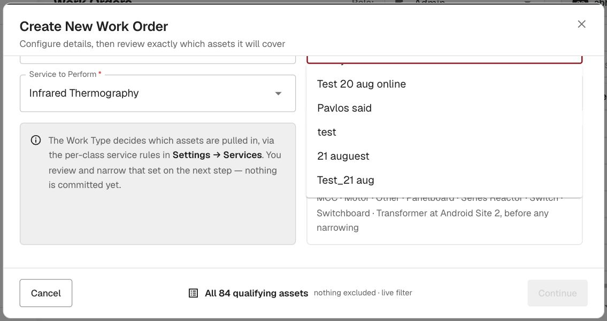
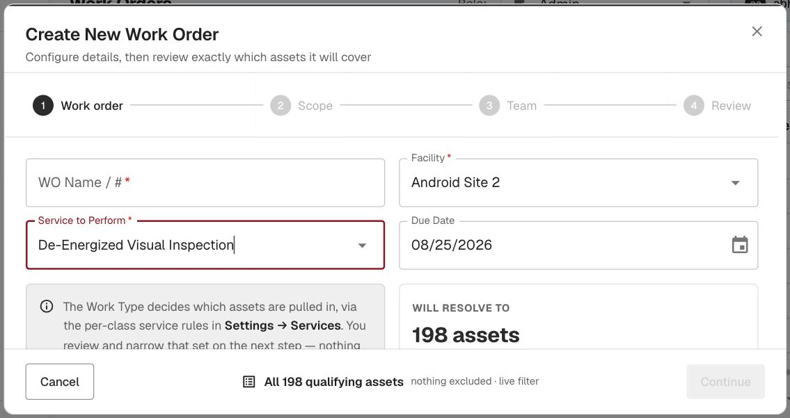

# Redesign Asset Auto-Selection Flow When Selecting a Work Order Type — QA verdict

**Tested:** 2026-08-21 · **Build:** QA V1.36 · **Tenant:** `acme.qa.egalvanic.ai`
**Ticket:** Z — "On the Web, when we select a Work Order Type, the matching assets are automatically selected."

---

## Verdict — **PASS.** Selecting a Work Order Type in the redesigned Create-Work-Order wizard auto-resolves and auto-selects every matching asset, live on QA. Confirmed in the UI (two work types → two different asset sets) and at the backend (the resolve endpoint returns the exact set).

## What the redesign looks like
The Create Work Order flow on `/sessions` is now a **4-step wizard**: **Work order → Scope → Team → Review** (heading "Create New Work Order — Configure details, then review exactly which assets it will cover"). The Work Type field is labeled **"Service to Perform"**. Below it, an info panel states the behavior verbatim:

> *"The Work Type decides which assets are pulled in, via the per-class service rules in Settings → Services. You review and narrow that set on the next step — nothing is committed yet."*

## The auto-selection — verified two ways

**1. UI (two work types, two auto-selected sets):**

| Service to Perform | Auto-resolved | Footer |
|---|---|---|
| **Infrared Thermography** | **84 assets** ("every ATS · Circuit Breaker · Disconnect Switch · Generator · MCC · Motor · … · Transformer") | **"All 84 qualifying assets — nothing excluded · live filter"** |
| **De-Energized Visual Inspection** | **198 assets** | **"All 198 qualifying assets — nothing excluded · live filter"** |

Picking the Work Type immediately updates "WILL RESOLVE TO — N assets" and the footer shows the full set auto-selected (nothing excluded) by default; the user then reviews/narrows on the Scope step. Changing the type re-resolves live (84 → 198), so the selection is driven by the type, not static.

**2. Backend (the resolve endpoint):** picking the Work Type fires
`POST /api/ir_session/scope-preview {sld_id, work_type_id, asset_scope:null, enrich:true}`
→ **200**, `data.assets` = **exactly 84 items** (of 234 total nodes) for Infrared Thermography — the matching set the UI auto-selects. Each asset carries its `node_class_id`, confirming the per-class service-rule resolution the info panel describes.

## Notes
- This is a "verify the feature works" ticket (summary is one line, no defect claimed) — it works as designed. No bug found.
- The auto-selected set is **inclusive by default** ("nothing excluded"), and the wizard explicitly defers commitment to the Scope/Review steps, so a user can de-select before creating — matching "auto-selects the matching assets, then you narrow."
- Did not create a WO (no need — the auto-selection is the ticket's subject and is fully observable pre-commit). Test dialog cancelled; no data written.

## Method
Live QA, redesigned Create-WO wizard on `/sessions`. Selected two Work Types and observed the live "WILL RESOLVE TO N assets" + "All N qualifying assets" footer (screenshots). Captured the driving request `POST /ir_session/scope-preview` and confirmed its response returns the 84-asset set. Consent modals (Terms/Privacy) dismissed to reach the page. No WO created.
