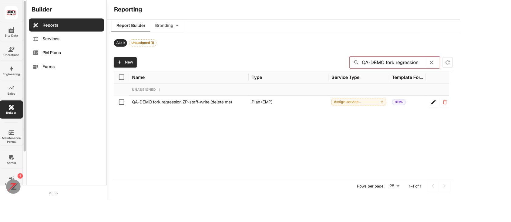
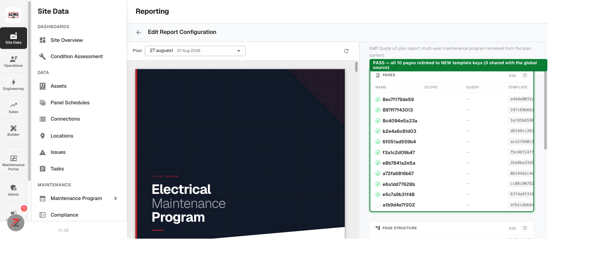

# Staff write surface (ZP-3874 follow-on) — QA verdict

**Tested:** 2026-09-01 · **Env:** `acme.qa.egalvanic.ai`, build **V1.36** · **Tenant:** acme (`d59d449b`)
**Tickets/PRs:** eg-pz-backend **#1073** (staff write routes) · **#1074** (fork-helper tests) ·
**#1080** prod · **#1081** qa · **#1082** stag · companion `eg-pz-reporting-lambdas` **#331**
**Related:** ZP-3874 (read-only staff elevation: #1064/#1065/#1066)

---

## Verdict — **PASS on the part that is testable on QA. No defects found.**

The change's stated main risk is the refactor, not the new routes: `fork_config_into_company` and
`fork_global_form` were lifted out of the customer routes so the customer fork and the staff copy
share one implementation. That makes **`POST /reporting/configs/<id>/fork`** and
**`POST /eg-forms/<id>/fork`** — two live customer endpoints that had no test coverage — run through
new shared code on every branch, allowlist or not.

Both were exercised end to end as an ordinary product user against real QA data. **Every isolation
property the ticket names holds.** The specific failure the ticket warns about — *"a fork whose pages
still name the source's keys looks successful while quietly making every edit to the copy rewrite the
original, and for a global source that is every tenant at once"* — **does not occur**.

Three things that looked like findings were each disproved by a control (see
[Checked and dismissed](#checked-and-dismissed)). Nothing is being filed.

---

## What was verified

### 1. Report-config fork — `POST /reporting/configs/<id>/fork`

Source: **"EMP Proposal + Condition Assessment"** (`61c9cfae`), a **global** config
(`company_id: null`) with 10 templated pages — the heaviest global, and the dangerous direction,
since a leaked ref on a global source would reach every tenant.

| Check | Result |
|---|---|
| Fork accepted, copy is company-owned | ✅ `200`; `global: false`, `company_id: d59d449b` (acme) |
| **Pages relinked to new template keys** | ✅ **0 of 10** template keys shared with the source; **0 of 10** `page_template_id`s shared |
| Page count / labels / order preserved | ✅ 10 → 10, same labels in order |
| Template rows landed in the destination | ✅ all 10 present, **exactly once each** (no duplication), owner `d59d449b` |
| S3 HTML came across | ✅ the copy **renders** — cover page previews in the builder |
| **Editing the copy leaves the source untouched** | ✅ source byte-identical, hash `-1235676228/len2041` before *and* after |



*The copy exists as a normal company-owned report config in the tenant's Report Builder.*



*Every row is `source key → copy's own new key`. The preview rendering on the left is what proves
the per-template S3 HTML was copied, not just the database rows.*

The isolation test is not vacuous: the same run asserts the **copy did change**
(`page[2].label` → `EDITED-BY-QA-fork-isolation-probe`, confirmed on re-read) before asserting the
source did not. A silently-failed write would otherwise look like a pass.

### 2. EG Forms fork — `POST /eg-forms/<id>/fork`

Source: **"Torque Record"** (`d5fa18f0`), a global form carrying **76 node-class names + 76 pairs** —
picked because node-class mappings are what decide where a form is offered.

| Check | Result |
|---|---|
| First fork | ✅ `201`, `forked: true` → copy `477b4d72`, acme-owned, `is_override: true` |
| **Copy points at its own template** | ✅ id `52f85ba8` → `f7c79a0e`; key `egform-torque-record-cross-cutting.html` → `8c314072fd8c.html` |
| **Node-class mappings carried** | ✅ **76 / 76** names and pairs, full structure (`node_class_id` + subtype) |
| **The copy is actually reachable** | ✅ on a real Transformer asset, `available-for-node` offers the **fork**; the global is **correctly superseded** (not double-offered) |
| Definition content copied faithfully | ✅ identical hash `-1541913108/len3449` |
| **Re-fork is a no-op** | ✅ repeat call `200` + `forked: false`, returns the **same** copy id; still exactly one copy after three calls |
| **Editing the copy leaves the global untouched** | ✅ global byte-identical, still `is_global: true`, `company_id: null` |
| Deleting the copy restores the global | ✅ global returns to the list and is offered on the asset again |

> **On the re-fork status code.** The QA checklist asks that a re-fork "still return the same status
> code it returned before". The observed contract is **201 on create / 200 on existing**, with an
> explicit `forked: false` flag — coherent and clearly deliberate. I can confirm it is idempotent and
> creates no duplicate; I **cannot** diff it against pre-refactor behaviour, since QA only has the
> post-merge build. If the intent was that a re-fork return 201 as well, that is a one-line confirm
> with the author rather than something QA can settle here.

### 3. Staff routes are present and inert on QA — as the ticket predicts

All eight new routes plus the dataprep proxy answer **`401 {"error": "eg_staff_denied"}` as JSON** to
a normal authenticated Super Admin, even with `X-Act-As-Company` naming their own tenant:

```
PUT  /staff/reporting/configs/<id>            401 eg_staff_denied
POST /staff/reporting/configs/<id>/copy       401 eg_staff_denied
PUT  /staff/eg-forms/<id>                     401 eg_staff_denied
POST /staff/eg-forms/validate                 401 eg_staff_denied
POST /staff/eg-forms/<id>/render-preview      401 eg_staff_denied
POST /staff/eg-forms/<id>/copy                401 eg_staff_denied
POST /staff/reporting/generate                401 eg_staff_denied
GET  /staff/reporting/status/<handle>         401 eg_staff_denied
POST /staff/dataprep                          401 eg_staff_denied
```

This is worth two separate conclusions. A **JSON** refusal (rather than the `200 + SPA HTML` this host
returns for unmatched `/api/...` paths) confirms the routes really are **deployed on QA** — #1081
landed. And `require_eg_staff` **holds** with `EG_STAFF_ALLOWLIST` unset, which is the documented
inert state.

---

## Not testable on QA — needs dev

These are the majority of the checklist, and they are blocked by environment, not skipped:

- Every **positive** staff-write path (config update, form update, both copies, validate,
  render-preview) — needs `EG_STAFF_ALLOWLIST` + `EG_STAFF_CLIENT_IDS` set.
- **Copy negatives** — `source_company` omitted, and a config id belonging to a tenant not named in
  `source_company`; both must be `403 wrong_source_tenant`. This is the most important negative in
  the ticket and it cannot be reached while the gate refuses first.
- **`POST /staff/dataprep` `primary_id` cross-tenant refusal** across all four entity kinds — the
  narrower defect this change fixes.
- **`POST /staff/reporting/generate` → `status/<handle>`**, and that the audit trail names the staff
  member rather than a customer employee. Also gated on reporting-lambdas **#331** reaching the
  environment, which this monitor does not track.
- **Audit records** on accepted writes and on errored requests — not observable from the product UI.

## Author-flagged, deliberately deferred — not re-tested

Both were verified by the author and left to a separate change with its own blast radius. Flagging
that they remain open, and recommending each gets its own ticket rather than riding along:

- `PUT /eg-forms/<id>` never references `company_id` or the caller — any authenticated user with
  `forms.manage` can edit any non-global form in any company by id.
- `GET /reporting/status/<arn>` describes any execution whose ARN you hold and returns its download URL.

I did **not** exercise the cross-tenant write, because demonstrating it means mutating another
tenant's data — the refusal path is the author's to prove, not something QA should reproduce
destructively on a shared environment.

---

## Checked and dismissed

Each of these looked like a finding until a control was run. Recording them so the next person does
not re-raise them:

| Observation | Control that dismissed it |
|---|---|
| The forked form has `service_id: null` while the source had "UPS Maintenance" | **277 / 277** pre-existing overrides are also `service_id: null`, while **41 / 41** globals carry one. Nulling the service on an override is the established pattern, not new. |
| The forked form does not appear in the EG Forms library grid | The grid shows **330** rows against the API's **647** — it lists plain company forms and excludes *all* overrides, including the 277 that predate this branch. Pre-existing UI scoping. Reachability is via node-class offering, which passed. |
| The global source config renders "No pages yet" in the builder | An untouched control global ("EMP Proposal", `d88c14a9`) resolves **0 of 9** of its page templates in the company-scoped catalog, exactly like the forked source's **0 of 10**. Pre-existing for these seeded globals; unrelated to the fork. |

A fourth near-miss: my first template-ownership lookup keyed on `template`, but the field is `s3_key`,
so *both* the copy and the source came back "MISSING". Including the source as a control is what
showed the lookup was wrong rather than the data.

---

## Method

Live UI + live API on acme as a real logged-in user (Super Admin), Playwright-driven. Forks were
issued against the same endpoints the UI calls; the Report Builder locks the fork affordance for
Super Admin (see the 2026-08-10 authz-mismatch report), so the config fork was driven through the
API the button posts to. All isolation assertions are before/after hashes of the full config or
form definition, each paired with a positive control proving the write to the copy actually landed.

**Fixtures used:** config `61c9cfae` (global, 10 pages) · form `d5fa18f0` (global, 76 node-class
pairs) · asset `d8f4dc9d` "397 Transformer TF-Add" on site `aadcee4c` (Android Site 2).

**Test-data footprint.** The EG Forms fork was removed after testing (`PUT /eg-forms/<id>
{is_deleted: true}` — `DELETE` is 405 and `/delete` returns the SPA shell), which restored the
global to the library and to the asset's offered list; the tenant is back to its prior state. The
report-config fork is left in place, labelled **"QA-DEMO fork regression ZP-staff-write (delete
me)"**, as an inert extra config.
