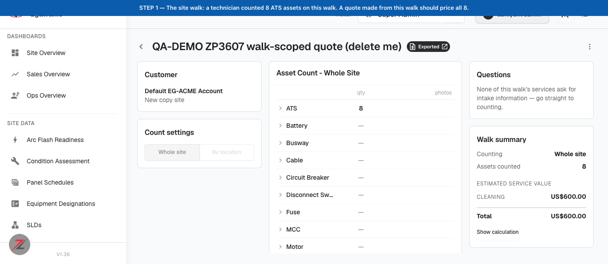
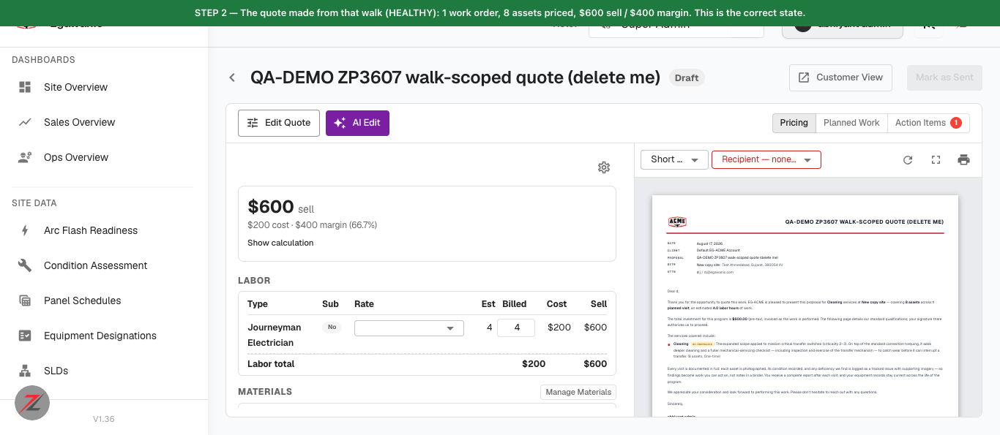
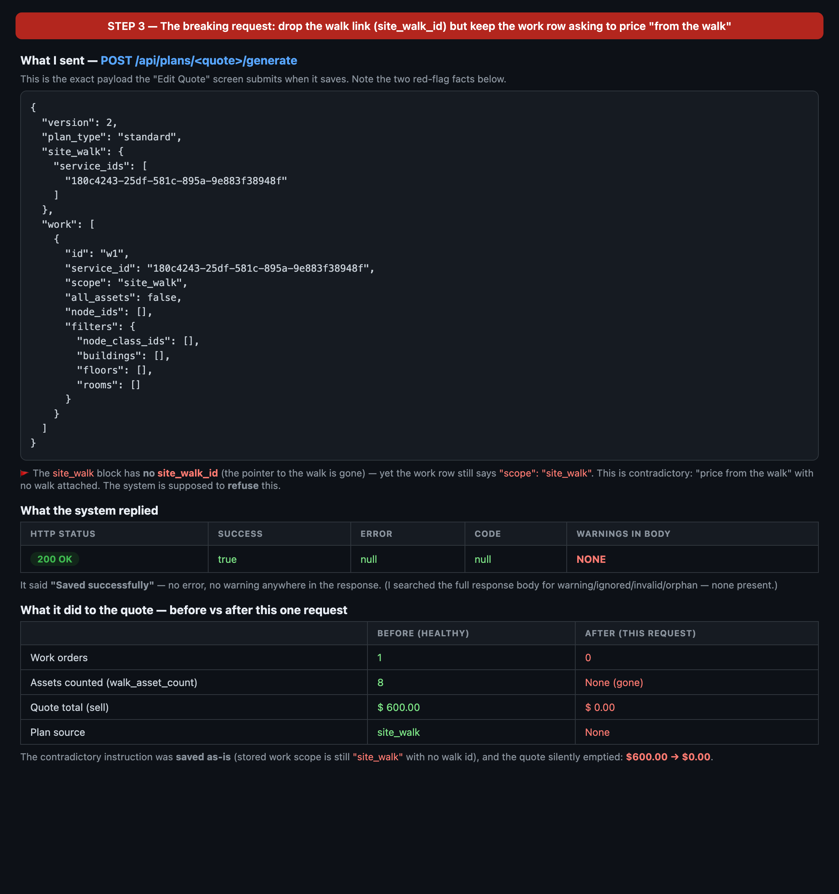
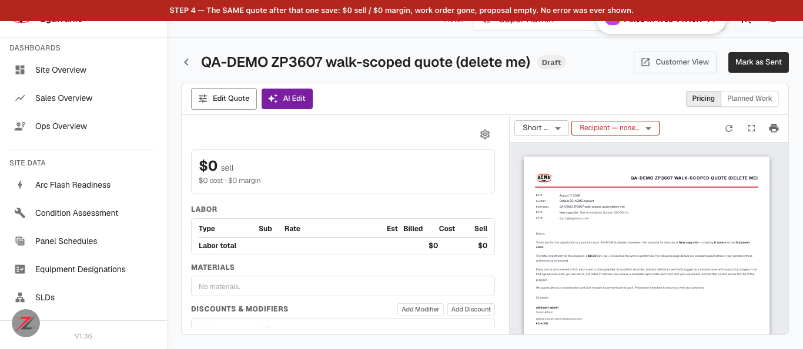

# Walk-sourced quote silently drops to $0.00 — illustrated walkthrough

**What this is:** a step-by-step, screenshot-by-screenshot account of one bug found while testing ZP-3607 ("AI quote editor: understand site-walk-scoped quotes"). Written so both a non-technical reader and the developer can follow exactly what was done and what went wrong.

**Where:** QA · `acme.qa.egalvanic.ai` · build **V1.36** · 2026-08-17
**Refs:** ZP-3607 · eg-pz-engineering-ai-pipeline #37 · eg-pz-backend #956
**Severity:** Medium

---

## 30-second summary

A "site walk" counts equipment in a building; you then turn that walk into a **price quote**. The quote doesn't own the equipment list — it just holds a **pointer** to the walk (`site_walk_id`).

If that pointer is removed while the quote still says *"price me from the walk"*, the app should **refuse** it. Instead it says **"Saved ✓"** and the quote **silently empties from $600.00 to $0.00** — no error, no warning. This can happen through the normal **Edit Quote → Save** path.

---

## The 4 steps, with screenshots

### STEP 1 — Start with a site walk that counted 8 assets

I created a walk ("QA-DEMO ZP3607 … delete me") with **8 ATS units** counted. Its estimated value is **$600.00**. (Side note visible on the right: *"None of this walk's services ask for intake information"* — that fact matters later.)

### STEP 2 — Turn it into a quote → healthy, $600

Exporting the walk creates the quote. It reads correctly: **1 work order, 8 assets priced, $600 sell / $400 margin**, and the customer proposal on the right says *"covering 8 assets across 1 planned visit."* **This is the correct state — and proves the ZP-3607 fix itself works.**

### STEP 3 — Save one contradictory edit → app says "Saved ✓"

I saved the quote with the **walk pointer removed** (`site_walk_id` gone) but the work row **still set to `scope: "site_walk"`** — i.e. *"price me from the walk"* with **no walk attached**. This is the exact payload the **Edit Quote** screen submits.

The server replied **HTTP 200, `success: true`, no error, no warning anywhere**. The contradictory instruction was saved as-is, and the quote's total went **$600.00 → $0.00**.

### STEP 4 — The same quote is now empty: $0.00

Re-opening the very same quote: **$0 sell · $0 cost · $0 margin**, the work order is gone, and the customer proposal now reads *"covering 0 assets across 0 planned visits."* **No error was ever shown to the user.**

---

## Why it matters

A **priced customer quote can silently become $0** through the normal editor save, with a success message and no warning. If someone doesn't happen to re-read the total, they could send a $0 quote. Nothing is permanently destroyed (the walk is untouched, and re-sending a valid edit restores the quote), which is why this is **Medium**, not High — but a "Saved ✓" that quietly zeroes a quote is a real trust problem.

## What *should* happen

The save should be **refused** with a clear message, e.g. *"This work row is priced from a site walk, but no site walk is attached — re-link the walk or change the row's scope."* Per ZP-3607 itself: *"validation … refuses to drop `site_walk.site_walk_id` while any row still claims walk scope."*

## Two honest caveats for the developer

1. **Which layer owns the fix?** I reproduced this on the REST save path (`POST /api/plans/{id}/generate`). PR #37 lives in the AI-pipeline repo, and its validation may be intended for the separate **AI-edit** path (`/ai-edit`, a Step Function) rather than this REST path. That AI-edit run hadn't finished when I tested. So please confirm which layer should host the check before routing this ticket. Either way, the REST save path currently accepts it.
2. **This path has *no* validation at all right now.** The same endpoint also accepted an invalid scope name, a work row with no service, a made-up service id, and a missing version — so the missing walk-pointer check is one instance of a broader "no input validation on save" gap.

## What I did NOT report (and why)

While testing I also sent a made-up `intake_overrides` key (a "typo" the PR claims to reject). It was accepted — **but every walkable service on QA has an empty intake question set** (visible in Step 1: *"None of this walk's services ask for intake information"*), so there's nothing for that rule to reject here. Without a service that actually asks a question, I can't tell "rule is broken" from "rule doesn't apply." I'm holding it as an open question rather than filing a false bug.

## Reproduction details (for the developer)

- Endpoint: `POST /api/plans/{plan_id}/generate`
- Body: `site_walk` present but **without** `site_walk_id`; `work[0].scope = "site_walk"`.
- Result: `200 / {"success": true, "error": null}`, no warnings in the body; stored `instructions.work[0].scope` stays `"site_walk"` with no `site_walk_id`; regenerated `content` has `source: null`, `site_walk: null`, `workorders: []`, `pricing.totals.total_sell: 0.0`.
- `site_walk_id: null` (explicit) behaves the same as omitting it.
- Reachable from the UI: the editor emits the `site_walk` block only when a walk id is present (`V = p.site_walk?.site_walk_id || null; … V && rows.length ? {site_walk:{…}} : {}`), so once the id is lost every later save reproduces this state.
