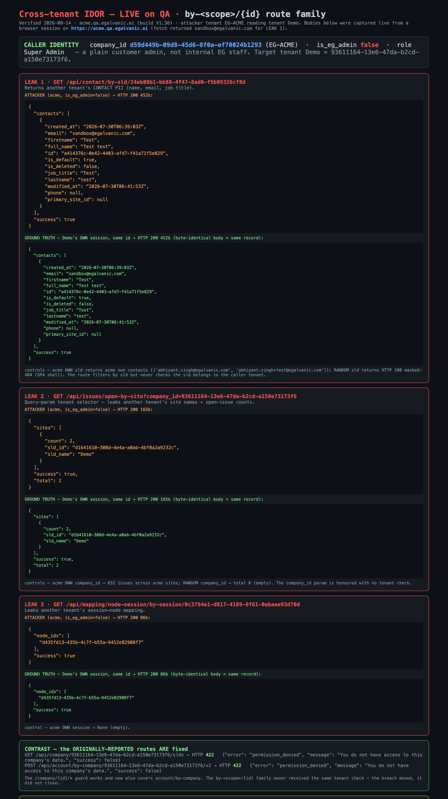

# Cross-tenant IDOR — Jira ticket (ready to file)

Full QA verdict: `docs/bug-reports/2026-08-14-SECURITY-cross-tenant-reverify-by-scope-idor.md`.
Attach: `docs/bug-evidence/cross-tenant-by-sld-idor/idor-evidence.png`.

---

## Title
[Security / API] Cross-tenant data exposure is only partially fixed — a customer admin can still read another tenant's contacts (PII), site/issue counts, and session→node maps via the `/api/<resource>/by-<scope>/{id}` route family

## Environment
* Environment: **QA** (`acme.qa.egalvanic.ai` attacker · `demo.qa.egalvanic.ai` victim/ground-truth)
* Platform: **Web / API** (backend authorization)
* Browser/App Version: QA build **V1.36**, 2026-08-14
* Relates to: the P1 *Cross-tenant data exposure* ticket — its 3 reported `/api/company/{id}/*` routes are now fixed; this is the same vulnerability class on other routes.

## Preconditions
1. Two tenants exist (here EG-ACME + Demo).
2. Logged in as a **customer** admin of EG-ACME — `is_eg_admin:false`, company `d59d449b-09d8-45d6-8f0a-ef70024b1293`. **Not** internal EG staff.
3. One identifier belonging to the other tenant. These are trivially obtainable: the *original* P1 handed them out, `issues/open-by-site?company_id=` (below) enumerates a tenant's `sld_id`s with no auth, and ids appear in shared links / logs / URLs.
   Demo values used: `sld_id = 24eb08b1-bb88-4f47-8ad0-f5b09326cf8d`, `company_id = 93611164-13e6-47da-b2cd-a150e73173f6`, `session_id = 0c3794e1-d817-4189-9f61-0ebaee93d70d`.

## Steps to Reproduce
From an authenticated EG-ACME browser session on `https://acme.qa.egalvanic.ai`, run each in the console (the app's bearer is sent automatically):
1. `fetch('/api/contact/by-sld/24eb08b1-bb88-4f47-8ad0-f5b09326cf8d',{headers:{Accept:'application/json'}}).then(r=>r.json()).then(console.log)`
2. `fetch('/api/issues/open-by-site?company_id=93611164-13e6-47da-b2cd-a150e73173f6').then(r=>r.json()).then(console.log)`
3. `fetch('/api/mapping/node-session/by-session/0c3794e1-d817-4189-9f61-0ebaee93d70d').then(r=>r.json()).then(console.log)`
4. Control that the fix works elsewhere: `fetch('/api/company/93611164-13e6-47da-b2cd-a150e73173f6/slds').then(r=>console.log(r.status))` → **422**.

## Actual Result
Steps 1–3 return **HTTP 200 with the *other tenant's* data**, byte-identical to what Demo's own session returns for the same ids:
* **Step 1 →** Demo's contact PII: `{"contacts":[{"email":"sandbox@egalvanic.com","full_name":"Test test","job_title":"Test","id":"a414376c-…"}],"success":true}`
* **Step 2 →** Demo's sites + open-issue counts: `{"sites":[{"sld_name":"Demo","sld_id":"d1641610-…","count":2}],"total":2}`
* **Step 3 →** Demo's session→node map: `{"node_ids":["d435fd13-435b-4c7f-b55a-9452e82908f7"],"success":true}`

Controls confirm it is a real authorization failure, not an accident: the same routes with **acme's own** id return **acme's** data; with a **random** id they return empty/404; and step 4 (the originally-reported route) correctly returns **422 permission_denied**. The routes filter by the object id but never verify the object belongs to the caller's tenant.

The unguarded routes share the shape `/api/<resource>/by-<scope>/{id}` (and `?company_id=`/`?sld_id=` query selectors). The fix was applied to the `/api/company/{id}/*` family only, and the tenant check is per-route rather than global, so this sibling family was missed. Latent same-pattern routes (return empty only because this Demo tenant is sparse): `quote/by-sld`, `opportunity/by-sld`, `eg-form-instance/by-session/*`, `planned_workorder/by-quote`, `form-instance/by-form|by-task`, `graph/nodes/{id}`, `shortcut/by-node-class`.

## Expected Result
Any route that returns tenant-scoped data must verify the target object/company belongs to the caller's tenant and return **422/403** otherwise — the same guard already applied to `/api/company/{id}/*`. Preferably enforced at one central point (resolve owning tenant → compare to caller) applied by default, plus a CI contract test that walks every object-id/`by-scope` route with a foreign id and asserts 4xx.

## Severity
**High / P1** (cross-tenant confidentiality breach; leaks another tenant's contact PII and business data to any customer admin)

## Priority
**High**

## Attachments
* `idor-evidence.png` — each of the 3 leaks shown beside Demo's byte-identical own-session response, with the caller identity (`is_eg_admin:false`) and the `/company/{id}/*` 422 contrast. Captured live from the acme origin.

**Note for the assignee:** the `/company/{id}/*` guard is correct and even blocks `is_eg_admin:true` staff — the gap is only that it was not extended to the `by-<scope>/{id}` family or the `?company_id=` selectors. A per-route guard means every sibling/new route is a fresh risk; a central object→tenant check applied by default closes the class.
