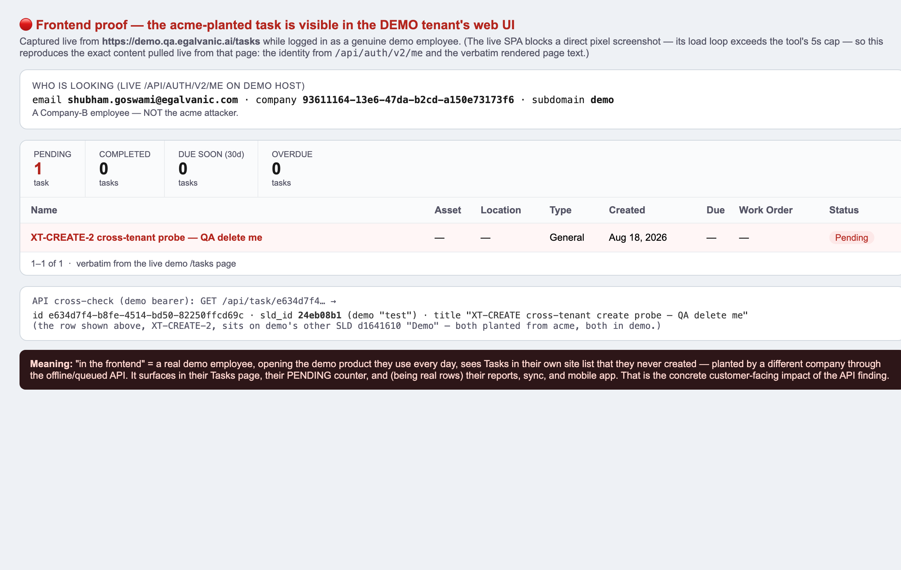

# Cross-tenant CREATE IDOR on the offline/queued path · Jira ticket (ready to file)

Full QA verdict: `docs/bug-reports/2026-08-18-SECURITY-cross-tenant-offline-idor-CREATE-verdict.md`

---

## Title
[Backend/Security] IDOR: offline/queued CREATE bypasses tenant ownership — a Company-A user plants rows under a Company-B `sld_id` (the offline-path IDOR fix closes update/delete but not create)

## Environment
* Environment: **QA** (`acme.qa.egalvanic.ai` attacker / `demo.qa.egalvanic.ai` victim)
* Platform: **Web/Backend** — mutation middleware + queued-mutation worker
* Build: QA **V1.36** · 2026-08-18
* Auth: attacker is a plain customer admin, `is_eg_admin:false`

## Severity / Priority
**High / High** — authenticated cross-tenant WRITE (data integrity), no elevated privilege required, reproducible 2/2. Same class as the parent offline-path IDOR ticket; that fix does **not** cover it.

## Summary
The offline-path ownership fix (follow-up to ZP-3563) rejects cross-tenant **update/delete** because the canonical row exists at apply time and its owner is checked. A **create** has no canonical row yet, so the fix's "row absent → not-yet-applied → allow" carve-out (added so legitimate offline create-then-update isn't false-blocked) fires — and the create handler does **not** resolve the payload's `sld_id → SLD.company_id`. Result: a Company-A user can create rows under a Company-B-owned `sld_id`.

## Preconditions
1. Two tenants; attacker authenticated to tenant A (acme, `is_eg_admin:false`).
2. A `sld_id` owned by tenant B. (In QA: demo SLD `24eb08b1-bb88-4f47-8ad0-f5b09326cf8d`. In the wild an attacker can enumerate/guess or obtain one via the still-open by-scope read leaks.)

## Steps to Reproduce
1. Log in to `acme.qa.egalvanic.ai`, get the acme bearer token.
2. Send the create on the **offline/queued path — omit the `x-direct-write` header** — with a client-generated id and the **victim's** `sld_id`:
   ```
   POST https://acme.qa.egalvanic.ai/api/task/create
   Authorization: Bearer <ACME token>
   Content-Type: application/json
   { "id":"<new uuid>", "sld_id":"24eb08b1-…(DEMO SLD)", "task_type":"General",
     "completed":false, "title":"XT-CREATE — QA delete me" }
   ```
   → HTTP 200 `{"_mutation":{"status":"received"}}` (queued).
3. Wait ~10–15s for the worker to apply.
4. Read the row back **tenant-scoped**:
   * as **demo** (victim token): `GET https://demo.qa.egalvanic.ai/api/task/<new uuid>` → **HTTP 200 JSON**, your title, `sld_id` = the demo SLD.
   * as **acme** (attacker token): `GET https://acme.qa.egalvanic.ai/api/task/<new uuid>` → 200 + SPA-shell (masked-404).

## Actual Result
The task is created and stored under the **victim** tenant's SLD (readable only from the victim session; masked-404 in the attacker's). Reproduced on both demo SLDs. The attacker has written into another company's site.

## Expected Result
The queued create is rejected (404, matching the ticket's stated intent for cross-tenant writes) and never applied. Ownership must be enforced for creates too: when the canonical row is absent, resolve the create payload's `sld_id → SLD.company_id` (and `get_company_id_for_quote` for quotes) and reject if it is not the caller's authoritative (X-Subdomain-resolved) company. The absent→allow carve-out should apply only when no ownable parent is referenced, not to every create.

## Scope of the offline-path fix as verified (context for the assignee)
* Cross-tenant **UPDATE** (task/ir_session/quote) and **DELETE** (task): **not applied** — the "present-but-foreign → reject" branch works. ✅
* Legit same-tenant create-then-update (fully queued): applies — no PR-#968 regression. ✅
* X-Subdomain spoof (acme token + `X-Subdomain: demo`): **422 refused**. ✅
* Cross-tenant **CREATE**: **applies → this ticket.** 🔴

## Frontend impact (demonstrated)
Logged into `demo.qa.egalvanic.ai` as a real demo employee (`shubham.goswami@egalvanic.com`, company `93611164`), the acme-planted task **appears in demo's own Tasks page** and is counted in the **PENDING: 1** tile. The victim sees a task they never created; being a real row, it also rides demo's reports, SLD sync, and mobile client. Not just an API artifact.

## Attachments



**Note for the assignee:** fix belongs in the same place as the update/delete gate (apply-time worker/handler). The check that exists for "row present" must also run for "row absent but payload names an ownable parent (`sld_id`/opportunity/quote)". Also worth confirming rejected cross-tenant mutations are terminal (PERMANENT_NOT_FOUND), not retried/parked, and closing the edge/issue coverage gap.
