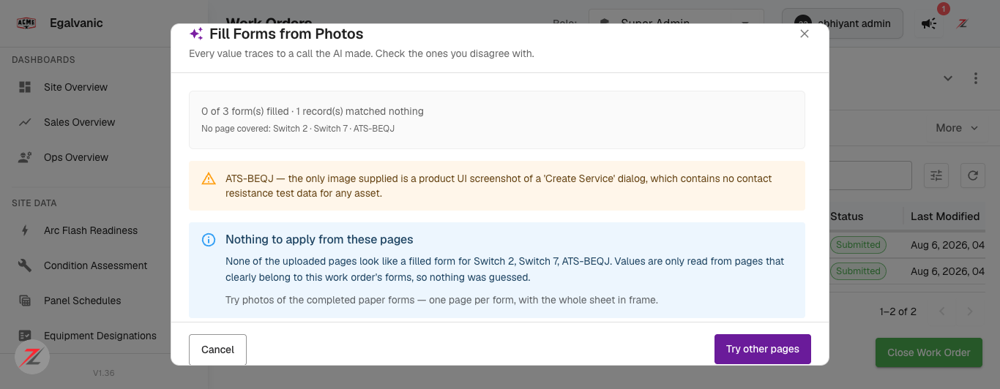
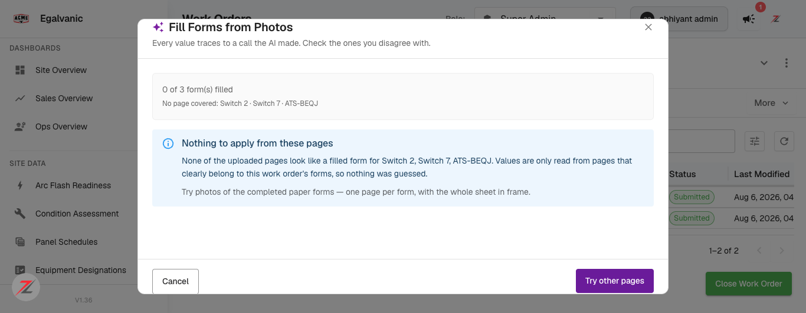

# Fill Forms from Photos — a *crashed* read job leaks the raw AWS ECS descriptor · Jira ticket (ready to file)

Full QA verdict: `docs/bug-reports/2026-08-18-fill-forms-nomatch-and-grid-refresh-QA.md`

> **Scope correction (2026-08-18).** An earlier draft of this ticket said the failure is *input-independent* and *reproduced 2/2 → systemic*, and that the read pipeline was down. **That framing was wrong.** On retest with a real photo the pipeline **succeeds** and returns a graceful no-match state, and the *same* input that was in the crashed job now succeeds too. The genuine defect is narrower and is about **how a crash is surfaced**, not that crashes always happen. Corrected below.

---

## Title
[Work Orders / Fill Forms from Photos] When the read (agent-runner) task crashes, the job's error is the raw AWS ECS task descriptor — served by `/api/form-fill/jobs/{id}/status` and rendered in the dialog — leaking AWS account id, cluster ARN, ECR image, subnet, ENI, MAC, private IP and internal DNS

## Environment
* Environment: **QA** (`acme.qa.egalvanic.ai`)
* Platform: **Web** (frontend dialog + `/api/form-fill/jobs/{id}/status` / `/jobs/active` backend)
* Browser/App Version: Chrome · QA build **V1.36** · 2026-08-18

## What this is / isn't
* **It IS:** an error-handling + information-disclosure defect on the **failure path**. Whenever the form-fill agent-runner (Fargate) task crashes, the backend stores the ECS failure `Cause` verbatim in `job.error` and returns it to the authenticated client, and the dialog renders it.
* **It is NOT:** a claim that the pipeline is broken or that any particular upload triggers it. The read pipeline is healthy — verified succeeding twice on retest (see the QA verdict). The crash that produced the leak was **transient** (see Reproducibility).

## Observed instance (evidence)
Failed job **`bb8c21c8-752c-4e52-8415-a5a75a978b92`** on session `fcc37c67-01fc-4940-87f3-8028fc86e97a` (created 2026-08-18 11:36, failed 11:38). Its `job.error` is a ~4 KB stringified ECS/Fargate task descriptor. Still retrievable today via `GET /api/form-fill/jobs/active?session_id=fcc37c67-…` and `…/jobs/{id}/status`. Exposed to the authenticated user:

* **AWS account id** `165183897698`
* **ECS cluster ARN** `arn:aws:ecs:us-east-2:165183897698:cluster/eg-pz-qa-ecs-ohio`
* **ECR image** `165183897698.dkr.ecr.us-east-2.amazonaws.com/eg-pz-agent-runner:qa` (+ image digest `sha256:66483167…`)
* **VPC internals** — `subnetId`, `networkInterfaceId` (eni-…), `macAddress` `0a:39:c8:df:7b:05`, `privateIPv4Address` `10.1.3.192`, `privateDnsName` `ip-10-1-3-192.us-east-2.compute.internal`
* Step-Functions **execution ARN** (`…:eg-pz-qa-ai-form-fill-sfn-ohio:bb8c21c8-…`), task ARN, runtime id, Fargate sizing (`Cpu 4096`, `Memory 16384`, arm64), the `JOB_JSON` env, `ExitCode: 1`, `DesiredStatus: STOPPED`

Confirmed at the API layer, not just the UI: the `/status` and `/active` endpoints return the descriptor inside the JSON body, so the backend passes the raw failure cause to the client and the dialog renders it.

## Reproducibility (honest)
* The crash itself is **not reproducible on demand.** Re-uploading the *exact* input from the crashed job (`create-service-forms-pricing-sections.png`) today produced a **successful** job with a graceful no-match message — no crash, no leak. So `bb8c21c8` was a transient agent-runner failure, not an input-driven one.
* Therefore the leak surfaces **only when an agent-runner task actually dies** (infra hiccup, OOM, image/dependency error, etc.). It cannot be scripted with a specific file. It should be reproduced by **forcing a task failure** (e.g. kill the Fargate task / make the container exit non-zero) and then reading `GET /api/form-fill/jobs/{id}/status`.

## Steps (to observe the leak on the already-captured instance)
1. Log in to `https://acme.qa.egalvanic.ai` (Super Admin, or any role that can open the session).
2. `GET https://acme.qa.egalvanic.ai/api/form-fill/jobs/active?session_id=fcc37c67-01fc-4940-87f3-8028fc86e97a` with the session bearer token (or open the IR session → Forms → Actions → **Fill from Photos**, which calls the same endpoint to restore the last job).
3. Observe `job.error` = the raw ECS task descriptor (fields listed above).

## Actual Result
The failed job's `job.error` is the raw AWS ECS/Fargate task descriptor, returned to the client and rendered under the dialog's error icon — leaking internal AWS topology (account id, cluster ARN, ECR image, VPC subnet/ENI/MAC/private-IP/DNS, SFN/task ARNs).

## Expected Result
A failed read job shows a **short, readable message** — e.g. *"We couldn't read those pages. Please try again."* — with a retry. The job-status / active endpoints must **not** return the raw Step-Functions/ECS failure `Cause` to the client, and the dialog must not render an unknown error object verbatim. Internal infrastructure (AWS account id, cluster ARN, ECR image, VPC subnet/ENI/MAC/private-IP/DNS, ARNs) must never appear in a user-facing surface. Map the ECS/SFN failure to an internal code + generic client message server-side; log the detail internally only.

## Severity
**Medium** — disclosure is to authenticated internal users (not cross-tenant/public), it is rare (only on an actual task crash), and it is QA infra. But internal AWS account id + topology should never reach the client, and the error is unreadable. Fix is small and worth doing regardless of crash frequency.

## Priority
**Medium**

## Attachments
* `verify-screenshot-input-succeeds-not-crash.png` — the *same* input that was in the crashed job now succeeds with a graceful no-match (proves the crash was transient, not input-driven).
* `verify-realphoto-1176-empty-state-WORKS.png` — a real photo → the polished no-match state (pipeline is healthy).

**Note for the assignee:** the fix is server-side error mapping on the form-fill failure path (return a code + generic message; keep the ECS/SFN `Cause` in internal logs only) plus a dialog guard against rendering an unknown error object. This is independent of *why* a task crashes — even a rare transient crash should never surface the descriptor. There is no "pipeline down" issue to chase; the pipeline works.
