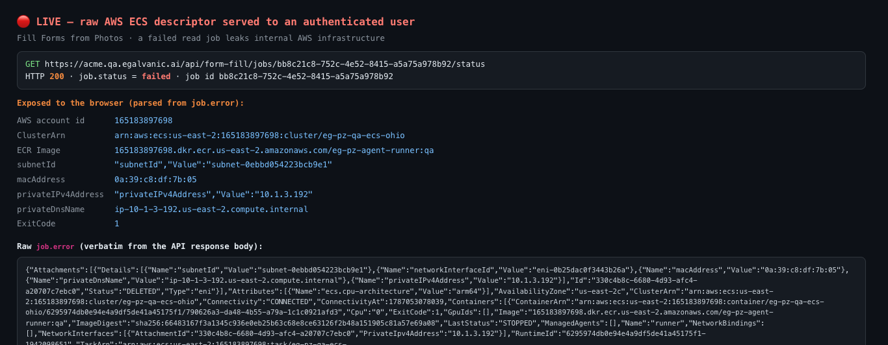

# Fill Forms from Photos — a failed read job leaks the raw AWS ECS descriptor · Jira ticket (ready to assign)

**Verified live 2026-08-18** on QA. Deterministically reproducible. Two proofs below: the user-facing dialog render **and** the API response captured today.

---

## Title
[Work Orders / Fill Forms from Photos] A failed "Read pages" job exposes the raw AWS ECS/Fargate task descriptor — `GET /api/form-fill/jobs/{id}/status` returns `job.error` verbatim (AWS account id, cluster ARN, ECR image, subnet, ENI, MAC, private IP, internal DNS), and the dialog renders it

## Environment
* Environment: **QA** — `acme.qa.egalvanic.ai`
* Platform: **Web** — frontend dialog + `/api/form-fill/jobs/{id}/status` (and `/jobs/active`) backend
* Build: QA **V1.36** · Chrome · 2026-08-18
* Auth: any authenticated user who can open a Work Order session (tested as Super Admin)

## Summary
When a Fill-from-Photos "Read pages" job fails, the backend stores the **raw ECS/Fargate failure `Cause`** in the job's `error` field and returns it to the client. The failed job **persists**, so the endpoint keeps serving the descriptor on demand, and the dialog renders it verbatim under the error icon. This leaks internal AWS infrastructure to the browser.

## Preconditions
1. Logged in to `https://acme.qa.egalvanic.ai`.
2. A **failed** form-fill job exists. Failed jobs persist and remain queryable. **Known live instance (still returning the descriptor today):**
   * session `fcc37c67-01fc-4940-87f3-8028fc86e97a`, job **`bb8c21c8-752c-4e52-8415-a5a75a978b92`**.

## Steps to Reproduce — deterministic (API)
1. Log in (obtain the session cookie).
2. Request, same-origin, with the session cookie:
   ```
   GET https://acme.qa.egalvanic.ai/api/form-fill/jobs/bb8c21c8-752c-4e52-8415-a5a75a978b92/status
   ```
   (In the browser console on the app origin: `fetch('/api/form-fill/jobs/bb8c21c8-752c-4e52-8415-a5a75a978b92/status',{credentials:'include'}).then(r=>r.json()).then(j=>console.log(j.job.error))`.)
3. Observe **HTTP 200**, `job.status: "failed"`, and **`job.error` = the raw ECS task descriptor** (see Actual Result). Same leak is served by `GET /api/form-fill/jobs/active?session_id=…` whenever the failed job is the session's most recent form-fill job.

## Steps to Reproduce — user-facing (UI)
1. Have a WO session whose most-recent form-fill job failed (i.e. right after a "Read pages" run fails, before a later run supersedes it).
2. Open the session → **Forms** tab → **Actions** → **Fill from Photos**.
3. The dialog restores that job and renders `job.error` verbatim — the raw ECS JSON appears in the dialog body under the red error icon (screenshot below).

> Note on the *trigger*: the read job itself only fails when the `eg-pz-agent-runner:qa` Fargate task crashes (`ExitCode 1`). That crash is **transient** (was happening repeatedly earlier on 2026-08-18 — ≥2 distinct ECS tasks — then recovered; a real photo now reads fine). But **once any job has failed, this leak is permanently and deterministically reproducible** via the steps above, independent of the crash. Fix the presentation regardless of crash frequency.

## Actual Result
`job.error` is a ~3.8 KB stringified ECS/Fargate task descriptor, returned to the browser and rendered in the dialog. Exposed (values captured live today from job `bb8c21c8`):

* **AWS account id** `165183897698`
* **ECS cluster ARN** `arn:aws:ecs:us-east-2:165183897698:cluster/eg-pz-qa-ecs-ohio`
* **ECR image** `165183897698.dkr.ecr.us-east-2.amazonaws.com/eg-pz-agent-runner:qa` (+ image digest)
* **subnetId** `subnet-0ebbd054223bcb9e1` · **networkInterfaceId** `eni-0b25dac0f3443b26a`
* **macAddress** `0a:39:c8:df:7b:05` · **privateIPv4Address** `10.1.3.192` · **privateDnsName** `ip-10-1-3-192.us-east-2.compute.internal`
* Step-Functions **execution ARN**, **task ARN**, runtime id, Fargate sizing (`Cpu 4096`, `Memory 16384`, arm64), `JOB_JSON` env, `ExitCode: 1`, `DesiredStatus: STOPPED`

(The user-facing dialog screenshot below is a *different* failed task — `subnet-03964d58…`, MAC `02:32:1a:3e:96:b7`, IP `10.1.1.21` — confirming multiple failed jobs all leak the same way.)

## Expected Result
A failed read job shows a **short, readable message** — e.g. *"We couldn't read those pages. Please try again."* — with a retry. Specifically:
* The `/jobs/{id}/status` and `/jobs/active` responses must **not** contain the raw Step-Functions/ECS failure `Cause`. Map it server-side to an internal error code + generic client message; keep the ECS detail in server logs only.
* The dialog must **not** render an unknown error object verbatim — guard it to a friendly string.
* Internal infrastructure (AWS account id, cluster ARN, ECR image, VPC subnet/ENI/MAC/private-IP/DNS, ARNs) must never reach a client surface.

## Severity / Priority
**Medium / Medium.** Disclosure is to authenticated internal users (not cross-tenant/public), and it's QA infra — but internal AWS account id + topology should never reach the browser, the failure is unreadable, and it is **deterministically reproducible on any persisted failed job**. Escalate to **High** if failed-job ids are enumerable across tenants, or if this path can render for customer-facing users.

## Attachments (both included)



**Fix ownership:** primarily backend (sanitize the form-fill failure path so the API never returns the ECS/SFN `Cause`), plus a small frontend guard (don't render an unknown error object). Independent of the agent-runner crash reliability (that's a separate devops item — the task was crashing repeatedly earlier on 2026-08-18 then recovered; worth a look, but this ticket is only about the leak).
