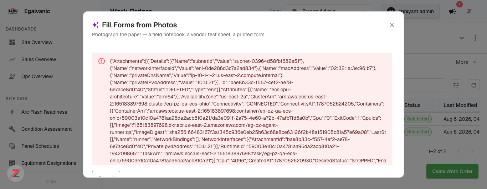
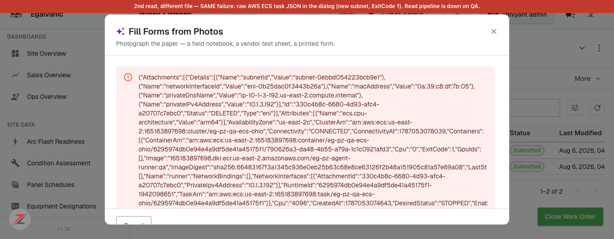

# Fill Forms from Photos — raw AWS ECS error dump · Jira ticket (ready to file)

Full QA verdict: `docs/bug-reports/2026-08-18-fill-forms-nomatch-and-grid-refresh-QA.md`

---

## Title
[Work Orders / Fill Forms from Photos] A failed "Read pages" job renders the raw AWS ECS task descriptor in the dialog — leaks AWS account id, cluster ARN, ECR image, subnet, ENI, MAC, private IP and internal DNS

## Environment
* Environment: **QA** (`acme.qa.egalvanic.ai`)
* Platform: **Web** (frontend dialog + `/api/form-fill/jobs/{id}/status` backend)
* Browser/App Version: Chrome · QA build **V1.36** · 2026-08-18
* Related PRs: eg-pz-frontend **#1176 / #1175** (this is a *hard-failure* path those PRs did not touch — filed separately)

## Preconditions
1. Logged in to `https://acme.qa.egalvanic.ai` (used Super Admin; any role that can open a session works).
2. An **IR (Infrared Thermography) session**. Used: `https://acme.qa.egalvanic.ai/sessions/fcc37c67-01fc-4940-87f3-8028fc86e97a` — "Infrared Thermography (I.R)".
3. **The "Read pages" job currently fails on QA** (the `eg-pz-agent-runner:qa` ECS/Fargate task exits 1 — see the companion finding). This ticket is about how that failure is *presented*, which is a defect regardless of why the task fails.

## Steps to Reproduce
1. Open the IR session above.
2. Click the **Forms** tab (the session tab, not the sidebar), then the **Actions** button → **Fill from Photos**.
3. In the **"Fill Forms from Photos"** dialog, click the drop zone (**"Drop pages here, or click to choose"**) and select **any image file**. The failure is **input-independent** — reproduced in two separate runs with two different files:
   * Run 1: a UI-screenshot PNG — `docs/bug-evidence/service-builder/create-service-forms-pricing-sections.png` (96 KB)
   * Run 2: an IR-photo PNG — `docs/bug-evidence/upload-anything-extras/UA-8-issue-ir-photo-pair.png`
   *(Any `.png/.jpg/.pdf` the picker accepts will do; a completed-paper-form photo is not required to hit this.)*
4. Click **"Read 1 page"**.
5. Wait ~1–2 minutes for the "Reading the pages…" job to finish.

## Actual Result
The job fails and the dialog renders the **raw AWS ECS/Fargate task descriptor** as its error body — a ~4 KB JSON blob shown verbatim under the error icon. Exposed to the (authenticated) user:

* **AWS account id** `165183897698`
* **ECS cluster ARN** `arn:aws:ecs:us-east-2:165183897698:cluster/eg-pz-qa-ecs-ohio`
* **ECR image** `165183897698.dkr.ecr.us-east-2.amazonaws.com/eg-pz-agent-runner:qa`
* **VPC internals** — `subnetId`, `networkInterfaceId` (eni-…), `macAddress` `02:32:1a:3e:96:b7`, `privateIPv4Address` `10.1.1.21`, `privateDnsName` `ip-10-1-1-21.us-east-2.compute.internal`
* task ARN, runtime id, `ExitCode: 1`, `DesiredStatus: STOPPED`

Confirmed at the API layer, not just the UI: `GET /api/form-fill/jobs/{jobId}/status` returns **HTTP 200** with the ECS descriptor inside the body — so the backend passes the raw failure cause to the client and the dialog renders it. Reproduced **2/2** with different files (two distinct ECS tasks, different `subnetId` each time), so it is systemic, not tied to one upload.

## Expected Result
A failed read job shows a **short, readable message** — e.g. *"We couldn't read those pages. Please try again."* — with a retry. The job-status endpoint must **not** return the raw Step-Functions/ECS failure cause to the client, and the dialog must not render an unknown error object verbatim. Internal infrastructure (AWS account id, cluster ARN, ECR image, VPC subnet/ENI/MAC/private-IP/DNS) must never appear in a user-facing surface.

## Severity
**Medium** — disclosure is to authenticated internal users (not cross-tenant/public), but internal AWS topology + account id should never render in a dialog, and the error is unreadable. If the read pipeline is expected to fail in front of customers, treat as High.

## Priority
**Medium**

## Attachments
* `read-job-failure-raw-ecs-dump.png` — run 1, the dialog showing the raw ECS JSON.
* `read-job-failure-2nd-run-different-file.png` — run 2, a different file → a new ECS task (different subnet), same dump (proves it's systemic).

**Note for the assignee:** two defects sit here — (a) the `eg-pz-agent-runner` read task is failing on QA (ExitCode 1 on every run; blocks Fill-from-Photos entirely and needs backend/devops), and (b) *this* ticket — the failure must be surfaced as a readable message, not the raw ECS cause. Fix (b) independently of (a): even once the task is healthy, any future failure would still leak the descriptor. Sanitize on the server (return a code/message, not the ECS `Cause`) and guard the dialog against rendering an unknown error object.
