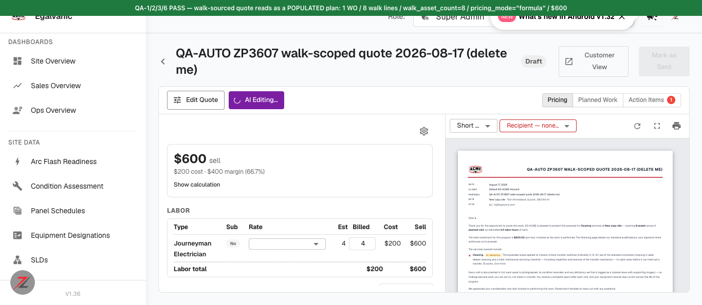

# Walk-scoped quote / `/generate` — Jira ticket (ready to file)

Full QA verdict: `docs/bug-reports/2026-08-17-site-walk-scoped-quotes-QA.md`
**File this one only.** The `intake_overrides` item is deliberately held (see the verdict) — not a defect on current evidence.

---

## Title
[Quotes / Plans API] `POST /api/plans/{id}/generate` silently accepts an orphaned walk-scoped instruction set — `site_walk_id` removed while a work row still declares `scope:"site_walk"` → HTTP 200, quote regenerates empty ($600 → $0.00)

## Environment
* Environment: **QA** (`acme.qa.egalvanic.ai`)
* Platform: **Web / API** (plan revision path used by the plan editor)
* Browser/App Version: QA build **V1.36**, tested 2026-08-17
* Refs: **ZP-3607** · eg-pz-engineering-ai-pipeline **#37** · eg-pz-backend **#956**

## Preconditions
1. A site walk with assets, assigned to a site. Used: `4a063404-e319-42c1-959d-e74fb33891e3` ("QA-AUTO ZP3607 … (delete me)") — 7 items, quantities summing to **8**; `GET /api/site-walk/{id}/evaluate` → `asset_count: 8`, `combined_total: 600.0`.
2. A walk-sourced quote created from it via `POST /api/plans/from-site-walk`. Used: plan `610fcb3d-7e0d-4345-9bb2-ab3a8de9ede4` — regenerates correctly to 1 work order / 8 lines / **$600**.

## Steps to Reproduce
1. Confirm the healthy baseline: `GET /api/plans/610fcb3d-…` → `content.audit.walk_asset_count = 8`, 1 work order, `pricing.totals.total_sell = 600.0`.
2. `POST /api/plans/610fcb3d-…/generate` with the walk id **removed** but the row still walk-scoped:
```json
{ "version": 2, "plan_type": "standard",
  "site_walk": { "service_ids": ["180c4243-25df-581c-895a-9e883f38948f"] },
  "work": [ { "id": "w1", "service_id": "180c4243-25df-581c-895a-9e883f38948f",
              "scope": "site_walk", "all_assets": false, "node_ids": [],
              "filters": { "node_class_ids": [], "buildings": [], "floors": [], "rooms": [] } } ] }
```
3. Observe the response.
4. `GET /api/plans/610fcb3d-…` again and compare.

*(`"site_walk_id": null` explicitly behaves identically to omitting the key.)*

## Actual Result
Step 3 returns **HTTP 200 with `"success": true`, no `error` and no `code`** — and no soft warning anywhere: I grepped the full 19.5 KB response body at every nesting level for `warning / warnings / ignored / skipped / dropped / unknown / invalid / unrecognized / orphan`; the only match is `error: null`. The acceptance is completely silent.

The incoherent instruction set is **persisted verbatim** — a subsequent GET shows `instructions.site_walk = {"service_ids":[…]}` with **no `site_walk_id`**, while `instructions.work[0].scope` is still `"site_walk"`.

Regenerating from that stored state empties the quote:

| | Before | After |
|---|---|---|
| `content.source` | `"site_walk"` | **`null`** |
| `content.site_walk` | walk identity block | **`null`** |
| work orders | 1 (8 lines) | **0** |
| `audit.walk_asset_count` | `8` | **absent** |
| `pricing.totals.total_sell` | **600.00** | **0.00** |

The empty plan is arguably the correct *output* for instructions with no asset source — this ticket is **not** claiming a pricing-calculation bug. The defect is that the **incoherent input is accepted silently** rather than refused.

**This state is reachable from the editor, not just the API.** The plan editor derives the walk id from stored instructions (`V = p.site_walk?.site_walk_id || null`) and only emits the `site_walk` block when it is truthy (`…V && rows.length ? {site_walk:{…}} : {}`). Once the id is lost, every subsequent editor save omits the block while walk-scoped rows remain — re-sending this exact payload.

**Wider context (worth a look while you're here):** the same endpoint accepts *every* malformed instruction set I tried, including rules that predate this work — `scope:"qa_garbage_scope_zz"`, a work row with no `service_id`, a nonexistent `service_id` UUID, a row missing its `id`, a payload with no `version`, and `scope:"assets"` with none of `all_assets` / `node_ids` / `filters`. All returned 200. There appears to be **no instruction validation on this REST path at all**.

## Expected Result
The request is refused with a structured error identifying the orphaned walk-scoped row — e.g. *"work row w1 declares scope 'site_walk' but no site_walk.site_walk_id was supplied"* — instead of silently accepting it and emptying a priced quote. (Per ZP-3607: *"refuses to drop `site_walk.site_walk_id` while any row still claims walk scope"*.)

## Severity
**Medium** — no data loss (the source site walk is untouched and the plan is restorable by re-sending valid instructions), but a priced customer quote can be silently zeroed out through the editor's own save path with a success response and no warning.

## Priority
**Medium**

## Attachments
* `walk-quote-populated.png` — the healthy walk-sourced quote (1 WO, 8 walk lines, `walk_asset_count = 8`, `pricing_mode = "formula"`, $600), with the customer proposal reading *"covering 8 assets across 1 planned visit"*.



**Ownership note for the assignee:** ZP-3607's pipeline half (PR #37) lives in `eg-pz-engineering-ai-pipeline`, and its validation / `get_plan_content` / `PLAN_SYSTEM` changes most plausibly sit on the `POST /api/plans/{id}/ai-edit` Step Function path, **not** on the REST `/generate` path this ticket is about. An equivalent edit through `ai-edit` ("Remove the site walk link but keep the walk-scoped work row") was still running when this was filed, so please confirm layer ownership before routing — this may belong to the backend REST path rather than to PR #37.

**Not a defect, recorded for completeness:** the walk-shaped content itself is working — `walk_asset_count` counts by quantity (8, vs 7 line items — the old "1 asset" bug is gone), `pricing_mode`/formula trace are exposed, walk labels/locations are carried, and non-walk node-based plans are unaffected.
