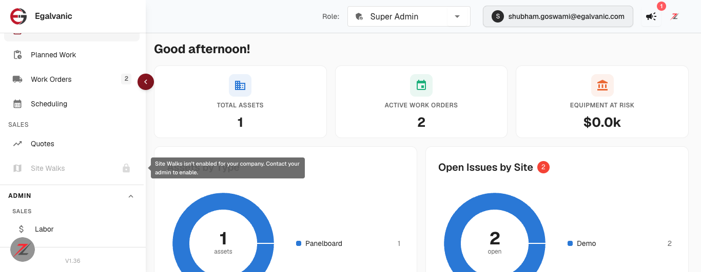
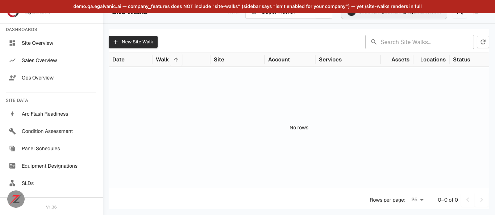
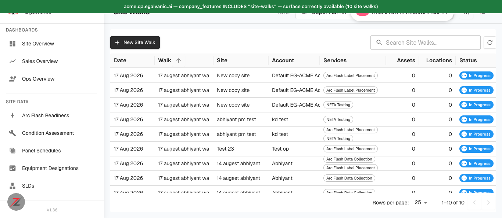

# Site Walks route gate — Jira ticket (ready to file)

Full QA verdict: `docs/bug-reports/2026-08-17-site-walks-feature-gate-QA.md`

---

## Title
[Sales / Site Walks] Feature gate is sidebar-only — a company without the `site-walks` feature can open the full Site Walks surface by typing the URL, and the API serves it too

## Environment
* Environment: **QA** (`demo.qa.egalvanic.ai` = feature OFF · `acme.qa.egalvanic.ai` = feature ON)
* Platform: **Web** (frontend route table + backend API)
* Browser/App Version: Chrome · QA build **V1.36** · tested 2026-08-17
* Related PRs: eg-pz-frontend **#1114** (gate Site Walks on a company flag), eg-pz-backend **#946** (feature key `site-walks`)

## Preconditions
1. A company **without** the `site-walks` feature whose role still holds the `site_walks.view` permission — exactly the case the gate exists for.
   Used: **Demo Company** (`93611164-13e6-47da-b2cd-a150e73173f6`), role **Super Admin**, which holds `site_walks.view` + `site_walks.manage`.
   Confirm via `GET /api/auth/v2/me` → `company_features[]` does **not** contain `site-walks` (it contains the other add-ons: `sales-core`, `ops-core`, `emp`, `eng-lib`, `reporting-v2`, `eg-forms`).
2. Contrast tenant (optional): **EG-ACME** (`d59d449b-…`) **does** hold `site-walks`.

## Steps to Reproduce
1. Log in to `https://demo.qa.egalvanic.ai` as Super Admin.
2. In the left sidebar under **SALES**, hover **Site Walks** — observe it is greyed with a lock and the tooltip *"Site Walks isn't enabled for your company. Contact your admin to enable."* (this part is correct).
3. Now type the URL directly in the address bar: `https://demo.qa.egalvanic.ai/site-walks`
4. Observe the page that loads.
5. In the console, check the API directly:
   `fetch('/api/site-walk/list',{headers:{Accept:'application/json'}}).then(r=>console.log(r.status)).catch(console.error)`

## Actual Result
Step 3 loads the **complete Site Walks surface** — no redirect (URL stays `/site-walks`), no "not enabled" state, no 404. The page renders the header, an **enabled "New Site Walk" button** (`disabled=false`, no `Mui-disabled`, `pointer-events:auto`, `cursor:pointer`), the search box, the full data grid (Date · Walk · Site · Account · Services · Assets · Locations · Status · Actions) and pagination.

Step 5 returns **HTTP 200** with a normal payload (`{"data":[],"success":true}`) — the API has no feature check either. (Demo shows 0 rows because it has no site-walk records, **not** because anything refused the call; on acme the same endpoint returns 10 rows. So this is a missing gate, not a data-exposure issue.)

Net: the app tells the user *"Site Walks isn't enabled for your company"* in the sidebar, then serves them the entire feature one URL away. The sidebar gate (`Layout.jsx`) landed; the route-table gate (`navigation.js`) did not.

## Expected Result
Per the ticket's own QA item — *"Confirm the navigation.js route table is gated too, so direct URL entry is covered"* — a direct/bookmarked/shared URL for a company without the `site-walks` feature should land on the same "not enabled" state (or be redirected away), exactly as the sidebar indicates, rather than rendering the live surface. Ideally the API enforces it too (`/api/site-walk/*` → 403/422 without the feature) so the entitlement is server-side, not client-only.

## Severity
**Medium** — no cross-tenant data exposure and the surface is empty for an unentitled company, but an unreleased/unpaid feature is fully reachable and its create action is enabled, which defeats the purpose of the gate.

## Priority
**Medium**

## Attachments
* `demo-greyed-tooltip.png` — the sidebar gate working correctly on demo (greyed + lock + tooltip).
* `demo-direct-url-renders.png` — the same tenant, one URL later: the full Site Walks page with an enabled "New Site Walk" button.
* `acme-enabled-works.png` — contrast: acme (feature held) correctly shows 10 site walks.

**Note for the assignee:** the sidebar implementation is solid — the disabled item is wrapped in a `` so the MUI tooltip fires on a disabled element, and the message is mirrored to `aria-label`. Only the route table needs the same `company_features` check. Also worth checking whether the **other group add-ons** gate their routes, since they follow the same pattern — I could only test `site-walks` (it's the only add-on the demo tenant lacks).

**Not covered by this ticket:** *"`alembic upgrade head` runs cleanly against a single head"* from the QA list needs DB/deploy access and must be verified by a backend engineer.
