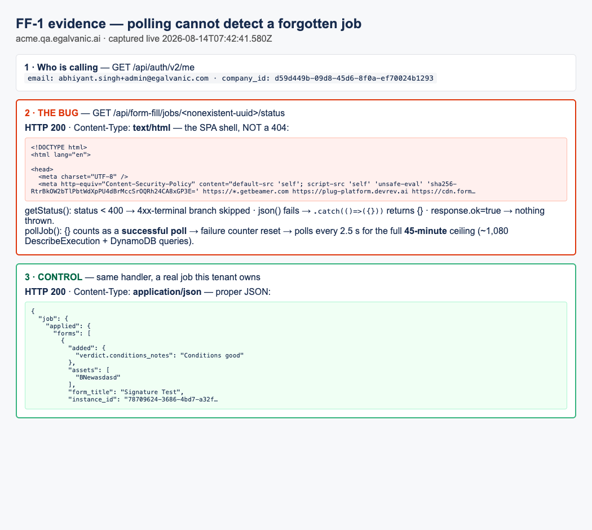
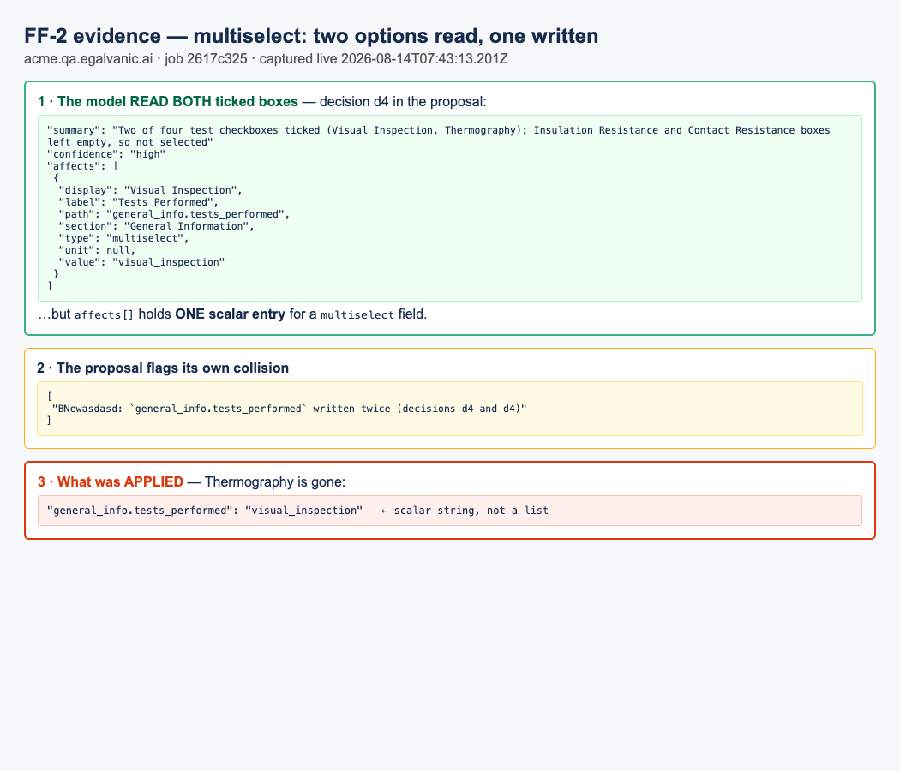
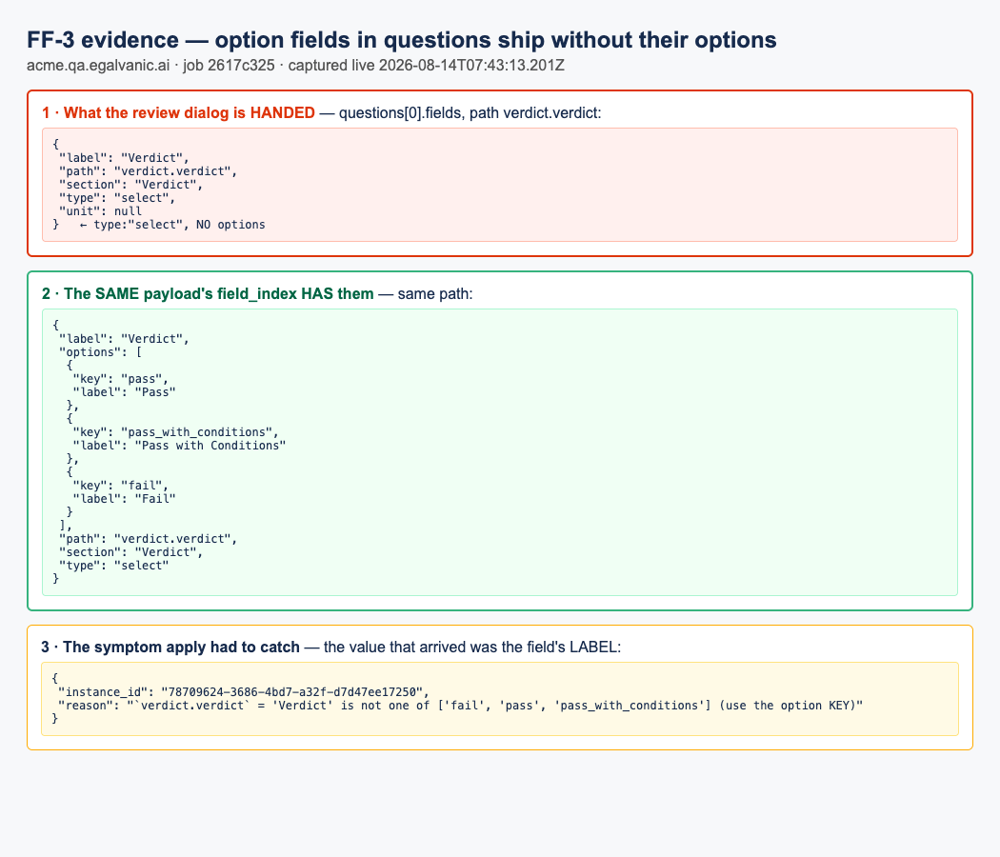

# Jira tickets — Fill Forms from Photos (3 defects, ready to file)

Copy each ticket below into a separate Jira issue. All three were found testing
*[Web] Fill Forms from Photos* (eg-pz-backend #977 · eg-pz-frontend #1151) on 2026-08-14.
Full QA verdict: `docs/bug-reports/2026-08-14-fill-forms-from-photos-QA.md`.

---

# TICKET 1 of 3

## Title
[Work Orders / Fill Forms from Photos] Polling cannot detect a forgotten job — two of its three termination guards never fire, so it hammers SFN/DynamoDB for the full 45 minutes

## Environment
* Environment: **QA** (`acme.qa.egalvanic.ai`)
* Platform: **Web**
* Browser/App Version: Chrome 151 · QA build V1.36 (in-app release panel shows "Fixes in Web v1.39.1")
* Device (if applicable): —

## Preconditions
1. Logged in as a company Admin (internal), any work order open.
2. Frontend `formFillJobService.js` from PR #1151 deployed (it is, on QA).

## Steps to Reproduce
1. Log in and open the browser console on any page.
2. Ask for the status of a form-fill job that does not exist:
   `fetch('/api/form-fill/jobs/00000000-0000-4000-8000-000000000000/status', {credentials:'include'}).then(r => console.log(r.status, r.headers.get('content-type')))`
3. Observe the response.
4. Trace it through the shipped client (`formFillJobService.getStatus` → `pollJob`), or simply open the Fill-from-Photos dialog for a job whose row has been deleted server-side and watch the network tab.

## Actual Result
Step 2 returns **HTTP 200 with `Content-Type: text/html`** — the SPA shell, not a 404 (platform-wide masked-404 behaviour for unknown `/api/` paths). In `getStatus()`:
* the `status >= 400 && < 500` terminal branch is **skipped** (status is 200);
* `response.json().catch(() => ({}))` swallows the HTML parse failure and returns `{}`;
* `response.ok` is `true`, so `jsonOrThrow` does not throw either.

`pollJob` then treats `{}` as a **successful poll**: the consecutive-failure counter resets to 0, the backoff resets, and `isTerminal(undefined)` is false — so the loop keeps polling every 2.5 s until the **45-minute wall clock**, ≈ **1,080 polls**, each one a DescribeExecution plus a paginated DynamoDB query (the exact load the in-code comments try to avoid). Verified by executing the shipped `getStatus` logic verbatim against the nonexistent id: it **returns `{}` and throws nothing**.

The user sees "running" the whole time for a job that is already gone.

## Expected Result
A job the server has forgotten terminates the poll promptly — per the PR's own design: *"a 4xx is terminal, a run of transient failures gives up."* On this platform the reliable signal is the **content type**, not the status code: a non-JSON body on the status endpoint should be treated as terminal (or at minimum count as a failure toward `maxFailures`, not a success).

## Severity
High

## Priority
High

## Attachments
* `JT-FF1-evidence.png` — live capture: caller identity, the nonexistent-job request returning 200 + `text/html`, and the control (a real owned job returning proper JSON) side by side.

**Note for the assignee:** this is the platform's masked-404 trap (unknown `/api/` paths return 200 + SPA shell) defeating a client that keys on 4xx. Any other poller written the same way has the same hole — worth a sweep.

---

# TICKET 2 of 3

## Title
[Work Orders / Fill Forms from Photos] Multiselect answers lose ticked options — model reads "Visual Inspection, Thermography", apply writes only `visual_inspection`

## Environment
* Environment: **QA** (`acme.qa.egalvanic.ai`)
* Platform: **Web** (defect likely in the pipeline/backend proposal-to-apply path)
* Browser/App Version: Chrome 151 · QA build V1.36
* Device (if applicable): —

## Preconditions
1. A work order with an EG form instance whose definition includes a **multiselect** field (used: *Signature Test* → "Tests Performed", options: visual_inspection / insulation_resistance / contact_resistance / thermography, instance `78709624-3686-4bd7-a32f-d7d47ee17250` on work order `465df0c4-39a0-4787-a815-642729c29707`).
2. A photographed paper sheet with **two or more** of that field's checkboxes ticked (used: Visual Inspection ✓ and Thermography ✓).

## Steps to Reproduce
1. Work order → Forms tab → Actions → **Fill from Photos**; upload the sheet; Read pages.
2. When the job completes, inspect the proposal (`GET /api/form-fill/jobs/{jobId}/proposal`) — decision covering the checkbox row (here `d4`) and `proposal.warnings`.
3. Accept and Apply.
4. Read the applied value: `GET /api/form-fill/jobs/{jobId}/status` → `job.applied.forms[0].wrote["general_info.tests_performed"]`, or open the form instance.

## Actual Result
The model **read both** ticks — decision d4's own summary: *"Two of four test checkboxes ticked (Visual Inspection, Thermography)…"* — but its `affects[]` carries **one scalar entry** (`"value": "visual_inspection"`), and the proposal warns about its own collision:

`"BNewasdasd: \`general_info.tests_performed\` written twice (decisions d4 and d4)"`

The applied value is the **scalar string** `"visual_inspection"`. **Thermography is silently dropped.** Two writes from one decision collapse onto the same path and the last one wins instead of merging into a list.

## Expected Result
A multiselect field's value is a **list** of option keys — here `["visual_inspection", "thermography"]` — with multiple reads for the same multiselect path merged, not overwritten. If a genuine conflict exists, it should surface as a review question, not a buried warning.

## Severity
High (silent loss of recorded inspection data — a technician ticks four tests, fewer land, nothing tells the reviewer)

## Priority
High

## Attachments
* `JT-FF2-evidence.png` — decision d4 (both options read, one `affects` entry), the "written twice (d4 and d4)" warning, and the applied scalar, from the live job.

**Repro artefacts on QA:** job `2617c325-e8d9-4f9c-b228-bcdc904c6db3`, source page `paper_form2_page1.jpg` (in the job's source files).

---

# TICKET 3 of 3

## Title
[Work Orders / Fill Forms from Photos] Review-dialog questions ship option fields WITHOUT their options — the "typed input from the field definition" cannot render a real picker

## Environment
* Environment: **QA** (`acme.qa.egalvanic.ai`)
* Platform: **Web** (contract produced by the backend proposal handler, consumed by `FillFormsFromPhotosDialog`)
* Browser/App Version: Chrome 151 · QA build V1.36
* Device (if applicable): —

## Preconditions
1. Any form-fill run where the model could not read a value for an **option-typed** field (select / radio / multiselect), so it lands in the proposal's `questions` (and/or `gaps`).
2. Used: *Signature Test*'s "Verdict" (`verdict.verdict`, type `select`, options pass / pass_with_conditions / fail) on job `2617c325-e8d9-4f9c-b228-bcdc904c6db3`.

## Steps to Reproduce
1. Run Fill from Photos with a sheet that leaves the Verdict unanswered (any normal sheet without a verdict).
2. `GET /api/form-fill/jobs/{jobId}/proposal`.
3. Compare, for the same path `verdict.verdict`:
   * `proposal.fills[0].questions[].fields[]` — the descriptor handed to the review dialog's typed input;
   * `proposal.field_index[<form_id>]` — the index apply validates against.

## Actual Result
The question descriptor is `{"label":"Verdict","path":"verdict.verdict","section":"Verdict","type":"select","unit":null}` — **no `options`** (same for `gaps` entries). The `field_index` entry for the identical path **has** them: `[{"key":"pass"},{"key":"pass_with_conditions"},{"key":"fail"}]`.

So the dialog is told "render a picker" with nothing to populate it. Corroborating symptom from this run: the value that reached apply for that field was the string **`'Verdict'` — the field's own label** (what an option input degrades to without options). Apply refused it: `` `verdict.verdict` = 'Verdict' is not one of ['fail','pass','pass_with_conditions'] (use the option KEY) `` — correct backstop, but the QA requirement is that the reviewer gets a real picker in the first place ("an option field is a picker").

## Expected Result
Question and gap field descriptors include the field's `options` (or the dialog resolves them from `field_index` by path), so an option field renders as a picker of its actual choices and the answer is stored as an option **key** — never the label.

## Severity
Medium

## Priority
Medium

## Attachments
* `JT-FF3-evidence.png` — the optionless question descriptor vs the option-bearing `field_index` entry for the same path, plus the label-as-value skip message, from the live job.

